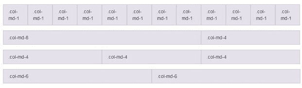

# Bootstrap网格

> 原文：<https://www.javatpoint.com/bootstrap-grid>

维基百科说:

“在平面设计中，网格是由一系列相交的直线(垂直、水平)组成的结构(通常是二维的)，用于组织内容。在平面设计中，它被广泛用于设计布局和内容结构。在网页设计中，使用 HTML 和 CSS 快速有效地创建一致的布局是一种非常有效的方法。”

* * *

### Bootstrap网格系统

Bootstrap网格系统允许页面中最多有 12 列。您可以单独使用所有 12 列，也可以将这些列组合在一起以创建更宽的列。



Bootstrap 网格系统响应迅速，列会根据屏幕大小自动重新排列。

* * *

### 网格类:

Bootstrap网格系统有四个类别:

*   xs(用于电话)
*   sm(用于平板电脑)
*   md(适用于台式机)
*   lg(适用于大型台式机)

您可以组合上述类来创建更加动态和灵活的布局。

* * *

### Bootstrap网格的基本结构:

```

  ...

* * *

### 创建Bootstrap网格时，请遵循以下说明:

*   创建一行()。

*   在网格中添加所需的列数(标记适当。col-*-*类)。

*   请注意。col-*-*每行最多应加 12。

* * *

### Bootstrap网格示例

**等列:**

```

     Job

# 网格示例

  Rahul
  Vijay
  Kartik
  Ajeet

```

[Test it Now](https://www.javatpoint.com/oprweb/test.jsp?filename=bootstrapgrid1)

* * *

**对于不相等的列:**

```

     Job

# 网格示例

  Rahul
  Vijay
  Kartik
  Ajeet

```

[Test it Now](https://www.javatpoint.com/oprweb/test.jsp?filename=bootstrapgrid2)

* * *

## Bootstrap 4 网格类

Bootstrap 4 网格系统中有 5 个类。

*   **。col-** (超小型设备-屏幕宽度小于 576 像素)

*   **。col-sm-** (小型设备-屏幕宽度等于或大于 576 像素)

*   **。col-md-** (中型设备-屏幕宽度等于或大于 768 像素)

*   **。col-lg-** (大型设备-屏幕宽度等于或大于 992px)

*   **。col-xl- ** (xlarge 设备-屏幕宽度等于或大于 1200px)

您还可以组合上述类来创建更加动态和灵活的布局。

## Bootstrap 4 网格的结构

请参见 Bootstrap 4 网格的基本结构:

```
<!-- Control the column width, and how they should appear on different devices -->
<div class="row">
  <div class="col-*-*"></div>
  <div class="col-*-*"></div>
</div>
<div class="row">
  <div class="col-*-*"></div>
  <div class="col-*-*"></div>
  <div class="col-*-*"></div>
</div>

<!-- Or let Bootstrap automatically handle the layout -->
<div class="row">
  <div class="col"></div>
  <div class="col"></div>
  <div class="col"></div>
</div>

```

首先创建一行(

)，然后添加所需数量的列(带有适当的标签。col-*-*类)。

这里:在。col-*-*，第一颗星(*)代表响应性:sm、md、lg 或 xl，而第二颗星代表一个数字，每行加起来应该是 12。

* * *

## 等列示例

让我们举个例子，看看如何在所有设备和屏幕宽度上创建等宽栏:

### 例子

```
<!DOCTYPE html>
<html lang="en">
<head>
  <title>Bootstrap Example</title>
  <meta charset="utf-8">
  <meta name="viewport" content="width=device-width, initial-scale=1">
  <link rel="stylesheet" href="https://maxcdn.bootstrapcdn.com/bootstrap/4.0.0-beta.2/css/bootstrap.min.css">
  <script src="https://ajax.googleapis.com/ajax/libs/jquery/3.2.1/jquery.min.js"></script>
  <script src="https://cdnjs.cloudflare.com/ajax/libs/popper.js/1.12.6/umd/popper.min.js"></script>
  <script src="https://maxcdn.bootstrapcdn.com/bootstrap/4.0.0-beta.2/js/bootstrap.min.js"></script>
</head>
<body>

<div class="container-fluid">
  <h2>Three equal-width columns</h2>
  <div class="row">
    <div class="col" style="background-color:lavender;">.col</div>
    <div class="col" style="background-color:orange;">.col</div>
    <div class="col" style="background-color:lavender;">.col</div>

  </div>
</div>

</body>
</html>

```

[Test it Now](https://www.javatpoint.com/oprweb/test.jsp?filename=bootstrap4grid)

* * *

## 不等列示例

让我们举一个例子，看看如何创建一个不等宽的列，支持平板电脑和扩展到大的额外桌面:

### 示例:

```
<!DOCTYPE html>
<html lang="en">
<head>
  <title>Bootstrap Example</title>
  <meta charset="utf-8">
  <meta name="viewport" content="width=device-width, initial-scale=1">
  <link rel="stylesheet" href="https://maxcdn.bootstrapcdn.com/bootstrap/4.0.0-beta.2/css/bootstrap.min.css">
  <script src="https://ajax.googleapis.com/ajax/libs/jquery/3.2.1/jquery.min.js"></script>
  <script src="https://cdnjs.cloudflare.com/ajax/libs/popper.js/1.12.6/umd/popper.min.js"></script>
  <script src="https://maxcdn.bootstrapcdn.com/bootstrap/4.0.0-beta.2/js/bootstrap.min.js"></script>
</head>
<body>

<div class="container-fluid">
  <h1>Unequal Columns</h1>
  <p>Resize the browser window to see the effect.</p>
  <p>The columns will automatically stack on top of each other when the screen is less than 576px wide.</p>
  <div class="row">
    <div class="col-sm-4" style="background-color:lavender;">.col-sm-4</div>
    <div class="col-sm-8" style="background-color:lavenderblush;">.col-sm-8</div>
  </div>
</div>

</body>
</html>

```

[Test it Now](https://www.javatpoint.com/oprweb/test.jsp?filename=bootstrap4grid1)

```