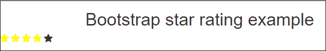

# Bootstrap星级

> 原文：<https://www.javatpoint.com/bootstrap-star-rating>

星级评定允许用户分享他们对文档、产品、图像、视频等的意见(评定)。

要创建选中(填充)的星形图标，请使用以下语法-

```

<span class = "fa fa-star checked"></span>

```

要创建未选中的星形图标，请使用以下语法-

```

<span class = "fa fa-star unchecked"></span>

```

### 代码:

```

<!doctype html>
<html lang = "en">
<head>
    <meta charset = "UTF-8">
    <meta name = "viewport" content = "width=device-width, initial-scale = 1.0">
    <title> Bootstrap Star Rating </title>
    <!--  Add Bootstrap cdn  -->
    <link rel = "stylesheet" href = "https://maxcdn.bootstrapcdn.com/bootstrap/3.3.6/css/bootstrap.min.css" />
    <script src = "https://ajax.googleapis.com/ajax/libs/jquery/1.11.3/jquery.min.js"></script>
    <script src = "https://maxcdn.bootstrapcdn.com/bootstrap/3.3.5/js/bootstrap.min.js"></script>
    <!--  Add bootstrap icon Library  -->
    <link rel="stylesheet" href="https://cdnjs.cloudflare.com/ajax/libs/font-awesome/4.7.0/css/font-awesome.min.css">
    <style>
        .checked {
            color : yellow;
            font-size : 20px;
        }
        .unchecked {
            font-size : 20px;
        }
    </style>
</head>
<body>
        <h1 align = "center">Bootstrap star rating example</h1>
        <!-- To display checked star rating icons -->
        <span class = "fa fa-star checked"></span>
        <span class = "fa fa-star checked"></span>
        <span class = "fa fa-star checked"></span>
        <span class = "fa fa-star checked"></span>
        <!-- To display unchecked star rating icons -->
        <span class = "fa fa-star unchecked"></span>

</body>
</html>

```

[Test it Now](https://www.javatpoint.com/oprweb/test.jsp?filename=Bootstrapstarrating)

**输出:**



* * *