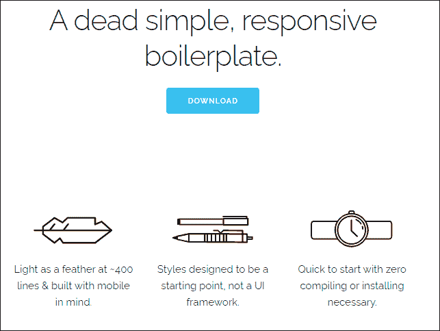
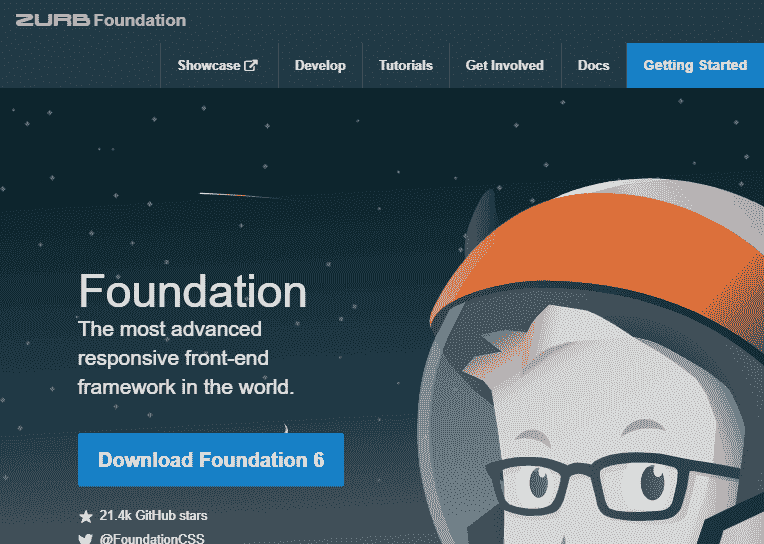
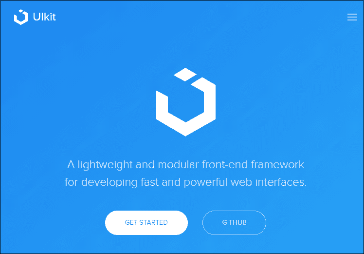
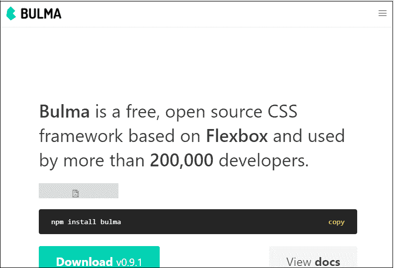
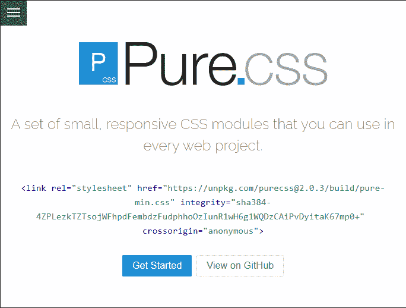
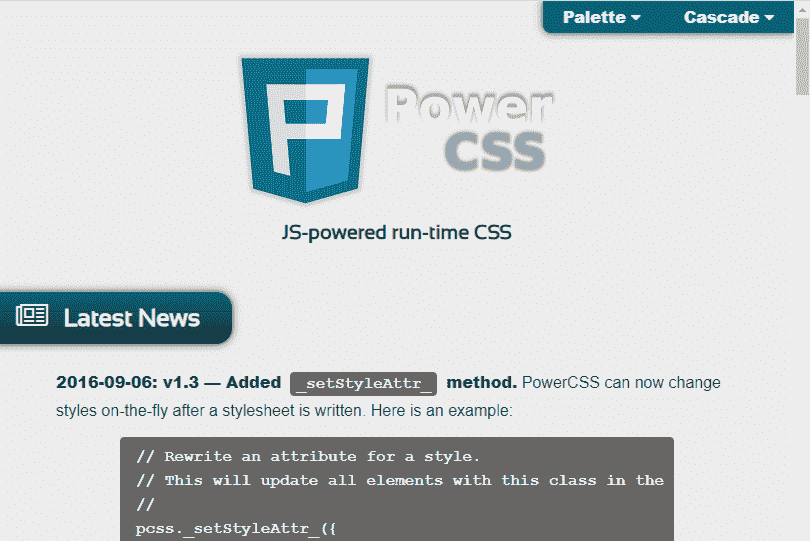
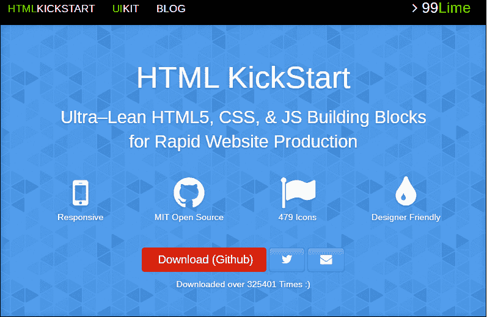
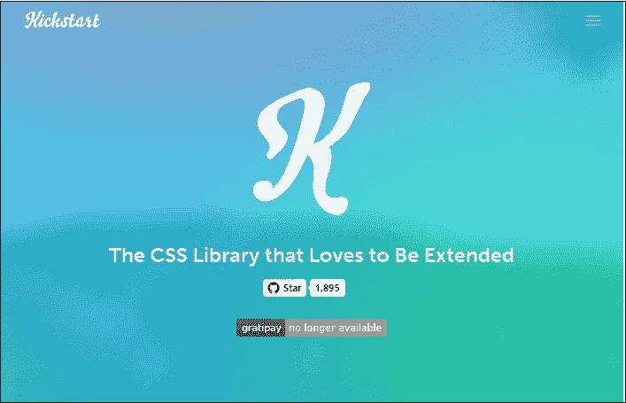
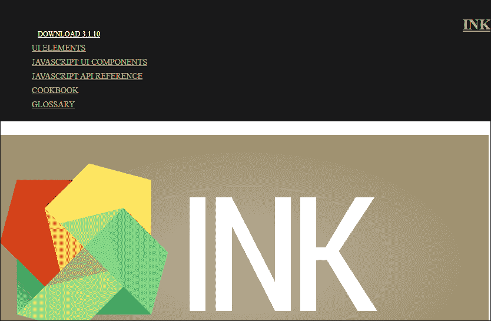
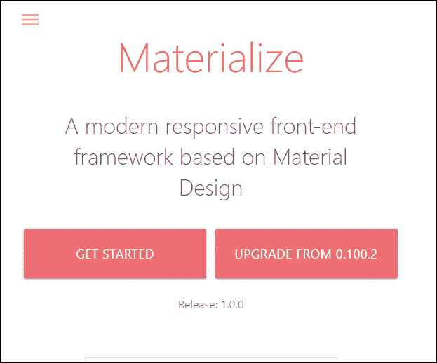

# 自举替代方案

> 原文:[https://www.javatpoint.com/bootstrap-alternatives](https://www.javatpoint.com/bootstrap-alternatives)

Bootstrap 是最流行的**开源前端(HTML、CSS 和 JavaScript)框架**之一，用于创建漂亮的 web 项目和移动友好的网站。

虽然 bootstrap 是一个令人惊叹的前端框架，但也有一些其他的 Bootstrap 替代方案与 [Bootstrap](https://www.javatpoint.com/bootstrap-tutorial) 一样好。

下面给出了一些最广泛使用的 Bootstrap 替代方法

### 1.骨骼

骷髅是**最好的也是最受欢迎的轻量级**自举替代品。它是由**戴夫·加马奇**开发的。它只提供重要的**组件，如按钮、列表、表单、表格、链接、输入等**来轻松创建有吸引力的网站。它通常使用 **12 列网格**系统。

**优点:**

*   Skeleton 帮助用户轻松开始他们的开发过程。
*   学习起来很简单，因为它不包含额外的组件，比如 jQuery 插件和其他 UI 框架。
*   这是开发人员创建小型 web 项目的首选。
*   是适合初学者的前端框架。

cons:t1]

*   可以通过定制 CSS 来开发其他组件。
*   骨骼不适合简单的原型制作。
*   模板有限。

**网站:**

点击给定链接，使用骨骼创建网站-[http://getskeleton.com/](http://getskeleton.com/)

* * *

### 2.基础

Foundation 是世界上响应速度最快的前端框架之一。它被用来建立**响应移动以及桌面网站**。它是由位于硅谷的开发机构 ZURB 设计的。它被世界上最大的组织使用，如 Adobe、福特、三星、惠普、易贝、亚马逊、Mozilla 等等。它包含各种重要的响应组件，如网格、按钮和更多的用户界面组件。

**优点:**

*   Foundation 是一个高度响应、易于使用、灵活且强大的前端框架。
*   它使我们能够轻松创建响应迅速的移动友好型应用程序和网站。
*   它包括各种必要的网站设计组件，如响应按钮、网格、图标、布局和其他重要的用户界面元素。
*   每个设备、媒体和可访问性都使用它。
*   它提供现成的代码。

cons:t1]

*   基础对初学者来说相当难学。
*   很难在基金会修改代码。

**网站:**

点击以下链接访问基金会网站-[https://get.foundation/](https://get.foundation/)

* * *

### 3\. 用户界面

UIKit 是**一个自由、响应迅速、轻量级、开源、易用、快速、强大的前端框架**。它是最好的引导程序替代品之一，包括各种用户界面组件，如默认值、布局、导航、元素、公共、网格和 [JavaScript](https://www.javatpoint.com/javascript-tutorial) 。该框架用于开发快速而强大的 web 界面。

**优点:**

*   UIKit 提供了一个内置的图标库。
*   它支持 SaSS
*   这个响应框架提供了各种功能，例如文档支持、动画支持、文本管理、搜索支持、可访问性支持、绘图支持和资源管理。

cons:t1]

*   与引导相比，实用程序类有限。

**网站:**

点击以下链接访问 UlKit 官网-[https://getuikit.com/](https://getuikit.com/)

* * *

### 4.布尔马

布尔玛是一个于 2016 年发布的自由、现代、开源和响应的框架。它完全基于 Flexbox 布局。目前已有 20 多万开发者使用。它包含用于创建任何类型网站的各种组件。布尔玛的当前版本(0.7.1)于 2018 年 4 月 18 日发布。

**优点:**

*   布尔玛帮助我们为台式机、平板电脑和手机开发 100%响应的网站设计。
*   它带有各种常见的用户界面组件，如模式、卡片、响应布局等。
*   布尔玛代码很容易理解，因为它使用最少的超文本标记语言代码。
*   布尔玛是一个组件丰富且记录良好的前端框架。

cons:t1]

*   布尔玛框架仍处于开发阶段。
*   由于它是一个新的框架，所以它被一个有限的社区使用。
*   开发网站需要熟练的开发人员。

**网站:**

点击以下链接访问布尔玛官方网站创建响应网站-[https://bulma.io/](https://bulma.io/)

* * *

### 5.纯的

Pure 是一个**响应性前端框架**，允许开发人员使用网格、菜单、表单、按钮、表格等创建令人印象深刻、响应迅速且美观的布局。由**雅虎**开发。

**优点:**

*   它允许用户开发桌面和移动网络应用程序。
*   它的文件非常小(大约 4.5 KB)
*   它提供不一致的浏览器支持。

cons:t1]

*   它包含有限的 CSS 选择器。

**网站**

点击以下链接访问 Pure 网站-[https://purecss.io/](https://purecss.io/)

* * *

### 6.Powertocss

power tocss/power towb 是一个基于开源技术的轻量级、响应性、多功能和简单的前端框架。它允许我们使用简单的类名，比如。按钮。专栏，并更多地创建有吸引力的网站。

**优点:**

Powertocss 框架有以下缺点-

*   Powertocss 简单易学。
*   加载快，开发快。
*   它允许我们添加自己的主题。

cons:t1]

*   有必要将 Powertocss 与某种用户界面工具包结合起来，以提供完整的功能。
*   不再维护。

**网站:**

点击以下链接访问 Powertocss 网站-[https://powercss.org/](https://powercss.org/)

* * *

### 7.HTML KickStart

HTML KickStart 包含 [HTML](https://www.javatpoint.com/html-tutorial) 、 [CSS](https://www.javatpoint.com/css-tutorial) 和 JavaScript 组件，这些组件允许开发人员节省构建基于网络的网站的时间。它允许开发人员快速轻松地创建响应性网站，而无需花费更多时间进行设计。因为它是基于推特自举的，所以它提供了字体牛逼的图标支持。

**优点:**

*   为了轻松创建网站，HTML KickStart 提供了各种预建元素，如按钮、导航菜单、下拉菜单、按钮和动画滑块。
*   用户界面元素在旧的浏览器上可以正常显示。
*   它提供了一个对设计师友好的环境。

cons:t1]

不再维护。

**网站:**

点击下面的链接，使用 HTML KickStart-[http://www.99lime.com/elements/](http://www.99lime.com/elements/)创建一个有响应且有吸引力的网站

* * *

### 8.踢带

Kickstrap 是 Bootstrap 的样板。它比 Bootstrap 更快更轻。它是生产环境中常用的开源框架。目前，由于其丰富的功能和更好的性能，它被一个大型社区使用。

**优点:**

*   与引导和基础框架相比，Kickstrap 是一个非常轻量级的框架。
*   它不需要 jQuery 插件。
*   这是最大限度减少问题的最佳框架。
*   它使用了最新版本的推特自举。

cons:t1]

*   Kickstart 不支持旧的 web 浏览器。
*   不再维护。

**网站:**

点击以下链接访问 Kickstrap 官方网站，创建有响应和吸引力的网站-[http://getkickstart.com/](http://getkickstart.com/)

* * *

### 9.墨水

INK 是目前流行的前端网站设计框架之一。它是由葡萄牙公司 SAPO 创建的。它允许开发人员使用 HTML、CSS 和 JavaScript 快速开发网站。

**优点:**

INK 框架有以下优点-

*   INK 允许我们创建各种可重用的组件，如数据选择器、可排序列表、树视图、表格、选项卡、表单验证器等等。
*   创建网页需要一点 HTML 和 CSS 知识。
*   它允许我们使用一个简单的文本编辑器，如记事本、记事本++、崇高、括号等来创建网页。

**网站:**

点击以下链接访问 ink 官网-[https://ink.sapo.pt/](https://ink.sapo.pt/)

* * *

### 10.实现

物化是最好的引导替代方法之一。它的用户界面组件类似于 Bootstrap。它基于 Material 设计(一种由谷歌创建的设计语言)原则。它提供了 Sass mixins、拖出式移动菜单、涟漪效果动画等等。它为最终用户提供移动和桌面友好的网络界面。

**优点:**

*   物化在移动设备上提供各种特定的插件。
*   它提供了更好的用户体验。
*   它提供多种现代组件。
*   它有一个包含各种 JavaScript 和 CSS 组件的 12 列网格系统。
*   Sass 版本可用。

cons:t1]

*   Github 上超过 700 个开放问题。
*   它支持较少的模板。
*   最新的浏览器支持它。

**网站:**

点击以下链接访问物化官网-[https://materializecss.com/](https://materializecss.com/)

* * *