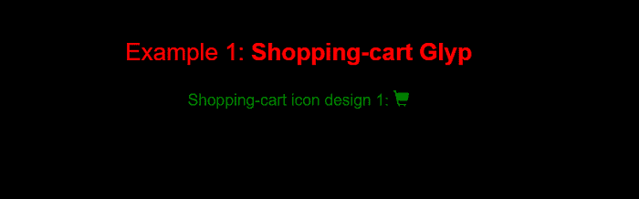
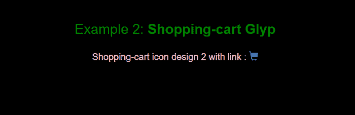
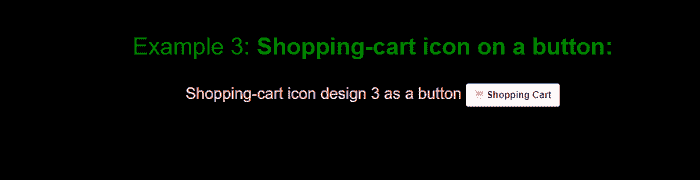
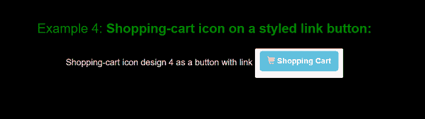
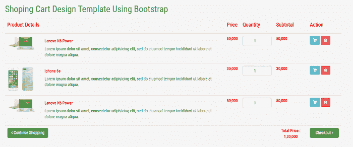

# 添加到引导数据库中的购物车按钮

> 原文:[https://www.javatpoint.com/add-to-cart-button-in-bootstrap](https://www.javatpoint.com/add-to-cart-button-in-bootstrap)

在本文中，我们将学习如何在引导程序中包含“**添加到购物车按钮。”为此，我们将使用各种**添加到购物车按钮设计和引导模板与购物车。****

首先，我们将学习 bootstrap 的一些基础知识， [bootstrap 按钮](https://www.javatpoint.com/bootstrap-button)，添加到 Bootstrap 中的购物车按钮设计。之后，我们将借助 bootstrap 中的添加到购物车按钮设计示例来理解这个概念。

### 你说的自举是什么意思？

[Bootstrap](https://www.javatpoint.com/bootstrap-tutorial) 用于在 [HTML](https://www.javatpoint.com/html-tutorial) 文档中添加设计，类似于[层叠样式表(CSS)](https://www.javatpoint.com/css-tutorial) 。这是一个免费的开源 CSS 框架，旨在进行响应性的、移动优先的前端 web 开发。它是级联样式表和基于 [JavaScript](https://www.javatpoint.com/javascript-tutorial) 的设计模板的集合，用于:

*   排印
*   形式
*   小跟班
*   航行
*   接口组件等。

Bootstrap 包括几个预定义的按钮样式，每个样式都有自己的语义目的，并加入了一些额外的东西来获得更多的控制。

### 添加到引导数据库中的购物车按钮

添加到购物车按钮主要用于电子商务网站，用于将产品添加到购物车中。在 bootstrap 中，我们可以为购物网站创建各种添加到购物车按钮的设计。

让我们举一些在 bootstrap 中添加到购物车按钮设计的例子。

### 例 1:

```

<! DOCTYPE html>
<html>
<head>
<title>
Add to cart button design
</title>
<meta name="viewport" content="width=device-width, initial-scale=1">
<link rel="stylesheet" href="https://maxcdn.bootstrapcdn.com/bootstrap/3.4.0/css/bootstrap.min.css">
<script src="https://ajax.googleapis.com/ajax/libs/jquery/3.5.1/jquery.min.js">
</script>
<script src="https://maxcdn.bootstrapcdn.com/bootstrap/3.4.0/js/bootstrap.min.js">
</script>
<style>
.container {
margin-top: 30px;
color: red;
}
p {
color: green;
font-size: 20px;
margin-top: 30px;
}
body {
background-color: black;
}
</style>
 </head>
 <body>
  <div class="container" align ="center">
    <h2> Example 1: <b> Shopping-cart Glyp </b> </h2>
    <p>Shopping-cart icon design 1: <span class="glyphicon glyphicon-shopping-cart"> </span>
</p>    
</div>
</body>
</html>

```

**输出:**

下面是购物车图标设计的输出。



### 例 2:

```

<! DOCTYPE html>
<html>
<head>
<title>
Add to cart button design
</title>
<meta name="viewport" content="width=device-width, initial-scale=1">
<link rel="stylesheet" href="https://maxcdn.bootstrapcdn.com/bootstrap/3.4.0/css/bootstrap.min.css">
<script src="https://ajax.googleapis.com/ajax/libs/jquery/3.5.1/jquery.min.js">
</script>
<script src="https://maxcdn.bootstrapcdn.com/bootstrap/3.4.0/js/bootstrap.min.js">
</script>
<style>
.container {
margin-top: 30px;
color: green;
}
.design {
color: pink;
font-size: 20px;
margin-top: 30px;
}
body {
background-color: black;
}
</style>
 </head>
 <body>
  <div class="container" align ="center">
    <h2> Example 2: <b> Shopping-cart Glyp </b> </h2>
	<p class = "design" >Shopping-cart icon design 2 with link : <a href="#">
          <span class="glyphicon glyphicon-shopping-cart">
		</span>
		</a>
	</p>    
</div>
</body>
</html>

```

**输出:**

下面是带有链接的购物车设计的输出。



### 例 3:

```

<! DOCTYPE html>
<html>
<head>
<title>
Add to cart button design
</title>
<meta name="viewport" content="width=device-width, initial-scale=1">
<link rel="stylesheet" href="https://maxcdn.bootstrapcdn.com/bootstrap/3.4.0/css/bootstrap.min.css">
<script src="https://ajax.googleapis.com/ajax/libs/jquery/3.5.1/jquery.min.js">
</script>
<script src="https://maxcdn.bootstrapcdn.com/bootstrap/3.4.0/js/bootstrap.min.js">
</script>
<style>
.container {
margin-top: 30px;
color: green;
}
.design {
color: pink;
font-size: 20px;
margin-top: 30px;
}
body {
background-color: black;
}
span {
color: pink;
}
</style>
 </head>
 <body>
  <div class="container" align ="center">
    <h2> Example 3: <b> Shopping-cart icon on a button: </b> </h2>
	<p class = "design" >Shopping-cart icon design 3 as a button <button type="button" class="btn btn-default btn-sm">
          <span class="glyphicon glyphicon-shopping-cart">
</span> <b> Shopping Cart </b>
        </button>
	</p>  
</div>
</body>
</html>

```

**输出:**

下面是购物车图标作为按钮的输出。



### 例 4:

```

<! DOCTYPE html>
<html>
<head>
<title>
Add to cart button design
</title>
<meta name="viewport" content="width=device-width, initial-scale=1">
<link rel="stylesheet" href="https://maxcdn.bootstrapcdn.com/bootstrap/3.4.0/css/bootstrap.min.css">
<script src="https://ajax.googleapis.com/ajax/libs/jquery/3.5.1/jquery.min.js">
</script>
<script src="https://maxcdn.bootstrapcdn.com/bootstrap/3.4.0/js/bootstrap.min.js">
</script>
<style>
.container {
margin-top: 30px;
color: green;
}
.design {
color: pink;
font-size: 20px;
margin-top: 30px;
}
body {
background-color: black;
}
span {
color: pink;
}
</style>
 </head>
 <body>
  <div class="container" align ="center">
    <h2> Example 4: <b> Shopping-cart icon on a styled link button: </b> </h2>
	<p class = "design" >Shopping-cart icon design 4 as a button with link <button type="button" class="btn btn-default btn-sm">
          <a href="#" class="btn btn-info btn-lg">
          <span class="glyphicon glyphicon-shopping-cart">
</span> <b> Shopping Cart </b>
        </a>
	</p>  
</div>
</body>
</html>

```

**输出:**

下面是一个样式链接按钮上购物车图标的输出。



**示例 5:** 使用 Bootstrap 的购物车设计模板。

```

<! DOCTYPE html>
<html>
<head>
	<title> Shopping Cart Design teamplate Using Bootstrap </title>
	<link href="https://fonts.googleapis.com/css?family=Roboto+Condensed" rel="stylesheet">
	<link rel="stylesheet" type="text/css" href="https://maxcdn.bootstrapcdn.com/font-awesome/4.7.0/css/font-awesome.min.css">
	<link rel="stylesheet" href="https://maxcdn.bootstrapcdn.com/bootstrap/3.4.0/css/bootstrap.min.css">
    <script src="https://ajax.googleapis.com/ajax/libs/jquery/3.5.1/jquery.min.js"> </script>
    <script src="https://maxcdn.bootstrapcdn.com/bootstrap/3.4.0/js/bootstrap.min.js"> </script>

	<link rel="stylesheet" type="text/css" href="custom.css">
</head>
<body>
	<div class="container main-section">
		<div class="row">
			<div class="col-lg-12 pb-2">
				<h2> Shoping Cart Design Template Using Bootstrap </h2>
			</div>
			<div class="col-lg-12 pl-3 pt-3">
				<table class="table table-hover border bg-white">
				    <thead>
				      	<tr>
					        <th> <h4> <b>  Product Details </b> </h4> </th>
					        <th> <h4> <b> Price </h4> <b> </th>
					        <th style="width:10%;"> <h4> <b> Quantity <b> </h4> </th>
					        <th> <h4> <b> Subtotal <b> </h4> </th>
					        <th> <h4> <b> Action <b> </h4> </th>
				      	</tr>
				    </thead>
				    <tbody>
				      	<tr>
					        <td>
					        	<div class="row">
									<div class="col-lg-2 Product-img">
										
									</div>
									<div class="col-lg-10">
										<h5 class="nomargin"> <b>  Lenovo K6 Power </b> </h5>
										<p> Lorem ipsum dolor sit amet, consectetur adipisicing elit, sed do eiusmod
										tempor incididunt ut labore et dolore magna aliqua. </p>
									</div>
								</div>
					        </td>
					        <td> <strong> 50,000 </strong> </td>
					        <td data-th="Quantity">
								<b> <input type="number" class="form-control text-center" value="1"> </b>
							</td>
							<td> <strong> 50,000 </strong> </td>
					        <td class="actions" data-th="" style="width:10%;">
								<button class="btn btn-info btn-sm"> <span class="glyphicon glyphicon-shopping-cart"> </span> </button>
								<button class="btn btn-danger btn-sm"> <i class="fa fa-trash-o"> </i> </button>								
							</td>
				      	</tr>

				      	<tr>
					        <td>
					        	<div class="row">
									<div class="col-lg-2 Product-img">
										
									</div>
									<div class="col-lg-10">
										<h5 class="nomargin"> <b>  Iphone 6s </b> </h5>
										<p> Lorem ipsum dolor sit amet, consectetur adipisicing elit, sed do eiusmod
										tempor incididunt ut labore et dolore magna aliqua. </p>
									</div>
								</div>
					        </td>
					        <td> <strong> 30,000 </strong> </td>
					        <td data-th="Quantity">
								<b> <input type="number" class="form-control text-center" value="1"> </b>
							</td>
							</td>
							<td> <strong> 30,000 </strong> </td>
					        <td class="actions" data-th="" style="width:10%;">
								<button class="btn btn-info btn-sm"> <span class="glyphicon glyphicon-shopping-cart"> </span> </button>
								<button class="btn btn-danger btn-sm"> <i class="fa fa-trash-o"> </i> </button>								
							</td>
				      	</tr>
						<tr>
					        <td>
					        	<div class="row">
									<div class="col-lg-2 Product-img">
										
									</div>
									<div class="col-lg-10">
										<h5 class="nomargin"> <b>  Lenovo K6 Power </b> </h5>
										<p> Lorem ipsum dolor sit amet, consectetur adipisicing elit, sed do eiusmod
										tempor incididunt ut labore et dolore magna aliqua. </p>
									</div>
								</div>
					        </td>
					        <td> <strong> 50,000 </strong> </td>
					        <td data-th="Quantity">
								<b> <input type="number" class="form-control text-center" value="1"> </b>
							</td>
							</td>
							<td> <strong> 50,000 </strong> </td>
					        <td class="actions" data-th="" style="width:10%;">
								<button class="btn btn-info btn-sm"> <span class="glyphicon glyphicon-shopping-cart"> </span> </button>
								<button class="btn btn-danger btn-sm"> <i class="fa fa-trash-o"> </i> </button>								
							</td>
				      	</tr>
				    </tbody>
				    <tfoot>
						<tr>
							<td> <a href="#" class="btn btn-success "> <i class="fa fa-angle-left"> </i> Continue Shopping </a> </td>
							<td colspan="2" class="hidden-xs"> </td>
							<td class="hidden-xs text-center" style="width:10%;"> <strong> Total Price : 1,30,000 </strong> </td>
							<td> <a href="#" class="btn btn-success btn-block"> Checkout <i class="fa fa-angle-right"> </i> </a> </td>
						</tr>
					</tfoot>
				</table>
			</div>
		</div>
	</div>
</body>
</html>

```

## 解释:

在这个例子中，我们创建了一个“使用引导的购物车设计模板”。为此，我们使用了“添加到购物车按钮”的设计来添加到购物车选项。

下面的库用于在模板中添加添加到购物车按钮。

**T2】src = " https://Ajax . Google APIs . com/Ajax/libs/jquery/3 . 5 . 1/jquery . min . js "></script>**

### 在模板中添加样式:

我们可以创建一个外部级联样式表文件，在“使用 Bootstrap 的购物车设计模板”中添加设计。

“使用 Bootstrap 的购物车设计模板”中外部样式表文件的名称为 **custom.css.** 下面是样式表文件的代码。

```

body {
	background-color: #f5f5f5;
}
.Product-img img{
	width: 100%;
}
.main-section{
	font-family: 'Roboto Condensed', sans-serif;
	margin-top:100px;
}
h2 {
	color: green;
}
h4 {
	color: red;
}
strong {
	color: red;
}
p {
	color: green;
}
h5 {
	color: red;
}

```

### 外部样式表

外部样式表是一个具有。css 扩展，并且只包括与样式相关的信息。它不包括任何 HTML 元素。html 元素在扩展名为. HTML 的单独文件中指定。外部样式表中指定的规则通过 HTML 文档中指定的<link>标签应用于网页。HTML 文档中指定的<link>标签描述了两个文档之间的关系。它需要三个属性:rel、type 和 href。

**语法:**

```

<head>
	<title> ...... </title>
	<link rel ="stylesheet" type="text/css" href ="url of CSS file">
</head>

```

**这里，**

**rel** 属性用于指定包含 [<链接>标签](https://www.javatpoint.com/html-link-tag)的文档与包含样式的文档之间的关系。rel 属性使用的值是“样式表”。

**类型**属性用于指定链接的文档。用于类型属性的值是“text/css”。

**href** 属性用于指定链接到的文档的网址。href 属性的值是包含 CSS 规则的外部样式表的 URL。网址可以有绝对路径，也可以有相对路径。"

**在我们的示例中**“使用 Bootstrap 的购物车设计模板”用于添加我们在<链接下方使用的样式表>标签。

**< link rel= "样式表" type = " text/CSS " href = " custom . CSS ">**

在这种情况下，rel = "样式表"，type = "text/css "和 href="custom.css "

**输出:**

下面是“使用 Bootstrap 的购物车设计模板”的输出。



* * *