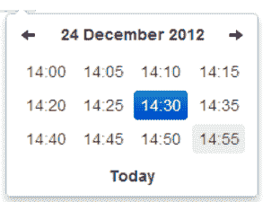

# 使用 datetimepicker 库设置Bootstrap程序计时器

> 原文：<https://www.javatpoint.com/setting-of-bootstrap-timepicker-using-datetimepicker-library>

在本节中，我们将使用 php 应用程序或 html 来添加 timepicker。在前一节中，我们已经学习了日期选择器插件来管理日期，但是很多时候我们的用户不仅想要选择日期，还想要选择时间。但幸运的是，我们的开发人员成功地找到了它，并为 Bootstrap 框架添加了许多有用的特性。其中一个功能允许我们使用日期选择器选择时间和日期。

如果我们想通过复制和粘贴代码来找到一个 timepicker，下面的代码将对我们有用。下面的代码显示了查找 timepicker 的完整代码。如果我们想使用这个代码，我们不需要安装任何东西。如果我们想找到一个时间选择器，我们必须使用非常流行的库，即 datetimepicker 库。使用这个库，我们还可以设置日期选择器。该库用于启用输入日期和时间的输入字段。

如果我们想选择日期和时间，这个库将非常有用，因为它提供了一种非常用户友好的方式。如果我们想在输入字段中添加日期选择器，并且我们的应用程序使用Bootstrap框架，我们可以通过使用[Bootstrap日期选择器](https://www.javatpoint.com/bootstrap-picker)的 jQuery 插件轻松添加它。在[Bootstrap](https://www.javatpoint.com/bootstrap-tutorial)日期选择器插件的帮助下，我们可以通过 [jQuery](https://www.javatpoint.com/jquery-tutorial) 在表单的输入元素中轻松添加日期选择器。为了从我们网站的表单域中选择日期和时间，这个插件将为我们提供一个添加 datetimepicker 弹出窗口的即时解决方案。用户可以选择使用 DateTimePicker 下拉菜单，只需点击一下，他们就可以轻松获得小时、分钟、年、月、日、秒等。

使用 datetimepicker，我们不必手动输入输入字段来查找日期和时间。我们将使用“日期时间选择器”对话框并选择日期和时间。如果我们的代码需要构建 timepicker 和 datetimepicker，我们可以使用 datetime picker 库来设置它们。在我们的示例中，我们设置了“HH:mm”格式，这是我们的自定义格式。如果我们想添加另一种格式，如“HH:mm:ss”，我们也可以这样做。

**示例:**

```

<html lang="en">
<head>
    <title> Example of Bootstrap Timepicker </title>  
    <link href="https://maxcdn.bootstrapcdn.com/bootstrap/3.3.6/css/bootstrap.min.css" rel="stylesheet">
    <script src="http://ajax.googleapis.com/ajax/libs/jquery/1.9.1/jquery.js"></script>
    <script src="https://maxcdn.bootstrapcdn.com/bootstrap/3.3.6/js/bootstrap.min.js"></script>  
    <script type="text/javascript" src="https://cdnjs.cloudflare.com/ajax/libs/moment.js/2.9.0/moment.min.js"></script>
    <link href="https://cdnjs.cloudflare.com/ajax/libs/bootstrap-datetimepicker/4.17.37/css/bootstrap-datetimepicker.min.css" rel="stylesheet">
    <script src="https://cdnjs.cloudflare.com/ajax/libs/bootstrap-datetimepicker/4.17.37/js/bootstrap-datetimepicker.min.js"></script>  
</head>
<body>

<div class="container" style="margin-top: 20px">
    <div style="position: relative">
        <input class="form-control" type="text" id="time"/>
    </div>
</div>

<script>
    $('#time').datetimepicker({
        format: 'HH:mm'
    });
</script>

</body>
</html>

```

当我们执行上述代码时，我们将看到以下输出:



* * *