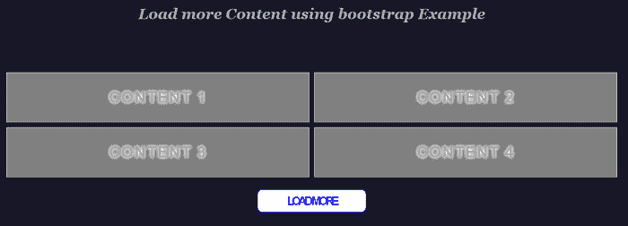
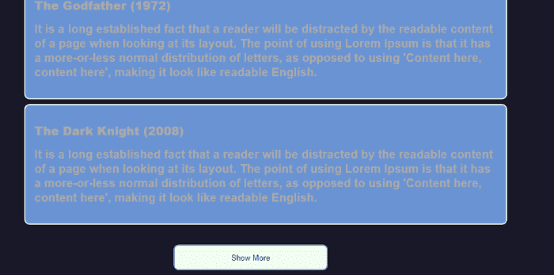
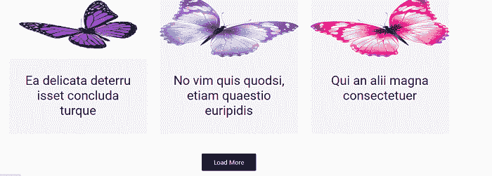

# 在Bootstrap中加载更多功能

> 原文：<https://www.javatpoint.com/load-more-feature-in-bootstrap>

在本文中，我们将学习如何使用**“使用Bootstrap**加载更多内容功能。”

首先，我们将学习 Bootstrap 的一些基础知识，加载更多的功能，然后，我们将学习一些如何使用 Bootstrap 创建加载更多选项的示例。

### 你说的Bootstrap是什么意思？

[bootstrap](https://www.javatpoint.com/bootstrap-tutorial) 用于在 [HTML](https://www.javatpoint.com/html-tutorial) 文档中添加类似级联样式表的设计。Bootstrap 的最新版本是[T5【Bootstrap 4T7】。它可以免费下载和使用。](https://www.javatpoint.com/bootstrap-4)

### 你说的加载更多是什么意思？

加载更多功能用于加载网页上更多可用的内容。最初，页面上只显示一些内容，当我们单击加载更多按钮时，剩余的内容将加载到浏览器中。

**让我们举一些如何在 Bootstrap 中创建 Load more 功能的例子。**

### 例 1:

```

<! DOCTYPE html>
<html>
<head>
<title>
Load more bootstrap Example
</title>
<meta name="viewport" content="width=device-width, initial-scale=1">
<style>
* {
  margin: 0;
  padding: 0;
}
body {
  margin: 0;
  padding: 0;
}
.flex {
  display: flex;
  flex-wrap: wrap;
  justify-content: center;
  align-items: center;
}
h2 {
  font-weight: bold;
  margin-bottom: 2.5rem;
  color: #aaa;
  align: center;
  font-size: 30px;
  margin-top: 1.5rem;
  font-weight: 1000;
}
p {
font-weight: bold;
  margin-bottom: 2.5rem;
  color: #aaa;
  align: center;
  font-size: 20px;
  margin-top: 1.5rem;
  font-weight: 1000;
}
h3 {
  font-weight: bold;
  margin-bottom: 2.5rem;
  color: #aaa;
  align: center;
  font-size: 30px;
  margin-top: 1.5rem;
  font-weight: 1000;
}
body {
  background: #191828;
 color: #aaa;
  font-family: "Roboto", Arial, Helvetica, sans-serif;
  font-size: 16px;
  font-weight: 300;
  letter-spacing: 0.01em;
  line-height: 1.6em;
  margin-top: 30;
}
  .content {
  height: 100px;
  width: 45%;
  color: #fff;
  font-size: 24px;
  line-height: 100px; /* centering text just for view */
  text-align: center;
  background-color: grey;
  margin: 5px;
  border: 1px solid lightgrey;
  display: none;
}
#loadMore {
  width: 200px;
  color: #fff;
  display: block;
  text-align: center;
  margin: 20px auto;
  padding: 10px;
  border-radius: 10px;
  border: 1px solid transparent;
  background-color: blue;
  transition: .3s;
}
#loadMore:hover {
  color: blue;
  background-color: #fff;
  border: 1px solid blue;
  text-decoration: none;
}
.noContent {
  color: #000 !important;
  background-color: transparent !important;
  pointer-events: none;
}
a:active {
text-decoration: none;
}
a {
color: #aaa;
text-decoration: none;
font-size: 2rem;		
}
a:visited {
text-decoration: none;
}
#loadMore {
  text-align: center;
  font-size: 1.5em;
  color: #fff;
  letter-spacing: -5px;
  font-weight: 700;
  text-transform: uppercase;
  animation: blur .75s ease-out ;
  text-shadow: 0px 0px 5px #fff, 0px 0px 7px #fff;
}
.content {
  text-align: center;
  font-size: 1.5em;
  color: #fff;
  letter-spacing: 2px;
  font-weight: 700;
  text-transform: uppercase;
  animation: blur .7s ease-out ;
  text-shadow: 0px 0px 5px #fff, 0px 0px 7px #fff;
}
em {
  font-family: Georgia, serif;
  line-height: 1.6;
}
@keyframes blur {
  from {
    text-shadow:0px 0px 10px #fff,
      0px 0px 10px #fff, 
      0px 0px 25px #fff,
      0px 0px 25px #fff,
      0px 0px 25px #fff,
      0px 0px 25px #fff,
      0px 0px 25px #fff,
      0px 0px 25px #fff,
      0px 0px 50px #fff,
      0px 0px 50px #fff,
      0px 0px 50px #7B96B8,
      0px 0px 150px #7B96B8,
      0px 10px 100px #7B96B8,
      0px 10px 100px #7B96B8,
      0px 10px 100px #7B96B8,
      0px 10px 100px #7B96B8,
      0px -10px 100px #7B96B8,
      0px -10px 100px #7B96B8;
  }
}
</style>
</head>
<body>
<h3 align="center"> <em> Example </em> </h3> 		   
<h2 align="center"> <em> Load more Content using bootstrap Example </em> </h2>  
<br /> <br />  
<div class="container">
  <div class="flex">
<div class="content"> <a href="#"> Content 1 </a> </div>
    <div class="content"> <a href="#"> Content 2 </a> </div>
    <div class="content"> <a href="#"> Content 3 </a> </div>
    <div class="content"> <a href="#"> Content 4 </a> </div>
    <div class="content"> <a href="#"> Content 5 </a> </div>
    <div class="content"> <a href="#"> Content 6 </a> </div>
    <div class="content"> <a href="#"> Content 7 </a> </div>
    <div class="content"> <a href="#"> Content 8 </a> </div>
    <div class="content"> <a href="#"> Content 9 </a> </div>
    <div class="content"> <a href="#"> Content 10 </a> </div>
    <div class="content"> <a href="#"> Content 11 </a> </div>
    <div class="content"> <a href="#"> Content 12 </a> </div>
    <div class="content"> <a href="#"> Content 13 </a> </div>
    <div class="content"> <a href="#"> Content 14 </a> </div>
    <div class="content"> <a href="#"> Content 15 </a> </div>
    <div class="content"> <a href="#"> Content 16 </a> </div>
  </div>
   <a href = "#" id = "loadMore"> Load More </a>
</div>
<script src ="https://cdnjs.cloudflare.com/ajax/libs/jquery/3.2.1/jquery.min.js"> </script>
<script src ="https://cdnjs.cloudflare.com/ajax/libs/jqueryui/1.12.1/jquery-ui.min.js"> </script>
<script>
$(document).ready (function () {
  $(".content").slice(0, 4).show();
  $("#loadMore").on("click", function(e){
    e.preventDefault();
    $(".content:hidden").slice(0, 4).slideDown();
    if ($(".content:hidden").length == 0) {
      $("#loadMore").text("No Content").addClass("noContent");
    }
  });
  })
</script>
</body>
</html>

```

[Test it Now](https://www.javatpoint.com/oprweb/test.jsp?filename=load-more-feature-in-bootstrap1)

**说明:**

在这个例子中，当我们点击加载更多按钮时，内容被加载。

**输出:**

以下是该示例的输出:



### 例 2:

```

<! DOCTYPE html>
<html>
<head>
<title>
Load more bootstrap Example
</title>
<meta name="viewport" content="width=device-width, initial-scale=1">
<style>
html {
    font-family: Arial, Helvetica, sans-serif;
}
* {
    font-family: Arial, Helvetica, sans-serif;
}
em {
  font-family: Georgia, serif;
  line-height: 1;
}
body {
  background: #191828;
 color: #aaa;
  font-family: "Roboto", Arial, Helvetica, sans-serif;
  font-size: 16px;
  font-weight: 300;
  letter-spacing: 0.01em;
  line-height: 1.6em;
  margin-top: 20;
   }
h2 {
  font-weight: bold;
  margin-bottom: 1rem;
  color: #aaa;
  align: center;
  font-size: 30px;
  margin-top: 1.5rem;
  font-weight: 1000;
}
p {
font-weight: bold;
  margin-bottom: 1rem;
  color: #aaa;
  align: center;
  font-size: 20px;
  margin-top: 1rem;
  font-weight: 600;
}
h4 {
font-weight: bold;
  margin-bottom: 1rem;
  color: #aaa;
  align: center;
  font-size: 20px;
  margin-top: 1rem;
  font-weight: 1000;
}
h1 {
    font-weight: bold;

  color: #aaa;
  align: center;
  font-size: 30px;

  font-weight: 1000;
    text-align: center;
}
#container {
    width: 60%;
    padding: 1em;
    margin: auto;
}
.result {
    background-color: #6a93d4;
    width: 100%;
    padding: 1em;
    margin: 0.5em;
    -webkit-border-radius: 9px;
    -moz-border-radius: 9px;
    border-radius: 9px;
    border: solid 2px honeydew;
}
#showMoreTrigger:hover {
    background-color: honeydew;
    border: solid 2px #6a93d4;
    color: #052d6e
}
#showMoreTrigger {
    width: 100%;
    padding: 1em;
    background-color: #6a93d4;
    display: inline-block;
    border: solid 2px white;
    -webkit-border-radius: 9px;
    -moz-border-radius: 9px;
    border-radius: 9px;
    color: honeydew;
}
button:hover {
	color: #FFFFFF;
	background-color: #3494e6;
}
.form-box {
    width: 20%;
    text-align: center;
    margin: auto; 
}
button {
  box-sizing: border-box;
  height: 45px;
  display: inline-block;
  border: 3px solid #2F96EF;
  border-radius: 15px;
  padding: 10 15px;
  margin: 10px 0;
  transition: .2s;
}
</style>
</head>
<body>
<h2 align="center"> <em> Load more Content using bootstrap Example </em> </h2>  
<br /><br />  
<h1> <em> Best Movies Ever </em> </h1>
<div id="container"> </div>
<div class="form-box">
    <button id="showMoreTrigger"> Load More </button>
</div>
<script src ="https://cdnjs.cloudflare.com/ajax/libs/jquery/3.2.1/jquery.min.js"> </script>
<script src ="https://cdnjs.cloudflare.com/ajax/libs/jqueryui/1.12.1/jquery-ui.min.js"> </script>
<script>
var LoadMore = function(userOptions) {
  this.options = {
    "pageSize": 10,
    "dataUrl": "",
    "container": "#container",
    "triggerText": "Show More",
    "triggerLoadingText": "...loading",
    "trigger": "#showMoreTrigger",
    "callback": null
  };
  $.extend(this.options, userOptions);
  this._index = 0;
  this._itemsCurrentlyDisplayed = 0;
};
LoadMore.prototype.scrollToElement = function(selector, time, verticalOffset) {
  time = typeof(time) != 'undefined' ? time : 1000;
  verticalOffset = typeof(verticalOffset) != 'undefined' ? verticalOffset : 0;
  var element = $(selector);
  var offset = element.offset();
  var offsetTop = offset.top + verticalOffset;
  //if (navigator.userAgent.match(/(iPod|iPhone|iPad|Android)/)) {
  //setTimeout(function () {
  //        window.scrollTo(0, offsetTop);
  //    }, 100
  //);
  //} else {
  /*$('html,body').scrollTo(selector, {
    duration: 1500
  });*/
 $('html,body').animate({
      scrollTop: offsetTop
  }, 800, function(){
      $('html,body').clearQueue();
  });
  //}
};
LoadMore.prototype.loadData = function() {
  var self = this;
  self.triggerFeedback(true);
  $.getJSON(self.options.dataUrl,
    function(data) {
      self.triggerFeedback(false);
      var totalResults = data.results.length;
      var items = [];
      var dataArr = data.results.splice(self._index, self.options.pageSize);
      if (dataArr.length > 0) {
        $.each(dataArr, function(key, val) {
          items.push("<div class='result'><h4>" + val.title + "</h4>" + "<p>" + val.description + "</p></div>");
        });
        $(items.join("")).appendTo(self.options.container);
        var scrollToEl = $(".result").get(self._index);
        self._index += self.options.pageSize;
        if (scrollToEl) {
          // occurs only when not the initial
          // load of data
          self.scrollToElement(scrollToEl);
        }
        self._itemsCurrentlyDisplayed += dataArr.length;
        if (self._itemsCurrentlyDisplayed >= totalResults) {
          self._trigger.hide();
        }
        if (self.options.callback != null) {
          self.options.callback();
        }
      }
    });
};
LoadMore.prototype.triggerFeedback = function(isLoading) {
  if (isLoading) {
    this._trigger.text(this.options.triggerLoadingText);
  } else {
    this._trigger.text(this.options.triggerText);
  }
};
LoadMore.prototype.init = function() {
  var self = this;
  $(document).ready(
    function() {
      self._trigger = $(self.options.trigger);
      self.loadData();
      self._trigger.on("click", function() {
        self.loadData();
      });
    });
};
// example usage
var loadMore = new LoadMore({
  "dataUrl": "https://s3-us-west-2.amazonaws.com/s.cdpn.io/173252/data.json",
  "pageSize": 3
});
loadMore.init();
</script>
</body>
</html>

```

[Test it Now](https://www.javatpoint.com/oprweb/test.jsp?filename=load-more-feature-in-bootstrap2)

**说明:**

在这个例子中，当我们点击加载更多按钮时，内容被加载。

**输出:**

以下是该示例的输出:



### 例 3:

```

<! DOCTYPE html>
<html>
<head>
<meta charset="utf-8">
<title> Load more bootstrap Example </title>
<link href="https://fonts.googleapis.com/css?family=Roboto" rel="stylesheet">
<link rel="stylesheet" href="https://maxcdn.bootstrapcdn.com/bootstrap/4.0.0/css/bootstrap.min.css">
<style>
p {
    margin: 0 0 10px;
    font-family: 'Roboto', sans-serif;
}
p, pre {
    margin: 0 0 1em 0;
}
a, a:link, a:focus, a:active, a:visited {
    outline: 0;
}
a, a:link, a:focus, a:active, a:visited {
    outline: 0;
}
img {
    border: 0;
    -ms-interpolation-mode: bicubic;
}
.interior.container .row {
    display: flex;
    flex-wrap: wrap;
    justify-content: space-between;
}
.blogBox {
    margin-bottom: 30px;
    box-sizing: border-box;
}
.blogBox .item {
    background: #f4f4f4;
    -webkit-transition: all 0.15s ease-in-out;
    transition: all 0.15s ease-in-out;
    height: 100%;
}
.blogBox .item:hover {
    background: #e8e8e8;
    cursor: pointer;
}
.blogBox .item img {
    width: 100%;
}
.blogBox .item p {
    padding-bottom: 40px;
}
.blogBox .item .blogTxt {
    padding: 25px;
}
.blogBox .item h2 {
    margin: 15px 0;
    font-family: 'Roboto', sans-serif;
}
.blogBox .item .blogCategory a {
    padding: 5px 10px 2px;
    border: 1px solid #616161;
    color: #616161;
    text-transform: uppercase;
    font-size: 14px;
    font-family: 'Roboto', sans-serif;
    -webkit-transition: all 0.15s ease-in-out;
    transition: all 0.15s ease-in-out;
}
.blogBox .item .blogCategory a:hover {
    background: #616161;
    color: #fff;
    text-decoration: none;
}
#loadMore {
    padding-bottom: 30px;
    padding-top: 30px;
    text-align: center;
    width: 100%;
}
#loadMore a {
    background: #042a63;
    border-radius: 3px;
    color: white;
    display: inline-block;
    padding: 10px 30px;
    transition: all 0.25s ease-out;
    -webkit-font-smoothing: antialiased;
}
#loadMore a:hover {
    background-color: #021737;
  text-decoration: none;
}
@media screen and (min-width: 1200px) {
	.blogBox .featured h2 {
		font-size: 42px;
	}
}
@media screen and (min-width: 991px) {
	.blogBox .featured h2 {
		font-size: 30px;
		font-style: italic;
	}	
	.blogBox .featured .blogTxt {
		max-width: 50%;
		width: 100%;
		padding: 50px;
		float: left;
		background: inherit;
		min-height: 378px;
	}
	.blogBox .featured img {
		max-width: 50%;
		width: 100%;
		float: left;
		min-height: 378px;
	}
}
@media screen and (min-width: 768px) {
	.blogBox .item img {
		height: 152px;
	}
}
</style>
<script src="https://ajax.googleapis.com/ajax/libs/jquery/3.5.1/jquery.min.js"> </script>
<script>
$( document ).ready(function () {
		$(".moreBox").slice(0, 3).show();
		if ($(".blogBox:hidden").length != 0) {
			$("#loadMore").show();
		}		
		$("#loadMore").on('click', function (e) {
			e.preventDefault();
			$(".moreBox:hidden").slice(0, 6).slideDown();
			if ($(".moreBox:hidden").length == 0) {
				$("#loadMore").fadeOut('slow');
			}
		});
	});
</script>
</head>
<body>
<center>
<div class="interior container clearfix">
   <div class="row"> 
      <div class="col-xs-12 col-sm-6 col-md-12 blogBox">
         <div class="item featured">
            
            <div class="blogTxt">
                <h2>
                  Eu qui dolore altera, saepe molestie accusamus
               </h2>
              </div>
         </div>
      </div>
      <div class="col-xs-12 col-sm-6 col-md-4 blogBox moreBox" >
         <div class="item">
            
            <div class="blog?>
               <h2>
                  Ea delicata deterru isset concluda turque
               </h2>

            </div>
         </div>
      </div>
      <div class="col-xs-12 col-sm-6 col-md-4 blogBox moreBox" >
         <div class="item">
            
            <div class="blogTxt">  
               <h2>
                  No vim quis quodsi, etiam quaestio euripidis
               </h2>
      </div>
         </div>
      </div>
      <div class="col-xs-12 col-sm-6 col-md-4 blogBox moreBox" >
         <div class="item">
            
            <div class="blogTxt">
                <h2>
                  Qui an alii magna consectetuer
               </h2>  
            </div>
         </div>
      </div>
      <div class="col-xs-12 col-sm-6 col-md-4 blogBox moreBox" style="display: none;">
         <div class="item">
            
            <div class="blogTxt">
                 <h2>
                  Integre voluptatum cu quo iriure docendi senserit
               </h2> 
            </div>
         </div>
      </div>
      <div class="col-xs-12 col-sm-6 col-md-4 blogBox moreBox" style="display: none;">
         <div class="item">
            
            <div class="blogTxt">
            <h2>
                  Pro brute causae aliquip ad
               </h2>
      </div>
         </div>
      </div>
  <div id="loadMore" style="">
         <a href="#"> Load More </a>
      </div>
</div>
</div>
</center>
</body>
</html>

```

[Test it Now](https://www.javatpoint.com/oprweb/test.jsp?filename=load-more-feature-in-bootstrap3)

**说明:**

在这个例子中，当我们点击加载更多按钮时，内容被加载。

**输出:**

以下是该示例的输出:



* * *