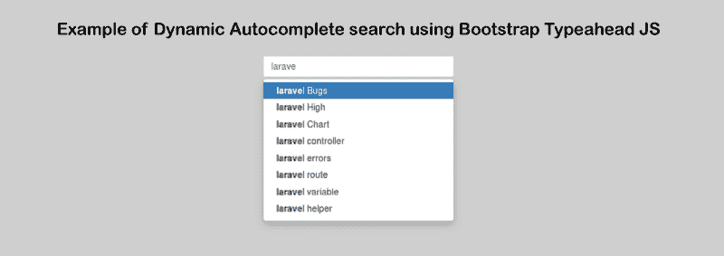

# 使用 Bootstrap 式提前键入的动态自动完成搜索示例

> 原文：<https://www.javatpoint.com/dynamic-autocomplete-search-using-bootstrap-typeahead-js-example>

在本节中，我们将使用 Bootstrap Typeahead JS，这样我们就可以执行动态自动完成搜索。Typeahead 也可以称为自动提示或自动完成。它是一种用于语言预测的工具。这个工具被许多搜索界面使用。当顾客在搜索栏里输入一些东西时，他们会得到一些建议。当用户在搜索栏中键入时，Typeahead 提供预测。

现代网络表单有非常流行的搜索工具，即提前输入字段。Typeahead 常用于改善用户体验。该工具查看用户在搜索或填写表单时输入的文本。在这些基础上，Typeahead 为用户提供了提示和可能选择的列表。搜索可以是任何类型。当我们使用 Typeahead 时，我们将减少潜在的错误，我们也可以节省时间，因为在使用它时，用户将有更少的拼写错误。

首先，我们将使用 ajax.html 文件创建 [html](https://www.javatpoint.com/html-tutorial) 布局。我们将在 ajax.html 文件中添加提前键入的 [JQuery](https://www.javatpoint.com/jquery-tutorial) 和 [Bootstrap](https://www.javatpoint.com/bootstrap-tutorial) 的代码。如果我们试图在输入框中写一些东西，我们能够获得动态自动完成搜索。使用 Ajax 请求是可能的。因此，ajax.html 文件将首先使用以下代码创建:

**ajax.html:**

```

<html lang="en">
<head>
    <title> Example of Bootstrap Typeahead with Ajax </title>  
    <link href="https://maxcdn.bootstrapcdn.com/bootstrap/3.3.6/css/bootstrap.min.css" rel="stylesheet">
    <script src="http://ajax.googleapis.com/ajax/libs/jquery/1.9.1/jquery.js"></script>
    <script src="https://cdnjs.cloudflare.com/ajax/libs/bootstrap-3-typeahead/4.0.1/bootstrap3-typeahead.min.js"></script>  
</head>
<body>

<div class="row">
	<div class="col-md-12 text-center">
		<br/>
		<h1> Example of Dynamic Autocomplete search using Bootstrap Typeahead JS</h1>	
			<input class="typeahead form-control" style="margin:0px auto;width:300px;" type="text">
	</div>
</div>

<script type="text/javascript">

	$('input.typeahead').typeahead({
	    source:  function (query, process) {
        return $.get('/ajaxpro.php', { query: query }, function (data) {
        		console.log(data);
        		data = $.parseJSON(data);
	            return process(data);
	        });
	    }
	});

</script>
</body>
</html>

```

现在我们的例子需要 [JSON](https://www.javatpoint.com/json-tutorial) 数据。我们将通过创建一个新页面和 Ajax 请求来实现这一点。在下面的例子中，我们将创建一个多页的 ajaxpro.php 文件。之后，我们将添加以下代码:

**ajxpro . PHP:**

```

<?php

	define (DB_USER, "root");
	define (DB_PASSWORD, "root");
	define (DB_DATABASE, "learn");
	define (DB_HOST, "localhost");
	$mysqli = new mysqli(DB_HOST, DB_USER, DB_PASSWORD, DB_DATABASE);

	$sql = "SELECT items.title FROM items 
			WHERE title LIKE '%".$_GET['query']."%'
			LIMIT 10"; 
	$result = $mysqli->query($sql);

	s$json = [];
	while($row = $result->fetch_assoc()){
	     $json[] = $row['title'];
	}

	echo json_encode($json);

```

我们上面的代码已经可以运行了。当我们运行这段代码时，我们将获得以下输出:



* * *