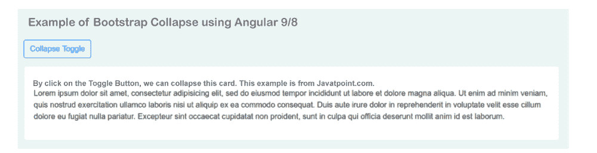

# 使用角度 9/8 的引导折叠

> 原文：<https://www.javatpoint.com/bootstrap-collapse-using-angular-9-8>

在本节中，我们将了解引导崩溃。我们将使用 Angular 9 或 Angular 8 来实现这一点。Bootstrap 提供了 Ng Bootstrap 的工具，它还提供了 Bootstrap 3 和 Bootstrap 4 的原生 Angular 指令，如按钮、工具提示、模型、分页、折叠、日期选择器等。 [Bootstrap](https://www.javatpoint.com/bootstrap-tutorial) UI 也可以借助 Ng Bootstrap 轻松使用。在下面的示例中，将创建折叠，我们将在应用程序中使用它。要在我们的[角度](https://www.javatpoint.com/angularjs-tutorial)应用程序中执行引导折叠，分步过程描述如下:

**第一步:**

在这一步中，我们将创建新的应用程序。以下命令将用于创建新的 Angular 应用程序。

```

ng new my-new-app

```

**第二步:**

第二步，我们将安装[引导程序 4](https://www.javatpoint.com/bootstrap-4) 。这里，将安装 Bootstrap 的核心包。为了安装这个，将使用 Bootstrap [CSS](https://www.javatpoint.com/css-tutorial) 。以下命令用于安装:

```

npm install bootstrap --save

```

当我们成功安装它时，我们必须添加像“node _ modules/Bootstrap/dist/CSS/Bootstrap . min . CSS”这样的 Bootstrap CSS。为此，我们将使用 angular.json 文件，并在其中添加以下代码:

**角。json**

```

.....
    "styles": [
      "node_modules/bootstrap/dist/css/bootstrap.min.css",
      "src/styles.css"
    ],
.....

```

**第三步:**

在这一步中，我们将安装引导程序。这里将安装 Ng Bootstrap 的软件包。为了安装这个，将使用引导用户界面。以下内容用于安装:

```

npm install --save @ng-bootstrap/ng-bootstrap

```

**第四步:**

在这一步中，我们将安装模块。在这里，我们将使用一个名为 app.module.ts 的文件，并将 NgModule 导入其中，如下所示:

**src/app/app.module.ts**

```

import { ModuleOfBrowser } from '@angular/platform-browser';
import { NgModule } from '@angular/core';

import { AppComponent } from './app.component';

import {ModuleOfNgb} from '@ng-bootstrap/ng-bootstrap';

@NgModule({
  declarations: [
    AppComponent
  ],
  imports: [
    ModuleOfBrowser, 
    ModuleOfNgb
  ],
  providers: [],
  bootstrap: [AppComponent]
})
export class AppModule { }

```

**第五步:**

在这一步中，我们将更新视图文件。在这里，我们将使用 HTML 文件，并更新该文件。在本文中，我们还将创建一个 Bootstrap 崩溃的示例，描述如下:

**src/app/app . component . html**

```

<div class="container">

<h1> Example of Bootstrap Collapse using Angular 9/8 </h1>

<p>
  <button type="button" class="btn btn-outline-primary" (click)="isCollapsed = !isCollapsed"
          [attr.aria-expanded]="!isCollapsed" aria-controls="collapseExample">
    Collapse Toggle
  </button>
</p>
<div id="collapseExample" [ngbCollapse]="isCollapsed">
  <div class="card">
    <div class="card-body">
      By click on the Toggle Button, we can collapse this card. This example is from Javatpoint.com.
    </div>
  </div>
</div>

</div>

```

**第六步:**

在这一步中，我们将更新 ts 文件。在这里，我们将使用我们的 app.component.ts 文件，并像这样更新该文件:

**src/app/app.component.ts**

```

import { Component } from '@angular/core';

@Component({
  selector: 'app-root',
  templateUrl: './app.component.html',
  styleUrls: ['./app.component.css']
})
export class AppComponent {
  title = 'appBootstrap';

  public isCollapsed = false;

  constructor() {}

}

```

现在我们上面的代码可以运行了。为了运行上述代码，我们将使用以下命令:

```

ng serve

```

当我们运行此命令时，将生成以下输出:



* * *