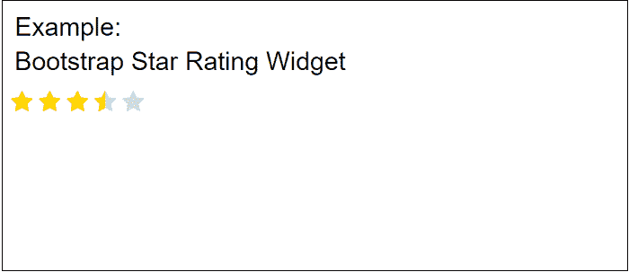
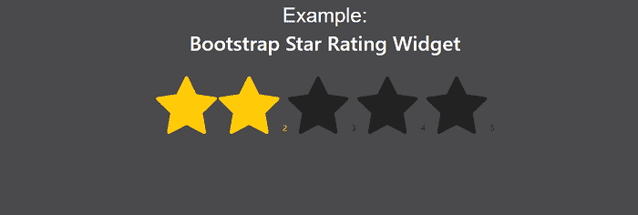
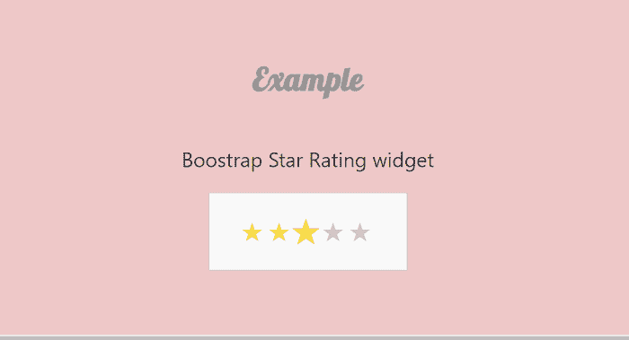

# Bootstrap 评级小部件

> 原文：<https://www.javatpoint.com/bootstrap-rating-widget>

在本文中，我们将在 Bootstrap 的帮助下创建一个星级小部件。首先，我们将学习 Bootstrap 评级小部件的一些基本含义。之后，我们将借助一些示例来学习如何实现 Bootstrap 评级小部件。

**你说的 Bootstrap 评级小部件是什么意思？**

[Bootstrap](https://www.javatpoint.com/bootstrap-tutorial) 星级小部件可以让用户分享他们对产品、文档页面、照片等的看法。这是一种显示用户对任何产品或服务的反应或反馈的技术。

### 例 1:

```

<! DOCTYPE html>
<html>
<head>
<meta name="viewport" content="width=device-width, initial-scale=1">
<meta charset="UTF-8">
<title>  Bootstrap Rating widget
</title>
<link href="https://maxcdn.bootstrapcdn.com/bootstrap/4.0.0-alpha.6/css/bootstrap.min.css" rel="stylesheet" integrity="sha384-rwoIResjU2yc3z8GV/NPeZWAv56rSmLldC3R/AZzGRnGxQQKnKkoFVhFQhNUwEyJ" crossorigin="anonymous">
<link rel="stylesheet" href="https://cdnjs.cloudflare.com/ajax/libs/font-awesome/4.7.0/css/font-awesome.min.css">
<style>
fieldset
 { 
margin: 0;
 padding: 0; 
}
label { 
margin: 0; 
padding: 0; 
}
body {
 margin: 20px; 
align: center;
}
h1 { 
font-size: 1.5em; 
margin: 10px;
 }
/***** Style Star Rating Widget *****/
.rating { 
  border: none;
  float: left;
  text-align: center;
}
h1 {
  position: relative;
  padding: 0;
  margin: 10;
  font-family: "Raleway", sans-serif;
  font-weight: 300;
  font-size: 40px;
  color: #080808;
  -webkit-transition: all 0.4s ease 0s;
  -o-transition: all 0.4s ease 0s;
  transition: all 0.4s ease 0s; 
}
h2 {
  position: relative;
  padding: 0;
  margin: 10;
  font-family: "Raleway", sans-serif;
  font-weight: 300;
  font-size: 40px;
  color: #080808;
  -webkit-transition: all 0.4s ease 0s;
  -o-transition: all 0.4s ease 0s;
  transition: all 0.4s ease 0s; 
}
.rating > input { 
display: none; 
text-align: center;
} 
.rating > label:before { 
  margin: 5px;
  font-size: 2.25em;
  font-family: FontAwesome;
  display: inline-block;
  content: "\f005";
}
.rating > .half:before { 
  content: "\f089";
  position: absolute;
}
.rating > label { 
  color: #ddd; 
 float: right; 
}
/***** CSS Magic to Highlight Stars on Hover *****/
.rating > input:checked ~ label { color: #FFD700;  }
.rating:not(:checked) > label:hover { color: #FFD700;  }
.rating:not(:checked) > label:hover ~ label { color: #FFD700;  } 
.rating > input:checked + label:hover { color: #FFED85;  }
.rating > input:checked ~ label:hover { color: #FFED85;  }
 .rating > label:hover ~ input:checked ~ label { color: #FFED85;  }
.rating > input:checked ~ label:hover ~ label { color: #FFED85;  }
</style>
<body>
<h1> Example: </h1>
<fieldset class="rating" align="center">
    <input type="radio" id="star5" name="rating" value="5" />
<label class = "full" for="star5" title="Awesome - 5 stars">
</label>
    <input type="radio" id="star4half" name="rating" value="4 and a half" />
<label class="half" for="star4half" title="Pretty good - 4.5 stars">
</label>
    <input type="radio" id="star4" name="rating" value="4" />
<label class = "full" for="star4" title="Pretty good - 4 stars">
</label>
    <input type="radio" id="star3half" name="rating" value="3 and a half" />
	<label class="half" for="star3half" title="Meh - 3.5 stars">
</label>
    <input type="radio" id="star3" name="rating" value="3" />
<label class = "full" for="star3" title="Meh - 3 stars">
</label>
    <input type="radio" id="star2half" name="rating" value="2 and a half" />
<label class="half" for="star2half" title="Kinda bad - 2.5 stars">
</label>
    <input type="radio" id="star2" name="rating" value="2" />
<label class = "full" for="star2" title="Kinda bad - 2 stars">
</label>
    <input type="radio" id="star1half" name="rating" value="1 and a half" />
<label class="half" for="star1half" title="Meh - 1.5 stars">
</label>
    <input type="radio" id="star1" name="rating" value="1" />
<label class = "full" for="star1" title="Sucks big time - 1 star">
</label>
    <input type="radio" id="starhalf" name="rating" value="half" />
<label class="half" for="starhalf" title="Sucks big time - 0.5 stars">
</label>
</fieldset>
</body>
</html>

```

**说明:**

在上面的例子中，我们在 Bootstrap 的帮助下创建了一个星级小部件。我们可以在输入字段**【输入类别=“评级”】中添加一个类别。**这将自动增加星级。当我们点击开始或悬停在星星上时，星星被选中。

**输出:**

以下是该示例的输出:



### 例 2:

```

<! DOCTYPE html>
<html>
<head>
<title>  Bootstrap Rating widget
</title>
<meta name="viewport" content="width=device-width, initial-scale=1">
<link href="https://maxcdn.bootstrapcdn.com/bootstrap/4.0.0-alpha.6/css/bootstrap.min.css" rel="stylesheet" integrity="sha384-rwoIResjU2yc3z8GV/NPeZWAv56rSmLldC3R/AZzGRnGxQQKnKkoFVhFQhNUwEyJ" crossorigin="anonymous">
<link rel="stylesheet" href="https://cdnjs.cloudflare.com/ajax/libs/font-awesome/4.7.0/css/font-awesome.min.css">
<style>
h1[alt="Simple"] {
color: white;
}
a[href]
{
color: grey; 
font-size: 0.5em; 
text-decoration: none
}
a[href]:hover {
color: grey; 
font-size: 0.5em;
text-decoration: none
}
body
{
  background: #4a4a4c !important;
}
.starrating > input {
display: none;
}  /* Remove radio buttons */
.starrating > label:before { 
  content: "\f005"; /* Star */
  margin: 2px;
  font-size: 8em;
  font-family: FontAwesome;
  display: inline-block; 
}
.starrating > label
{
  color: #222222; /* Start color when not clicked */
}
.starrating > input:checked ~ label
{ color: #ffca08 ; } /* Set yellow color when star checked */
.starrating > input:hover ~ label
{ color: #ffca08 ;  } 
h2 {
  position: relative;
  padding: 0;
  margin: 10;
  font-family: "Raleway", sans-serif;
  font-weight: 300;
  font-size: 40px;
  color: white;
  -webkit-transition: all 0.4s ease 0s;
  -o-transition: all 0.4s ease 0s;
  transition: all 0.4s ease 0s;
}
p {
  position: relative;
  padding: 0;
  margin: 20;
  font-family: "Raleway", sans-serif;
  font-weight: 100;
  font-size: 20px;
  color: black;
  -webkit-transition: all 0.4s ease 0s;
  -o-transition: all 0.4s ease 0s;
  transition: all 0.4s ease 0s;
}
</style>
</head>
<body>
<h2 class="text-center" alt="Simple"> Example: </h2>
<h1 class="text-center" alt="Simple"> Bootstrap Star Rating Widget </h1>
<div class="container">
        <div class="starrating risingstar d-flex justify-content-center flex-row-reverse">
            <input type="radio" id="star5" name="rating" value="" /> <label for="star5" title="5 star"> 5 </label>
            <input type="radio" id="star4" name="rating" value="4" /> <label for="star4" title="4 star"> 4 </label>
            <input type="radio" id="star3" name="rating" value="3" /> <label for="star3" title="3 star"> 3 </label>
            <input type="radio" id="star2" name="rating" value="2" /> <label for="star2" title="2 star"> 2 </label>
            <input type="radio" id="star1" name="rating" value="1" /> <label for="star1" title="1 star"> </label>
        </div>
  </div>	
</body>
</html>

```

**说明:**

在上面的例子中，我们在 Bootstrap 的帮助下创建了一个星级小部件。我们可以在输入字段**【输入类别=“评级”】中添加一个类别。**这将自动增加星级。当我们点击开始或悬停在星星上时，星星被选中。

**输出:**

以下是该示例的输出:



### 例 3:

```

<! DOCTYPE html>
<html lang="en" >
<head>
  <meta charset="UTF-8">
  <title> Bootstrap Star Rating </title>
  <link href='https://fonts.googleapis.com/css?family=Lobster' rel='stylesheet' type='text/css'>
<meta name="viewport" content="width=device-width, initial-scale=1">
  </head>
<style>
body h1 {
  font-family: 'Lobster', cursive;
  margin: 50px 20px 40px;
  font-size: 50px;
  letter-spacing: 0.5px;
  color: #999999;
  text-align: center;
}
.rating {
  width: 208px;
  height: 40px;
  margin: 0 auto;
  padding: 40px 50px;
  border: 1px solid #CCCCCC;
  background: #F9F9F9;
}
.rating label {
  float: right;
  position: relative;
  width: 40px;
  height: 40px;
  cursor: pointer;
}
.rating label:not(:first-of-type) {
  padding-right: 2px;
}
.rating label:before {
  content: "\2605";
  font-size: 42px;
  color: #CCCCCC;
  line-height: 1;
}
.rating input {
  display: none;
}
.rating input:checked ~ label:before 
{
 color: #F9DF4A;
}
.rating:not(:checked) > label:hover ~ label:before {
  color: #F9DF4A;
}
.rating:not(:checked) > label:hover:before {
 color: #F9DF4A;
}
body {
  align-items: center;
  background-color: rgba(201, 76, 76, 0.3);
  display: flex;
  flex-flow: column nowrap;
  height: 100vh;
  justify-content: center;
  width: 100%;
}
p {
  color: #333;
  font-family: 'segoe ui', sans-serif;
  font-size: 24pt;
  transition: transform .5s ease;
}
p:hover {
  transform: scale(1.5, 1.5);
}
rating label {
  color: lightgray;
  display: inline-block;
  font-size: 22pt;
  margin: 0 -2px;
  transition: transform .15s ease;
}
.rating label:hover {
  transform: scale(1.35, 1.35);
}
</style>
<body>
<h1> Example </h1>
  <p> Boostrap Star Rating widget </p>
<div class="rating">
    <input type="radio" id="star5" name="rating" value="5" />
	<label for="star5">
	</label>
    <input type="radio" id="star4" name="rating" value="4" />
	<label for="star4"></label>
    <input type="radio" id="star3" name="rating" value="3" />
	<label for="star3">
	</label>
    <input type="radio" id="star2" name="rating" value="2" />
	<label for="star2">
	</label>
    <input type="radio" id="star1" name="rating" value="1" />
	<label for="star1">
	</label>
</div>
</body>
</html>

```

**说明:**

在上面的例子中，我们在 Bootstrap 的帮助下创建了一个星级小部件。我们可以在输入字段**【输入类别=“评级”】中添加一个类别。**这将自动增加星级。当我们点击开始或悬停在星星上时，星星被选中。

**输出:**

以下是该示例的输出:



* * *