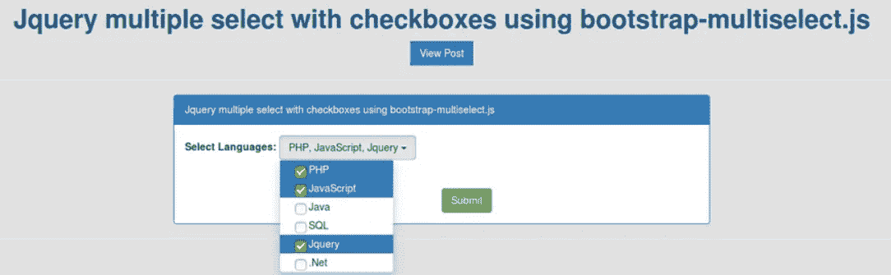

# Bootstrap - Jquery 使用 bootstrap-multiselect.js 插件使用复选框进行多选

> 原文:[https://www . javatpoint . com/bootstrap-jquery-多选-带复选框-使用-bootstrap-多选-js-plugin](https://www.javatpoint.com/bootstrap-jquery-multiple-select-with-checkboxes-using-bootstrap-multiselect-js-plugin)

在这一节中，我们将使用 bootstrap-multiselect.js 插件，这样我们就可以使用复选框选择多个下拉选项。我们将使用 Bootstrap 和 Jquery 来实现这一点。Bootstrap Jquery 使用 bootstrap-multiselect.js 的插件，这样用户可以选择多个复选框。Bootstrap 包含了很多插件，比如 colorpicker、datepicker、select with search 等。无论我们使用的是 Codeigniter 框架、Laravel 框架、Symfony 框架、PHP，还是 PHP 的任何其他[框架](https://www.javatpoint.com/top-10-php-frameworks)等，我们都很容易与我们的 [Bootstrap](https://www.javatpoint.com/bootstrap-tutorial) 项目进行集成。

[JQuery](https://www.javatpoint.com/jquery-tutorial) 插件由引导多选描述，用于创建多选下拉的组件。这个插件有很多特性，它是在推特引导框架的基础上创建的。通过在运行时使用引导-多选，简单的 HTML 选择可以很容易地转换成引导按钮。当我们点击该按钮时，下拉菜单将会打开，其中包含复选框。使用多选选项，用户可以一次选择多个选项。在下面的例子中，我们将使用 bootstrap-multiselect.js 查询的 Bootstrap 插件，这样我们就可以用下拉列表创建复选框。

bootstrap-multiselect.js 还提供了通过单选按钮、搜索等选择多种内容的功能。在下面的示例中，我们将提供多种语言的下拉框，并且我们可以根据需要通过复选框选择多种语言。这个例子非常简单，我们可以很容易地将我们当前的应用程序与下面的例子集成在一起。为了使用引导数据库 JQuery 执行带有复选框的多选下拉列表，分步过程描述如下:

**示例:**

```

<html lang="en">
<head>
  <title>Jquery multiple select with checkboxes using bootstrap-multiselect.js</title>
  <script src="http://ajax.googleapis.com/ajax/libs/jquery/1.9.1/jquery.js"></script>
  <link rel="stylesheet" href="https://maxcdn.bootstrapcdn.com/bootstrap/3.3.6/css/bootstrap.min.css">
  <script type="text/javascript" src="https://maxcdn.bootstrapcdn.com/bootstrap/3.3.6/js/bootstrap.min.js"></script>
  <script src="https://cdnjs.cloudflare.com/ajax/libs/bootstrap-multiselect/0.9.13/js/bootstrap-multiselect.js"></script>
  <link rel="stylesheet" href="https://cdnjs.cloudflare.com/ajax/libs/bootstrap-multiselect/0.9.13/css/bootstrap-multiselect.css">
</head>
<body>

<div class="container">
	<strong>Select Language:</strong>
    <select id="multiple-checkboxes" multiple="multiple">
        <option value="php">PHP</option>
        <option value="javascript">JavaScript</option>
        <option value="java">Java</option>
        <option value="sql">SQL</option>
        <option value="jquery">Jquery</option>
        <option value=".net">.Net</option>
    </select>
</div>

<script type="text/javascript">
    $(document).ready(function() {
        $('#multiple-checkboxes').multiselect();
    });
</script>

</body>
</html>

```

现在我们上面的代码可以运行了。当我们运行这段代码时，将生成以下输出:



* * *