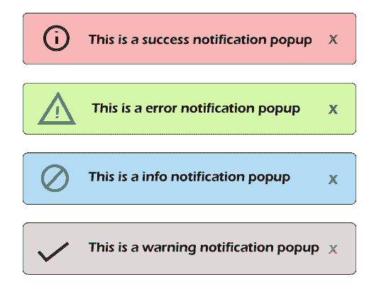

# 在Bootstrap程序中使用Bootstrap-咆哮 JS 插件的通知弹出框

> 原文：<https://www.javatpoint.com/notification-popup-box-using-bootstrap-growl-js-plugin-in-bootstrap>

在本节中，我们将学习通知弹出框。我们将使用Bootstrap咆哮 JS 插件来做到这一点。低吼是一种通知系统，在微软视窗系统、苹果操作系统中使用了几年。低吼通知系统用于最终用户向他们发送用户友好、无阻塞的通知弹出消息。当我们在项目中工作时，我们更喜欢使用通知。当我们执行一些操作时，我们总是需要收到通知警报，比如如果我们从任何网站或任何形式或任何地方删除项目，将会打开一个通知，其中会显示一条消息，如“项目已成功删除”。像这样，一些消息将在创建、列表、更新和其他项目操作中显示。当我们在用户面板或管理面板上工作时，这些通知警报将是强制性的。

如果在我们的项目中使用了 Bootstrap，我们可以简单地使用低吼 JS 插件。要使用它，我们不必添加 CSS 文件，我们将简单地添加 JS。当我们在项目中添加 bootstrap-low . js 插件时，它为我们提供了各种类型的通知，如错误、成功、警告、信息和许多功能。为了显示通知，我们还有很多选择。在我们之前的文章中，我们也展示了“使用 toastr JS 插件的 Laravel 通知消息弹出窗口”，但是在我们下面的应用程序中，我们将使用 Bootstrap-low JS 插件，因为它非常定制，并且非常容易与 Bootstrap 一起使用。为了添加通知，我们必须遵循一些步骤，如下所述:

**示例:**

```

<html lang="en">
<head>
    <title> Check For Notification Growl </title>
    <script type="text/javascript" src="//cdn.jsdelivr.net/jquery/1/jquery.min.js"></script>
    <link href="https://maxcdn.bootstrapcdn.com/bootstrap/3.3.6/css/bootstrap.min.css" rel="stylesheet">
    <script type="text/javascript" src="https://cdnjs.cloudflare.com/ajax/libs/bootstrap-growl/1.0.0/jquery.bootstrap-growl.min.js"></script>

</head>
<body>
<div class="container text-center">
    <br/>
        <h2> Check For Notification Growl </h2>
    <br/>
    <button class="success btn btn-success">Success</button>
    <button class="error btn btn-danger">Error</button>
    <button class="info btn btn-info">Info</button>
    <button class="warning btn btn-warning">Warning</button>
</div>  
<script type="text/javascript">
    $(".success").click(function(){
        $.bootstrapGrowl('This is a success notification popup',{
            type: 'success',
            delay: 2000,
        });
    });
    $(".error").click(function(){
        $.bootstrapGrowl('This is a error notification popup',{
            type: 'danger',
            delay: 2000,
        });
    });
    $(".info").click(function(){
        $.bootstrapGrowl('This is a info notification popup',{
            type: 'info',
            delay: 2000,
        });
    });
    $(".warning").click(function(){
        $.bootstrapGrowl('This is a warning notification popup',{
            type: 'warning',
            delay: 2000,
        });
    });
</script>
</body>
</html>

```

现在我们上面的代码可以运行了。当我们运行这段代码时，将生成如下输出:



* * *