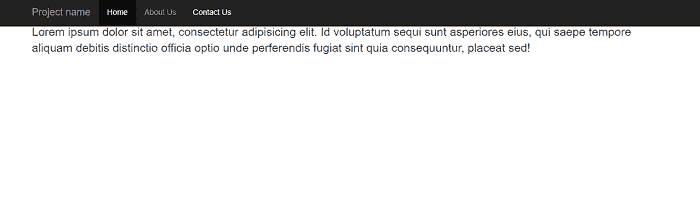
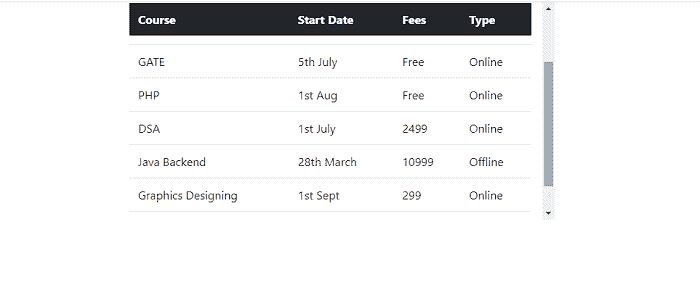
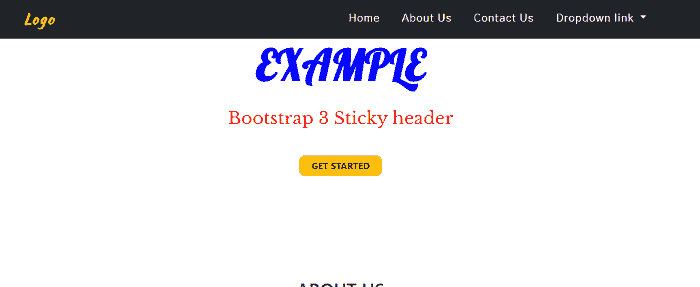

# bootstrap3 粘性标头

> 原文：<https://www.javatpoint.com/boostrap3-sticky-header>

在这篇文章中，我们将了解如何借助 Boostrap3 创建一个粘性头。首先，我们将了解 bootstrap 中的 bootstrap 和粘性头的基础知识。之后我们将借助例子学习这个概念。

### 你说的 Bootstrap3 是什么意思？

Bootstrap3 用于在 [HTML](https://www.javatpoint.com/html-tutorial) 文档中添加设计，类似于[层叠样式表](https://www.javatpoint.com/css-tutorial)。在 Bootsrap3 中，3 代表版本 [Bootstrap](https://www.javatpoint.com/html-tutorial) 。它可以免费下载和使用。

**以下链接用于将 Bootstrap 3 添加到模板。**

<link rel="stylesheet" href="https://maxcdn.bootstrapcdn.com/bootstrap/3.0.0/css/bootstrap.min.css">

### Bootstrap3 粘头是什么意思？

在 Bootstrap3 中，当导航栏想要固定在顶部位置，甚至页面向下滚动到底部时，使用粘性标题。这意味着导航栏总是固定在顶部。它也用于固定表头的位置。

**我们来举一下 Bootstrap3 粘性头的各种例子。**

### 例 1:

```

<! DOCTYPE html>
<html lang="en" >
<head>
  <meta charset="UTF-8">
  <title> Bootstrap 3 Sticky header </title>

<link href='https://fonts.googleapis.com/css?family=Lobster' rel='stylesheet' type= 'text/css'>
  <link href='https://maxcdn.bootstrapcdn.com/bootstrap/3.3.4/css/bootstrap.min.css' rel='stylesheet' type='text/css'>
<meta name="viewport" content="width=device-width, initial-scale=1">
  </head>
<style>
body {
  min-height: 2000px;
}
h1 {
	font-size:30px;
	text-align: center;
}
</style>
<script src="https://cdnjs.cloudflare.com/ajax/libs/jquery/2.1.3/jquery.min.js"> </script>
<script>
jQuery(document).ready(function($) {
    var navbar = $('#navbar-main'),
    		distance = navbar.offset().top,
        $window = $(window);
    $window.scroll(function() {
        if ($window.scrollTop() >= distance) {
            navbar.removeClass('navbar-fixed-top').addClass('navbar-fixed-top');
          	$("body").css("padding-top", "70px");
        } else {
            navbar.removeClass('navbar-fixed-top');
            $("body").css("padding-top", "0px");
        }
    });
});
</script>
<body>
<h1> Example </h1>
  <div class="container">
  <header class="page-header">
    <h1> Fixed <b> Navbar </b> by scrolling the page with <b> Bootstrap </b> </h1>
  </header>
</div>
<nav id="navbar-main" class="navbar navbar-inverse">
  <div class="container">
    <div class="navbar-header">
      <button type="button" class="navbar-toggle collapsed" data-toggle="collapse" data-target="#navbar" aria-expanded="false" aria-controls="navbar">
        <span class="sr-only">Toggle navigation</span>
        <span class="icon-bar"> </span>
        <span class="icon-bar"> </span>
        <span class="icon-bar"> </span>
      </button>
      <a class="navbar-brand" href="#"> Project name </a>
    </div>
    <div id="navbar" class="collapse navbar-collapse">
      <ul class="nav navbar-nav">
        <li class="active"> <a href="#"> Home </a> </li>
        <li> <a href="#about"> About Us </a> </li>
        <li> <a href="#contact"> Contact  Us </a> </li>
      </ul>
    </div>
  </div>
</nav>
<main class="container">
<p class="lead"> Lorem ipsum dolor sit amet, consectetur adipisicing elit. Id voluptatum sequi sunt asperiores eius, qui saepe tempore aliquam debitis distinctio officia optio unde perferendis fugiat sint quia consequuntur, placeat sed! </p>
</main>
</body>
</html>

```

**说明:**

在上面的例子中，我们已经在 Bootstrap3 的帮助下创建了一个固定的标题导航栏。

**输出:**

**下面是这个例子的输出。**



### 例 2:

```

<! DOCTYPE html>
<html lang="en">
<head>
	<meta charset="UTF-8" />
	<meta name="viewport" content="width=device-width, initial-scale=1.0" />
	<meta http-equiv="X-UA-Compatible" content="ie=edge" />
	<title> Bootstrap 3 sticky table header </title>
	<link rel="stylesheet" href=
"https://stackpath.bootstrapcdn.com/bootstrap/4.1.3/css/bootstrap.min.css" integrity="sha384-MCw98/SFnGE8fJT3GXwEOngsV7Zt27NXFoaoApmYm81iuXoPkFOJwJ8ERdknLPMO" crossorigin="anonymous" />
<script src="https://code.jquery.com/jquery-3.3.1.slim.min.js" integrity=
"sha384q8i/X+965DzO0rT7abK41JStQIAqVgRVzpbzo5smXKp4YfRvH+8abtTE1Pi6jizo" crossorigin="anonymous">
</script>
<script src= "https://cdnjs.cloudflare.com/ajax/libs/popper.js/1.14.3/umd/popper.min.js"
integrity = "sha384-ZMP7rVo3mIykV+2+9J3UJ46jBk0WLaUAdn689aCwoqbBJiSnjAK/l8WvCWPIPm49"
crossorigin="anonymous">
</script>
<script src= "https://stackpath.bootstrapcdn.com/bootstrap/4.1.3/js/bootstrap.min.js"
Integrity = "sha384-ChfqqxuZUCnJSK3+MXmPNIyE6ZbWh2IMqE241rYiqJxyMiZ6OW/JmZQ5stwEULTy"
crossorigin="anonymous">
</script>
<style>
.header {
position: sticky;
top:0;
margin-bottom: 20px;
}
.container {
  width: 600px;
 height: 300px;
overflow: auto;
text-align: center;
	}
	b {
margin-bottom: 20px;
padding-bottom: 30px;
color: red;
}
h1 {
color: blue;
}

	</style>
</head>
<body>
	<div class="container">
	<h1> Example </h1>
	<b> Bootstrap 3 sticky table header  </b>
	<table class="table">
	<thead style="position: sticky;top: 0" class="thead-dark">
	<tr>
	<th class="header" scope="col"> Course </th>
	<th class="header" scope="col"> Start Date </th>
	<th class="header" scope="col"> Fees </th>
	<th class="header" scope="col"> Type </th>
	</tr>
	</thead>
	<tbody>
	<tr>
	<td> UGC NET </td>
	<td> 21st Aug </td>
	<td> Free </td>
	<td> Online </td>
	</tr>
	<tr>
	<td> GATE </td>
	<td> 5th July </td>
	<td> Free </td>
	<td> Online </td>
	</tr>
     <tr>
	<td> PHP </td>
	<td> 1st Aug </td>
	<td> Free </td>
	<td> Online </td>
	</tr>
	<tr>
	<td> DSA </td>
	<td> 1st July </td>
	<td> 2499 </td>
	<td> Online </td>
	</tr>
	<tr>
	<td> Java Backend </td>
	<td> 28th March </td>
	<td> 10999 </td>
	<td> Offline </td>
	</tr>
	<tr>
	<td> Graphics Designing </td>
	<td> 1st Sept </td>
	<td> 299 </td>
	<td> Online </td>
	</tr>
        <tr>
	<td> WEB Development </td>
	<td> 1st Aug </td>
	<td> Free </td>
	<td> Online </td>
	</tr>
	</tbody>
	</table>
</body>
</html>	

```

**说明:**

在上面的例子中，我们在 Bootstrap3 的帮助下创建了一个固定的表头。

**输出:**

**下面是这个例子的输出。**



### 例 3:

```

<! DOCTYPE html>
<html lang="en" >
<head>
  <meta charset="UTF-8">
  <title> Bootstrap 3 Sticky header </title>
<link rel="stylesheet" href="https://stackpath.bootstrapcdn.com/bootstrap/4.4.1/css/bootstrap.min.css" integrity="sha384-Vkoo8x4CGsO3+Hhxv8T/Q5PaXtkKtu6ug5TOeNV6gBiFeWPGFN9MuhOf23Q9Ifjh" crossorigin="anonymous">
</head>
<style>
@import url('https://fonts.googleapis.com/css?family=Gothic+A1|Kaushan+Script|Libre+Baskerville|Lobster');
.body {
	font-family: 'Gothic A1', sans-serif;
	font-size: 16px;
	}
	p {
	color: #6c6c6f;
	font-size: 1em;
	}
	h1,h2,h3,h4,h5,h6 { color:#323233;
	text-transform: uppercase; }
.navbar-brand  span {
	color: #fed136;
	font-size: 25px;
	font-weight: 700;
  letter-spacing: 0.1em;
    font-family: 'Kaushan Script','Helvetica Neue',Helvetica,Arial,cursive;
}
.navbar-brand {
color: #fff;
font-size: 25px;
font-family: 'Kaushan Script','Helvetica Neue',Helvetica,Arial,cursive;
font-weight: 700;
letter-spacing: 0.1em;
}
.navbar-nav .nav-item .nav-link {
padding: 1.1em 1em!important;
font-size: 120%;
    font-weight: 500;
    letter-spacing: 1px;
    color: #fff;
   font-family: 'Gothic A1', sans-serif;
}
.navbar-nav .nav-item .nav-link:hover{ color: #fed136; }
.navbar-expand-md .navbar-nav .dropdown-menu {
border-top: 3px solid #fed136;
}
.dropdown-item:hover { 
background-color: #fed136;
color: #fff; }
nav { -webkit-transition: padding-top .3s,padding-bottom .3s;
    -moz-transition: padding-top .3s,padding-bottom .3s;
    transition: padding-top .3s,padding-bottom .3s;
    border: none;
	}
 .shrink {
    padding-top: 0;
    padding-bottom: 0;
    background-color: #212529;
}
.banner {
  text-align: center;
    color: #fff;
    background-repeat: no-repeat;
    background-attachment: scroll;
    background-position: center center;
    -webkit-background-size: cover;
    -moz-background-size: cover;
    -o-background-size: cover;
    background-size: cover;
}
.banner-text {
	padding:200px 0 150px 0;
}
.banner-heading {
	font-family: 'Lobster', cursive;
	font-size: 75px;
    font-weight: 700;
    line-height: 100px;
    margin-bottom: 30px;
	color: blue;
}
.banner-sub-heading {
	font-family: 'Libre Baskerville', serif;
	font-size: 30px;
    font-weight: 300;
    line-height: 30px;
    margin-bottom: 50px;
	color: red;
}
.btn-banner {
	padding: 5px 20px;
	border-radius: 10px;
	font-weight: 700;
	line-height: 1.5;
	text-align: center;
	color: #fff;
	text-transform: uppercase;
}
.text-intro {
	width: 90%;
	margin: auto;
	text-align: center;
	padding-top: 30px;
}
@media (max-width: 500px)
{
          .navbar-nav {
		background-color: #000;
		border-top: 3px solid #fed136;
		color: #fff;
		z-index: 1;
		margin-top: 5px;
		}
	.navbar-nav .nav-item .nav-link {
	padding: 0.7em 1em!important;
	font-size: 100%;
    font-weight: 500;
    }
	.banner-text {
	padding: 150px 0 150px 0;
}
.banner-heading {
	font-size: 30px;
    line-height: 30px;
    margin-bottom: 20px;
}
.banner-sub-heading {
    font-size: 10px;
    font-weight: 200;
    line-height: 10px;
    margin-bottom: 40px;
}
}
@media (max-width:768px) {
	.banner-text {
	padding:150px 0 150px 0;
}
.banner-sub-heading {
    font-size: 23px;
    font-weight: 200;
    line-height: 23px;
    margin-bottom: 40px;
}
}
</style>
<script src="https://cdnjs.cloudflare.com/bootstrap/4.0.0/js/bootstrap.min.js"> </script>
<script src="https://cdnjs.cloudflare.com/ajax/libs/jquery/3.2.1/jquery.min.js"> </script>
<script>
	$(document).on("scroll", function() {
		if($(document).scrollTop() > 86){
		  $("#banner").addClass("shrink");
		}
		else
		{
			$("#banner").removeClass("shrink");
		}
	});
</script>
<body>
<nav class="navbar navbar-expand-md navbar-dark fixed-top" id="banner">
	<div class="container">
  <a class="navbar-brand" href="#"> <span> Logo </span> </a>
   <button class="navbar-toggler" type="button" data-toggle="collapse" data-target="#collapsibleNavbar">
    <span class="navbar-toggler-icon"></span>
  </button>
  <div class="collapse navbar-collapse" id="collapsibleNavbar">
    <ul class="navbar-nav ml-auto">
      <li class="nav-item">
        <a class="nav-link" href="#"> Home </a>
      </li>
      <li class="nav-item">
        <a class="nav-link" href="#"> About Us </a>
      </li>
      <li class="nav-item">
        <a class="nav-link" href="#"> Contact Us </a>
      </li> 
    <li class="nav-item dropdown">
      <a class="nav-link dropdown-toggle" href="#" id="navbardrop" data-toggle="dropdown">
        Dropdown link
      </a>
      <div class="dropdown-menu">
        <a class="dropdown-item" href="#"> Link 1 </a>
        <a class="dropdown-item" href="#"> Link 2 </a>
        <a class="dropdown-item" href="#"> Link 3 </a>
      </div>
    </li>
    </ul>
  </div>
	</div>
</nav>
<div class="banner">
	<div class="container">
	<div class="banner-text">
	<div class="banner-heading">
	EXAMPLE
	</div>
	<div class="banner-sub-heading">
	 Bootstrap 3 Sticky header
	</div>
	<button type="button" class="btn btn-warning text-dark btn-banner"> Get started </button>
	</div>
	</div>
</div>
<section id="about">
<div class="container">
	<div class="text-intro">
	<h2> About Us </h2>
		<p> Lorem ipsum dolor sit amet, consectetur adipisicing elit. Minima maxime quam architect </p>
	</div>
</div>
</section>
</body>
</html>

```

**说明:**

在上面的例子中，我们已经在 Bootstrap3 的帮助下创建了一个固定的标题导航栏。

**输出:**

**下面是这个例子的输出。**



* * *