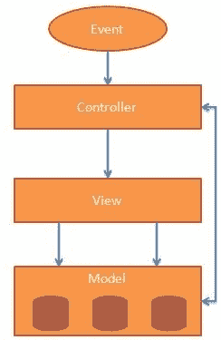

# MVC 架构

> 原文:[https://www.javatpoint.com/angularjs-mvc-architecture](https://www.javatpoint.com/angularjs-mvc-architecture)

MVC 代表模型视图控制器。它是一种用于开发 web 应用程序的软件设计模式。它非常受欢迎，因为它将应用程序逻辑与用户界面层隔离开来，并支持关注点分离。

MVC 模式由以下三部分组成:

1.  **模型:**负责管理应用数据。它响应来自视图的请求和来自控制器的指令来更新自己。
2.  **视图:**负责向用户显示所有数据或只显示部分数据。它还指定了由控制器决定呈现数据而触发的特定格式的数据。它们是基于脚本的模板系统，如 JSP、ASP、PHP，非常容易与 AJAX 技术集成。
3.  **控制器:**负责控制模型和视图之间的关系。它响应用户输入并在数据模型对象上执行交互。控制器接收输入，验证输入，然后执行修改数据模型状态的业务操作。