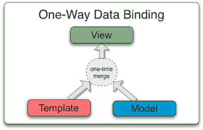
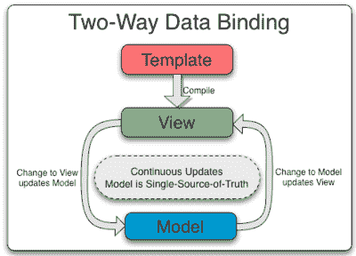

# 数据绑定

> 原文：<https://www.javatpoint.com/angularjs-data-binding>

数据绑定是软件开发技术中非常有用和强大的功能。它充当应用程序的视图和业务逻辑之间的桥梁。

AngularJS 遵循双向数据绑定模型。

## 单向数据绑定

单向数据绑定是一种从数据模型中获取值并将其插入到 HTML 元素中的方法。没有办法从视图更新模型。它用于经典的模板系统。这些系统只在一个方向绑定数据。



## 双向数据绑定

Angular 应用程序中的数据绑定是模型和视图组件之间的数据自动同步。

数据绑定允许您将模型视为应用程序中唯一的真实来源。视图始终是模型的投影。如果模型发生变化，视图将反映变化，反之亦然。



```

在输入框中输入内容:

名称:<input type="text" ng-model="firstName">

您写道:{{名字}}

```

[Test it Now](https://www.javatpoint.com/oprweb/test.jsp?filename=angulardatabinding1)

在上面的例子中，{{ firstName }}表达式是一个 AngularJS 数据绑定表达式。AngularJS 中的数据绑定将 AngularJS 表达式与 AngularJS 数据绑定在一起。

{{ firstName }}与 ng-model="firstName "绑定。

让我们举另一个例子，其中两个文本字段用两个 ng-model 指令绑定在一起:

```

## 成本计算器

Quantity: <input type="number" ng-model="quantity">
Price: <input type="number" ng-model="price">

**总计卢比:**{ {数量*价格}}

```

[Test it Now](https://www.javatpoint.com/oprweb/test.jsp?filename=angulardatabinding2)