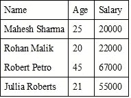

# 安圭拉 AJAX

> 原文：<https://www.javatpoint.com/angularjs-ajax>

AngularJS 提供了一个$http 服务，用于读取数据和远程服务器。它用于从服务器检索所需的记录。

AngularJS 需要 JSON 格式的数据。数据准备就绪后，$http 以下列方式从服务器获取数据:

```
  function employeeController($scope,$http) {
var url = "data.txt";

   $http.get(url).success( function(response) {
      $scope.employees = response; 
   });
}

```

这里的文件“data.txt”是员工的记录。$http 服务发出一个 AJAX 调用，并为其物业员工设置响应。这个模型用于在 HTML 中绘制表格。

* * *

## AngularJS AJAX 示例

**测试矩形. htm**

```

 Angular JS Includes

      示例应用程序

                名字 |
                年龄 |
                薪水 |

                {{ employee。姓名}} |
                {{ employee。年龄}} |
                {{ employee。工资}} |

```

这里，文件 data.txt 包含员工的记录。

**“data . txt”(JSON 格式的员工数据)**

```
    [
   {
      "Name" : "Mahesh Sharma",
      "Age" : 25,
      "Salary" : "20000"
   },

   {
      "Name" : "Rohan Malik",
      "Age" : 20,
      "Salary" : "22000"
   },

   {
      "Name" : "Robert Petro",
      "Age" : 45,
      "Salary" : "67000"
   },

   {
      "Name" : "Jullia Roberts",
      "Age" : 21,
      "Salary" : "55000"
   }
]

```

要执行上面的示例，您必须将 testAngularJS.htm 和 data.txt 文件部署到 web 服务器。

在网络浏览器中使用服务器的网址打开 testAngularJS.htm 文件并查看结果。

**输出:**

结果如下所示:



**表:**

| 名字 | 年龄 | 薪水 |
| 马什·夏尔马 | Twenty-five | Twenty thousand |
| 罗翰·马利克 | Twenty | Twenty-two thousand |
| 罗伯特·皮特罗 | Forty-five | Sixty-seven thousand |
| 茱莉亚罗勃兹 | Twenty-one | Fifty-five thousand |

* * *

## 服务方法

调用$http 服务有几种快捷方式。在上面的例子中。使用了$http 服务的 get 方法。以下是其他几种快捷方式:

*   。删除()
*   。get()
*   。头部()
*   。jsonp()
*   。补丁()
*   。岗位()
*   。放()

## 性能

来自服务器的响应是具有以下属性的对象:

*   。配置用于生成请求的对象。
*   。携带服务器响应的字符串或对象。
*   。标题一个用来获取标题信息的函数。
*   。状态定义 HTTP 状态的数字。
*   。状态文本一个定义 HTTP 状态的字符串。