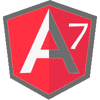

# Angular 7 教程

> 原文：<https://www.javatpoint.com/angular-7-tutorial>

Angular 7 教程提供了 Angular 7 的基本和高级概念。我们的 Angular 7 教程是为初学者和专业人士设计的。

Angular 是一个 JavaScript 框架，它使你能够创建反应性的**单页应用程序** (SPAs)。这是一个领先的前端开发框架，由谷歌的 Angular 团队定期更新。Angular 7 完全基于组件。它由几个组件组成，形成一个包含父组件和子组件的树结构。

在本教程中，您将学习如何准备您的开发环境，以使用尖端框架 Angular 7 开始构建您令人惊叹的现代网站。本教程包括 Angular 7 介绍和特性、Angular 7 组件、Angular 7 指令、数据绑定、事件绑定、属性绑定、模块、模板、管道、服务、路由等。

* * *

## Angular 7 教程索引

* * *

**角度 7 教程**

*   [角度 7 教程](angular-7-tutorial)
*   [角度 7 介绍](angular-7-introduction)
*   [角度 7 特征](angular-7-features)
*   [角度 7 安装](angular-7-installation)
*   [历史&版本](angular-7-history-and-versions)
*   [角度 7 第一应用](angular-7-first-app)
*   [角度 7 文件解释](angular-7-files-explanation)
*   [带自举的角度 7](angular-7-with-bootstrap)
*   [所有命令行界面命令](angular-7-all-cli-commands)
*   [角度 7 库](angular-7-libraries)
*   [角度 7 架构](angular-7-architecture)
*   [角度 7 分量](angular-7-components)

**角度 7 指令**

*   [角度 7 指令](angular-7-directives)
*   [角度 7 ngIf 指令](angular-7-ngif-directive)
*   [角度 7 样式指令](angular-7-ngstyle-directive)

**角度 7 数据绑定**

*   [角度 7 数据绑定](angular-7-databinding)
*   [角度 7 弦插值](angular-7-string-interpolation)
*   [角度 7 事件绑定](angular-7-event-binding)
*   [角度 7 属性绑定](angular-7-property-binding)

**角形 7 管**

*   [角形 7 管](angular-7-pipes)

**角度 7 误差修正**

*   [角度 7 误差修正](angular-7-error-fixing)

**角形 7 形**

*   [角形 7 形](angular-7-forms)
*   [角度形式的数据流](data-flow-in-angular-7-forms)
*   [角反应形式](angular-reactive-forms)
*   [模板驱动表单](angular-template-driven-forms)

**角度杂项**

*   [角度与反应](angular-vs-react)

**角度+弹簧**

*   [积垢示例](angular-spring-crud-example)
*   [文件上传示例](angular-spring-file-upload-example)
*   [登录&注销示例](angular-spring-login-and-logout-example)
*   [搜索字段示例](angular-spring-search-field-example)

**面试问题**

*   [有角度](angular-interview-questions)
*   [角型](angularjs-interview-questions)
*   [角度 7](angular-7-interview-questions)

* * *

## 先决条件

在深入学习 Angular 7 之前，您必须具备 AngularJS、Visual Studio Code IDE、任何服务器端编程语言的概念以及 JavaScript 的基本知识。

## 观众

我们为初学者和专业人士开发了这个 Angular 7 教程。

## 问题

我们向您保证，您不会在我们的 Angular 7 教程中发现任何问题。但是，如果你发现任何错误，你可以在我们的评论区发布。

* * *