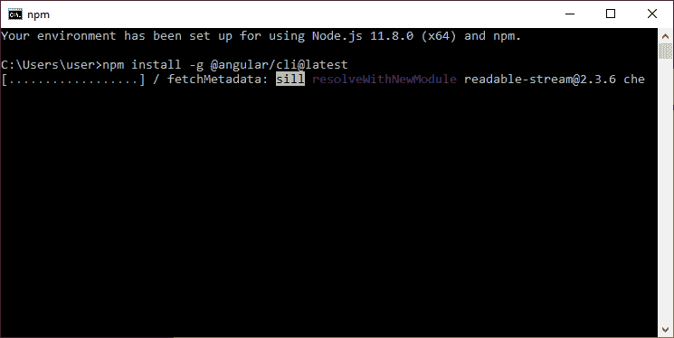

# 如何安装 Angular 7？

> 原文：<https://www.javatpoint.com/angular-7-installation>

## Angular 7 环境设置

在此页面中，您将看到如何安装运行第一个 Angular 7 应用程序所需的先决条件。

## 安装 Visual Studio 代码集成开发环境或喷气大脑网络风暴

你必须有一个像 Visual Studio 代码集成开发环境或喷气大脑网络风暴这样的集成开发环境来运行你的 Angular 7 应用程序。

VS 代码很轻，易于设置，它有大量的内置代码编辑、格式化和重构功能。它是免费使用的。它还提供了大量的扩展，将显著提高您的工作效率。

可以从这里下载 VS 代码:[https://code.visualstudio.com](https://code.visualstudio.com)

喷气大脑网络风暴也是开发 Angular 7 应用程序的一个很好的 IDE。它速度快，有吸引力，并且非常容易使用软件，但是，它不是免费使用的。你以后还得购买，它只提供 30 天的免费试用期。

可以从这里下载 VS Code:[https://www . jet brains . com/webstorm/download/# section = windows](https://www.jetbrains.com/webstorm/download/#section=windows)

在本教程中，我们将使用喷气大脑网络风暴。

## 安装 Node.js

你应该安装 node.js 来运行你的 Angular 7 应用。它管理 npm 依赖项在加载特定页面时对某些浏览器的支持。它提供运行 Angular 项目所需的库。Node.js 作为本地主机服务于您的运行时环境。

参见如何安装 node.js: [install-nodejs](install-nodejs)

或者

只需前往 node.js 官网[https://nodejs.org/en/](https://nodejs.org/en/)

下载并安装最新版本的 node.js，在我这里是 11.8.0


成功安装后，您将看到如下命令提示符:


## 使用 npm 安装 Angular CLI

运行 Angular 命令行界面命令以安装 Angular 命令行界面

```js

npm install -g @angular/cli

```



**或**

只需前往 Angular CLI 官网[https://cli.angular.io/](https://cli.angular.io/)

您将看到创建 Angular 应用程序的整个 cli 命令。您需要运行第一个命令来安装 Angular CLI。对于 Windows 和 Mac，这些步骤是相同的。


```js

npm install -g @angular/cli
ng new my-dream-app
cd my-dream-app
ng serve

```

您的 Angular 7 环境设置现已完成。

* * *