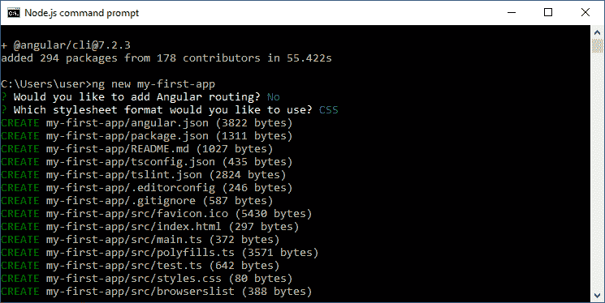
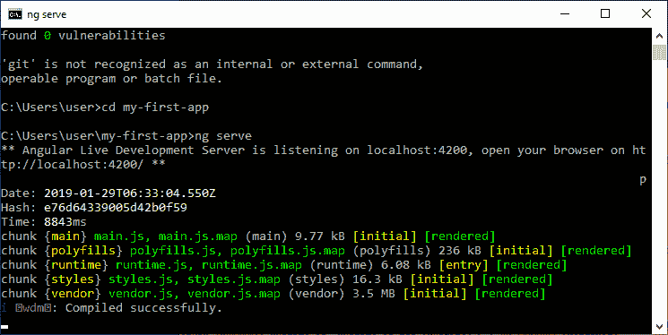
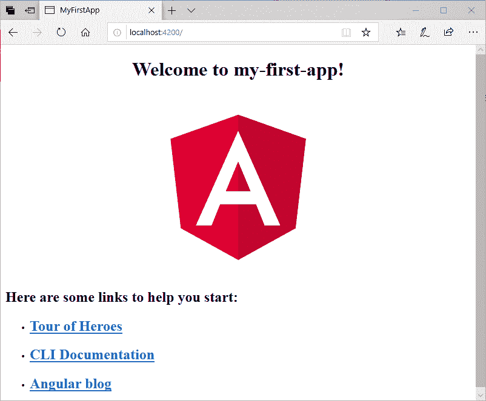
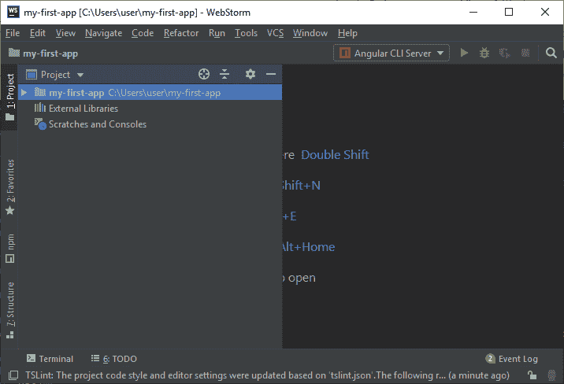
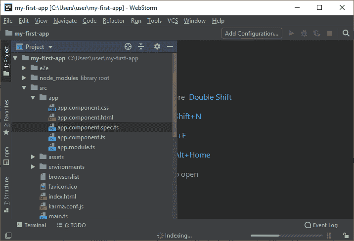
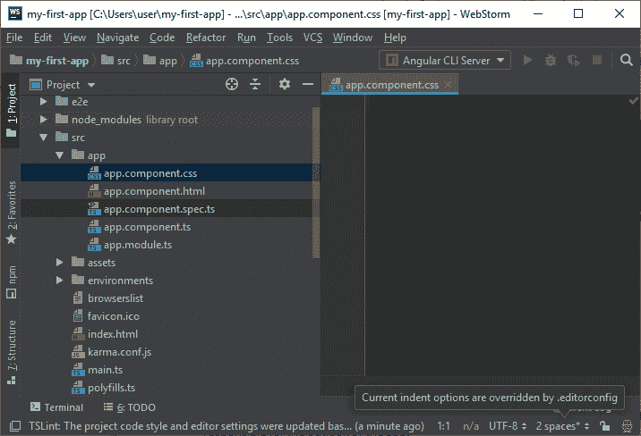
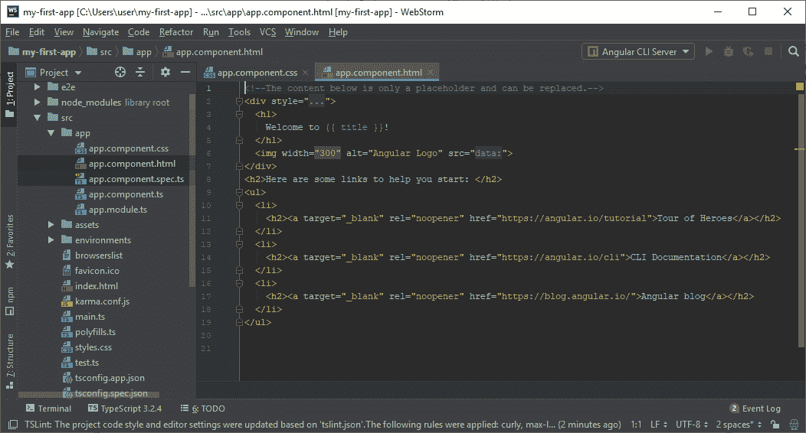

# Angular 7 项目设置(创建第一个应用程序)

> 原文:[https://www.javatpoint.com/angular-7-first-app](https://www.javatpoint.com/angular-7-first-app)

以下是创建第一个 Angular 应用程序的 Angular CLI 命令。

```

npm install -g @angular/cli
ng new my-dream-app
cd my-dream-app
ng serve

```

运行以下命令创建您的第一个 Angular 应用程序。

```

ng new my-first-app

```



导航到您的第一个应用程序。

```

cd my-first-app

```

启动服务器运行应用程序。

```

ng serve

```



您的服务器运行在 localhost:4200 上。现在，打开浏览器。



现在，您需要一个集成开发环境来编辑和运行您的应用程序的代码。这里，我们使用的是 WebStorm。

打开 WebStorm，在 IDE 中打开你的应用“我的第一个应用”。它看起来像这样:



在这里，转到 src 文件夹，你会在那里看到 app 文件夹。展开应用文件夹。



**你会在那里看到 5 个组件:**

*   app.component.css
*   app.component.html
*   app.component.spec.ts
*   app.component.ts
*   app.module.ts

您可以查看不同组件中的代码，以了解发生了什么，以及哪个部分负责应用程序的外观。

**app.component.css**

这个部分是空的，因为我们在这里没有指定任何 CSS。



**app.component.html**

这是最重要的组件，你的应用的首页。在这里，您可以更改应用程序名称前使用的称呼。您还可以更改首页上的内容及其各自的链接。



**代码:**

```

<div style="text-align:center">
  <h1>
    Welcome to {{ title }}!
  </h1>
  
</div>
<h2>Here are some links to help you start: </h2>
<ul>
  <li>
    <h2><a target="_blank" rel="noopener" href="https://angular.io/tutorial">Tour of Heroes</a></h2>
  </li>
  <li>
    <h2><a target="_blank" rel="noopener" href="https://angular.io/cli">CLI Documentation</a></h2>
  </li>
  <li>
    <h2><a target="_blank" rel="noopener" href="https://blog.angular.io/">Angular blog</a></h2>
  </li>
</ul>

```

**app.component.spec.ts:**

该文件仅用于测试目的。

```

import { TestBed, async } from '@angular/core/testing';
import { AppComponent } from './app.component';

describe('AppComponent', () => {
  beforeEach(async(() => {
    TestBed.configureTestingModule({
      declarations: [
        AppComponent
      ],
    }).compileComponents();
  }));

  it('should create the app', () => {
    const fixture = TestBed.createComponent(AppComponent);
    const app = fixture.debugElement.componentInstance;
    expect(app).toBeTruthy();
  });

  it(`should have as title 'my-first-app'`, () => {
    const fixture = TestBed.createComponent(AppComponent);
    const app = fixture.debugElement.componentInstance;
    expect(app.title).toEqual('my-first-app');
  });

  it('should render title in a h1 tag', () => {
    const fixture = TestBed.createComponent(AppComponent);
    fixture.detectChanges();
    const compiled = fixture.debugElement.nativeElement;
    expect(compiled.querySelector('h1').textContent).toContain('Welcome to my-first-app!');
  });
});

```

**app.component.ts**

您可以在此更改应用程序的名称。你只需要换个标题。

```

import { Component } from '@angular/core';

@Component({
  selector: 'app-root',
  templateUrl: './app.component.html',
  styleUrls: ['./app.component.css']
})
export class AppComponent {
  title = 'my-first-app';
}

```

**app.module.ts**

```

import { BrowserModule } from '@angular/platform-browser';
import { NgModule } from '@angular/core';

import { AppComponent } from './app.component';

@NgModule({
  declarations: [
    AppComponent
  ],
  imports: [
    BrowserModule
  ],
  providers: [],
  bootstrap: [AppComponent]
})
export class AppModule { }

```

* * *