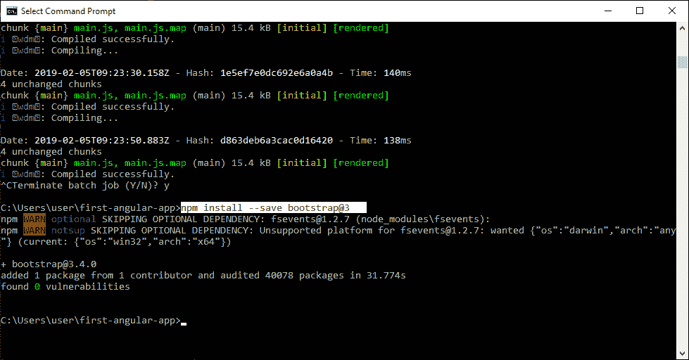
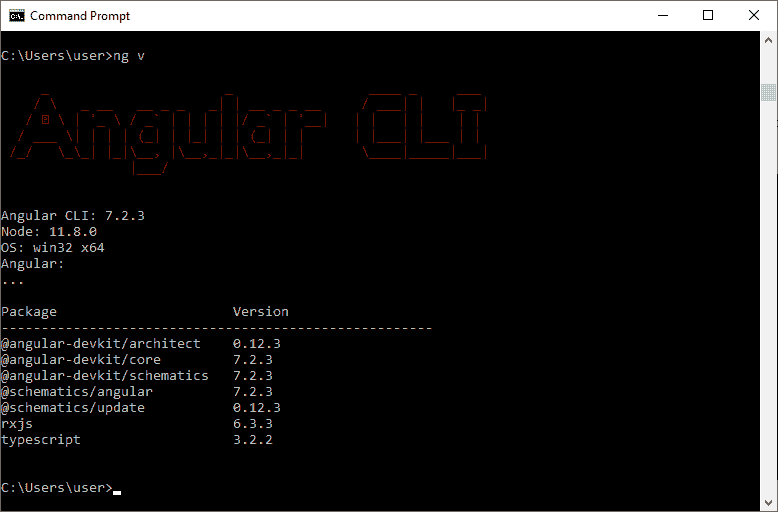
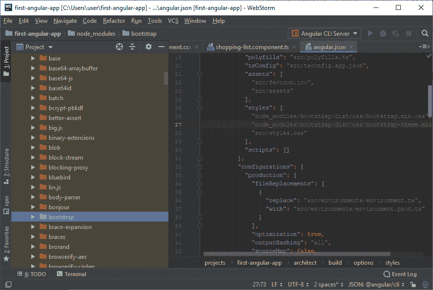
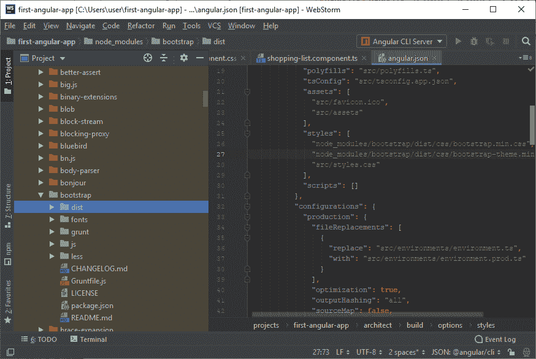
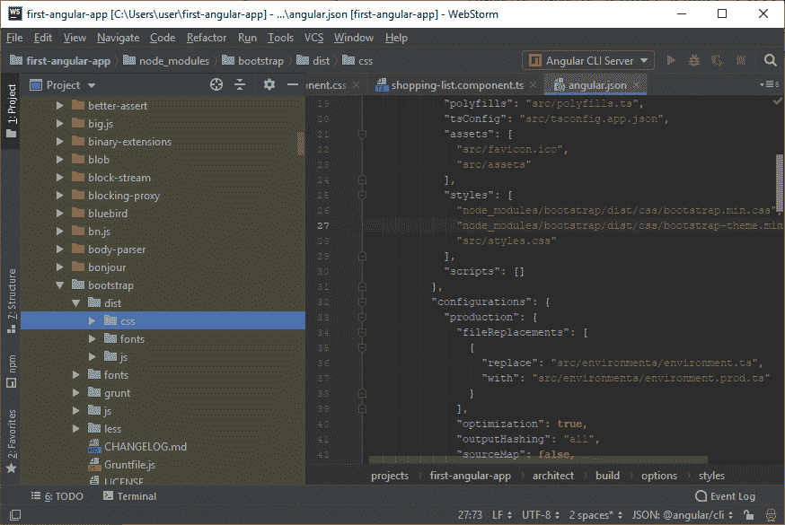
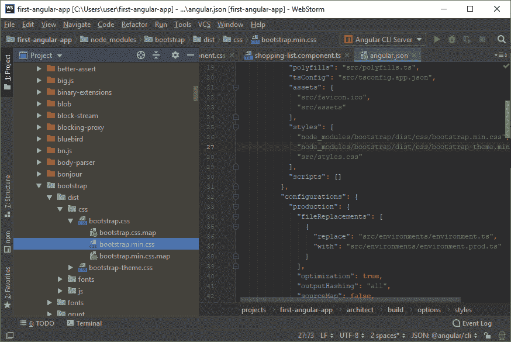

# 带自举的 Angular 7

> 原文：<https://www.javatpoint.com/angular-7-with-bootstrap>

## 如何为 Angular 项目安装 Bootstrap？

在命令提示符下运行以下命令:

```
npm install --save bootstrap@3  => The @3  is important!

```



此外，当您使用使用 Angular CLI 6+(通过 **ng v** 检查)创建的项目时，您将拥有 angular.json 文件，而不是**。angular-cli.json** 文件。在该文件中，您仍然需要将 Bootstrap 添加到**style【】**数组中，但是路径应该是**node _ modules/Bootstrap/dist/CSS/Bootstrap . min . CSS，** **而不是** **../node _ modules/bootstrap/dist/CSS/bootstrap . min . CSS**。领先的**../** 不得包含在内。



这里，我们使用的是 Angular 7.2.3 版本。

## 如何在项目中添加 bootstrap.css 文件？

展开节点模块(库根文件夹)



转到引导文件夹并展开它。



转到 dist 文件夹并展开 dist。



展开 css，你会发现“bootstrap.css”。展开 bootstrap.css，您将看到 bootstrap.min.css



打开 angular.json 文件，在 style 部分添加 bootstrap.min.css。

```
"styles": [
  "node_modules/bootstrap/dist/css/bootstrap.min.css",
  "src/styles.css"
],

```

Bootstrap 现已为您的 Angular 7 项目安装。你现在可以用了。

* * *