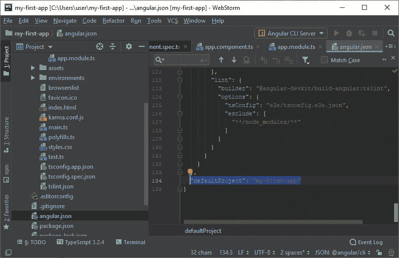

# 所有 Angular 命令行界面命令

> 原文：<https://www.javatpoint.com/angular-7-all-cli-commands>

Angular CLI 是一个命令行界面工具，用于初始化、开发、搭建和维护 Angular 应用程序。您可以直接在命令提示符下使用这些命令，也可以通过交互式用户界面(如 Angular 控制台)间接使用这些命令。

| 命令 | 别名 | 描述 |
| 增加 |  | 它用于向项目添加对外部库的支持。 |
| 建设 | b | 它将 Angular 应用程序编译到给定输出路径下名为 dist/的输出目录中。必须从工作区目录中执行。 |
| 配置 |  | 它在 angular.json 文件中为工作空间检索或设置 Angular 配置值。 |
| 文件 | d | 它在浏览器中打开官方的 Angular 文档(angular.io)，并搜索给定的关键字。 |
| e2e | e | 它构建并服务于一个 Angular 应用程序，然后使用量 Angular 器进行端到端的测试。 |
| 产生 | g | 它基于原理图生成和/或修改文件。 |
| 帮助 |  | 它提供了可用命令及其简短描述的列表。 |
| 线头 | l | 它用于在给定项目文件夹中的 Angular 应用程序代码上运行林挺工具。 |
| 新的 | n | 它创建了一个新的工作空间和一个初始的 Angular 应用程序。 |
| 奔跑 |  | 它使用项目中定义的可选自定义生成器配置来运行架构师目标。 |
| 服务 | s | 它构建并服务于您的应用程序，根据文件更改进行重建。 |
| 试验 | t | 它在项目中运行单元测试。 |
| 更新 |  | 它会更新您的应用程序及其依赖项。看 https://update.angular.io/ |
| 版本 | v | 它输出 Angular 命令行界面版本。 |
| xi18n |  | 它从源代码中提取 i18n 消息。 |

## 添加命令

ng add 命令用于向项目添加对外部库的支持。它将已发布库的 npm 包添加到您的工作区，并使您的默认应用程序项目使用该库，无论该库的示意图以何种方式指定。例如，如果您添加@angular/pwa，那么它将为 pwa 支持配置您的项目。

默认的 app 项目是 angular.json 中 defaultProject 的值。



### 语法:

```

ng add <collection> [options]

```

### 参数说明:

<collection>:指定要添加的包。</collection>

### 选择

**-默认值=真|假:**为真时，禁用默认选项的交互式输入提示。

**-help = true | false | JSON | JSON:**用于在控制台显示帮助消息。默认值:false

**- interactive=true|false:** 为 false 时，禁用交互输入提示。

## ng 构建命令

ng build 命令用于将 Angular 应用程序编译到给定输出路径下名为 dist/的输出目录中。它必须从工作区目录中执行。

### 语法:

```

ng build <project> [options]
ng b <project> [options]

```

### 参数说明:

**<项目> :** 指定要建设的项目名称。它可以是一个应用程序或一个库。

### 选择

**- aot=true|false:** 它使用提前编译构建。默认值:false

**- baseHref=baseHref:** 它指定正在构建的应用程序的基本 url。

**-构建事件日志=构建事件日志:**(实验)构建事件协议事件的输出文件路径。

**-Build Optimizer = true | false:**它在使用“aot”选项时启用“@ angular-dev kit/Build-Optimizer”优化。默认值:false

**- commonChunk=true|false:** 它使用一个单独的包，其中包含跨多个包使用的代码。默认值:真

**-配置=配置:**一个命名的构建目标，如 angular.json 的“配置”部分所指定的。每个命名的目标都附有该目标的选项默认值的配置。

别名:-c

**-deleteOutputPath = true | false:**用于在构建前删除输出路径。默认值:真

**- deployUrl=deployUrl:** 将部署文件的 Url。

**-5 浏览器支持=真|假:**启用有条件加载的 ES2015 聚合填充。默认值:false

**- extractCss=true|false:** 用于将全局样式中的 Css 提取到 css 文件中，而不是 js 文件中。默认值:false

**-extract licenses = true | false:**用于提取单独文件中的所有许可证。默认值:false

**-forkTypeChecker = true | false:**用于在分叉进程中运行 TypeScript 类型检查器。默认值:真

**-help = true | false | JSON | JSON:**用于在控制台中显示该命令的帮助消息。默认值:false

**- i18nFile=i18nFile:** 用于 i18n 的本地化文件。

**-i18n infomat = i18n infomat:**用- i18n-file 指定的本地化文件的格式。

-i18nlcale = i18nlscale:local 用于 i18n。

**-i18nmisingtranslation = i18nmisingtranslation:**如何处理 i18n 的缺失翻译。

**- index=index:** 索引 HTML 文件的名称。

**- lazyModules:** 将被延迟加载的其他模块文件列表。惰性路由器模块将被自动发现。

**- main=main:** 相对于当前工作区的应用程序主入口点的完整路径。

**-名称数据块=真|假:**为延迟加载的数据块使用文件名默认值:真

**-ng wconigpath = ng wconigpath:**ng w-config . JSON 的路径。

**-优化=真|假:**启用构建输出的优化。

**-output hashing = none | all | media | bundle:**定义输出文件名破坏缓存的哈希模式。

默认值:无

**-输出路径=输出路径:**新输出目录相对于当前工作空间的完整路径。

默认情况下，将输出写入当前项目中名为 dist/的文件夹。

**-轮询:**启用并定义文件观看轮询时间段(以毫秒为单位)。

**-聚合填充=聚合填充:**聚合填充文件相对于当前工作空间的完整路径。

**-preserveSymlinks = true | false:**解析模块时不要使用真实路径。

默认值:false

**- prod=true|false:** 为 true 时，将构建配置设置为生产目标。所有构建都使用捆绑和有限的树摇动。生产构建也运行有限的死代码消除。

**-配置文件=真|假:**Chrome profiler 的输出配置文件事件。

默认值:false

**-进度=真|假:**在构建时将进度记录到控制台。

**-resources OutputPath = resources output path:**相对于 output path，放置样式资源的路径。

**-ServiceWorker = true | false:**为生产版本生成服务工作器配置。默认值:false

**-showcirculanddependencies = true | false:**显示版本的循环依赖警告。默认值:真

**- sourceMap=true|false:** 用于显示输出源图。

默认值:真

**- statsJson=true|false:** 它生成一个“stats.json”文件，可以使用诸如“webpack-bundle-analyzer”或 https://webpack.github.io/analyse.之类的工具对其进行分析

默认值:false

**-subresourceinintegrity = true | false:**它支持使用子资源完整性验证。

默认值:false

**-tsConfig = tsConfig:**TypeScript 配置文件相对于当前工作空间的完整路径。

**- vendorChunk=true|false:** 它使用一个单独的捆绑包，其中只包含供应商库。

默认值:真

**- verbose=true|false:** 它为输出日志添加了更多细节。

默认值:false

**- watch=true|false:** 它在文件更改时运行构建。

默认值:false

## ng 配置命令

ng config 命令用于检索或设置工作空间的 angular.json 文件中的 Angular 配置值。

### 语法:

```

ng config <jsonPath> <value> [options]

```

### 参数说明:

**<JSON 路径> :** 要设置或查询的配置键，以 JSON 路径格式。例如:“a[3].foo.bar[2]”。如果没有提供新值，则返回该键的当前值。

**<值> :** 如果提供，给定配置键的新值。

### 选择

**-全局=真|假:**为真时，访问调用者主目录中的全局配置。

默认值:false

别名:-g

**-help = true | false | JSON | JSON:**用于在控制台中显示该命令的帮助消息。

默认值:false

## ng doc 命令

ng doc 命令用于在浏览器中打开官方的 Angular 文档(angular.io)，并搜索给定的关键字。

### 语法:

```

ng doc <keyword> [options]
ng d <keyword> [options]

```

### 参数说明:

**<关键词> :** 用于指定要搜索的关键词，如 angular.io 中的搜索栏所示。

### 选择

**-help = true | false | JSON | JSON:**用于在控制台中显示该命令的帮助消息。

Default: false

**- search=true|false:** 为 true 时，搜索 angular.io 的全部内容，否则只搜索 API 参考文档。

默认值:false

别名:-s

## ng e2e 司令部

它用于构建和服务一个 Angular 应用程序，然后使用量 Angular 器进行端到端测试。

### 语法:

```

ng e2e <project> [options]     
ng e <project> [options]

```

它必须从工作区目录中执行。当您不指定项目名称时，它将对所有项目执行。

### 参数说明:

**<项目> :** 指定你要建的项目名称。它可以是一个应用程序或一个库。

### 选择

**- baseUrl=baseUrl:** 指定量 Angular 器要连接的基本 Url。

**-configuration = configuration:**用于指定命名的构建目标，如 angular.json 的“configurations”部分中所指定的。每个命名的目标都附有该目标的选项默认值的配置。

别名:-c

**-devserver target = devserver target:**它指定要对其运行测试的 dev 服务器目标。

**-elementExplorer = true | false:**启动量 Angular 器的 Element Explorer 进行调试。

默认值:false

**-help = true | false | JSON | JSON:**它在控制台中显示此命令的帮助消息。

默认值:false

**-主机=主机:**要监听的主机。

默认值:localhost

**-端口:**指定为应用服务的端口。

**- prod=true|false:** 为 true 时，它将构建配置设置为生产目标。所有构建都使用捆绑和有限的树摇动。生产构建也运行有限的死代码消除。

**-量 Angular 器配置文件=量 Angular 器配置文件:**指定量 Angular 器配置文件的名称。

**-规格:**它覆盖了量 Angular 器配置中的规格。

**-套件=套件:**它覆盖了量 Angular 器配置中的套件。

**-webdriverpdate = true | false:**用于更新 webdriver。

默认值:真

## 生成命令

ng generate 命令用于根据原理图生成和/或修改文件。

```

ng generate <schematic> [options]
ng g <schematic> [options]

```

### 参数说明:

**<原理图> :** 指定要生成的原理图或集合:原理图。它可以采用以下子命令之一。

*   appShell
*   应用
*   班级
*   成分
*   管理的
*   列举型别
*   防护装置
*   连接
*   图书馆
*   组件
*   管
*   服务
*   serviceWorker
*   普遍的

**示意命令解释**

### appShell:

它用于生成运行服务器端版本的应用程序的应用程序外壳。

### 语法:

```

ng generate appShell [options]
ng g appShell [options]

```

### 应用

它用于在工作区的“项目”子文件夹中创建新的基本应用程序定义。

### 语法:

```

ng generate application <name> [options]
ng g application <name> [options]

```

### 班级

它用于在给定或默认项目中创建新的泛型类定义。

### 语法:

```

ng generate class <name> [options]
ng g class <name> [options]

```

### 成分

它用于在给定或默认项目中创建新的通用组件定义。

### 语法:

```

ng generate component <name> [options]
ng g component <name> [options]

```

### 管理的

它用于在给定或默认项目中创建新的通用指令定义。

### 语法:

```

ng generate directive <name> [options]
ng g directive <name> [options]

```

### 列举型别

它用于为给定或默认项目创建新的通用枚举定义。

### 语法:

```

ng generate enum <name> [options]
ng g enum <name> [options]

```

### 列举型别

它用于为给定或默认项目创建新的通用枚举定义。

### 语法:

```

ng generate enum <name> [options]
ng g enum <name> [options]

```

### 防护装置

它用于在给定项目或默认项目中生成新的通用路线保护定义。

### 语法:

```

ng generate enum <name> [options]
ng g enum <name> [options]

```

### 连接

它用于在给定或默认项目中创建新的通用接口定义。

### 语法:

```

ng generate interface <name> <type> [options]
ng g interface <name> <type> [options]

```

### 图书馆

它用于在当前工作区中创建新的通用库项目。

### 语法:

```

ng generate library <name> [options]
ng g library <name> [options]

```

### 组件

它用于在给定或默认项目中创建新的通用模块定义。

### 语法:

```

ng generate module <name> [options]
ng g module <name> [options]

```

### 管

它用于在给定或默认项目中创建新的通用管道定义。

### 语法:

```

ng generate pipe <name> [options]
ng g pipe <name> [options]

```

### 服务

它用于在给定或默认项目中创建新的通用服务定义。

### 语法:

```

ng generate service <name> [options]
ng g service <name> [options]

```

### serviceWorker

这用于将该原理图传递给“运行”命令，以创建一个服务工人。

### 语法:

```

ng generate serviceWorker [options]
ng g serviceWorker [options]

```

### 普遍的

此命令用于将此示意图传递给“运行”命令，以设置应用程序的服务器端渲染。

### 语法:

```

ng generate universal [options]
ng g universal [options]

```

### 选择

**-默认值=真|假:**为真时，禁用默认选项的交互式输入提示。

**- dryRun=true|false:** 为 true 时，它会贯穿并报告活动，而不会写出结果。

默认值:false

别名:-d

**- force=true|false:** 如果为 true，则强制覆盖现有文件。

默认值:false

别名:-f

**-help = true | false | JSON | JSON:**用于在控制台显示帮助消息。

默认值:false

**- interactive=true|false:** 为 false 时，禁用交互输入提示。

* * *