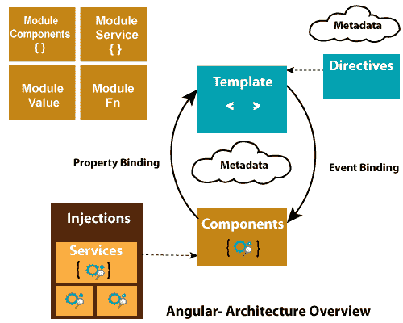

# Angular 7 架构

> 原文：<https://www.javatpoint.com/angular-7-architecture>

Angular 7 是一个平台和框架，用于在 HTML 和 TypeScript 中创建客户端应用程序。Angular 7 是用 TypeScript 编写的。

Angular 7 将核心和可选功能实现为一组 TypeScript 库，您可以在应用程序中导入这些库。

模块是 Angular 7 应用程序的基本构件。它们为组件提供编译上下文。Angular 7 应用程序由一组模块定义，模块将相关代码收集到功能集中。

Angular 7 应用程序总是至少有一个支持引导的根模块，通常还有许多其他功能模块。

*   组件定义视图，视图是由 Angular 7 根据程序逻辑和数据选择和修改的屏幕元素集。
*   组件使用服务，服务提供与视图不直接相关的特定功能。服务提供者可以作为依赖注入到组件中，使您的代码模块化、可重用和高效。

## 成分

组件和服务都只是带有装饰器的类，这些装饰器标记它们的类型并提供元数据来指导 Angular 做事。

每个 Angular 应用程序总是至少有一个被称为根组件的组件，它将页面层次结构与页面 DOM 连接起来。每个组件定义一个包含应用程序数据和逻辑的类，并与一个 HTML 模板相关联，该模板定义了要在目标环境中显示的视图。

### 组件类的元数据:

*   组件类的元数据将其与定义视图的模板相关联。模板将普通的 HTML 与 Angular 指令和绑定标记相结合，允许 Angular 在显示之前修改 HTML。
*   服务类的元数据提供了 Angular 需要的信息，使组件可以通过依赖注入(DI)获得这些信息。

[阅读更多关于 Angular 7 组件的信息](angular-7-components)

## 模块

Angular 7 NgModules 不同于其他 JavaScript 模块。每个 Angular 7 应用程序都有一个名为 AppModule 的根模块。它提供启动应用程序的引导机制。

一般每个 Angular 7 app 都包含很多功能模块。

七角模的一些重要特征:

*   Angular 7 NgModules 像其他 JavaScript 模块一样，从其他 NgModules 导入功能。
*   模块允许自己的功能被其他模块导出和使用。例如，如果您想在应用程序中使用路由器服务，您可以导入路由器模块。

## 模板、指令和数据绑定

在 Angular 7 中，模板用于将 HTML 与 Angular Markup 结合起来，并在显示 HTML 元素之前对其进行修改。模板指令提供程序逻辑，绑定标记连接应用程序数据和 DOM。

**数据绑定有两种类型:**

*   **事件绑定:**事件绑定用于将事件绑定到您的 app，并通过更新您的应用程序数据来响应目标环境中的用户输入。[阅读更多关于事件绑定的信息](angular-7-event-binding)
*   **属性绑定:**属性绑定用于从组件类传递数据，并便于您将从应用程序数据计算的值插入到 HTML 中。[阅读更多关于属性绑定](angular-7-property-binding)

## 服务和依赖注入

在 Angular 7 中，开发人员为不与特定视图相关联的数据或逻辑创建一个服务类，他们希望跨组件共享。

依赖注入(DI)被用来使你的组件类变得精简和高效。DI 不从服务器获取数据、验证用户输入或直接登录控制台；它只是将这些任务呈现给服务。

## 选择途径

在 Angular 7 中，**路由器**是一个 NgModule，它提供了一种服务，方便开发人员定义不同应用程序状态之间的导航路径，并查看其应用程序中的层次结构。

它的工作方式与浏览器导航的工作方式相同。即:

*   在地址栏中输入一个网址，浏览器将导航到相应的页面。
*   单击页面上的链接，浏览器将导航到新页面。
*   单击浏览器的后退或前进按钮，浏览器将根据您看到的历史页面向后或向前导航。

## 路由器是如何工作的？

路由器将类似网址的路径映射到视图，而不是页面。每当用户执行某个操作时，例如单击将在浏览器中加载新页面的链接，路由器就会拦截浏览器的行为，并显示或隐藏视图层次结构。

如果路由器发现当前的应用程序状态需要特定的功能，并且定义它的模块还没有被加载，那么路由器可以按需延迟加载该模块。

路由器会根据应用程序的视图导航规则和数据状态来解释链接网址。当用户单击按钮或从下拉框中选择时，或者响应来自任何来源的其他刺激时，您可以导航到新视图。路由器将活动记录在浏览器的历史记录中，因此后退和前进按钮也可以工作。

要定义导航规则，请将导航路径与组件相关联。路径使用类似 URL 的语法来集成程序数据，就像模板语法集成视图和程序数据一样。然后，您可以应用程序逻辑来选择显示或隐藏哪些视图，以响应用户输入和您自己的访问规则。

* * *