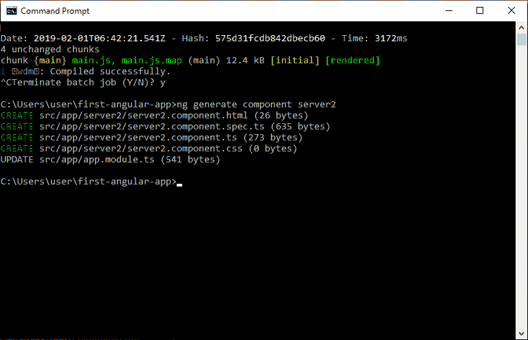
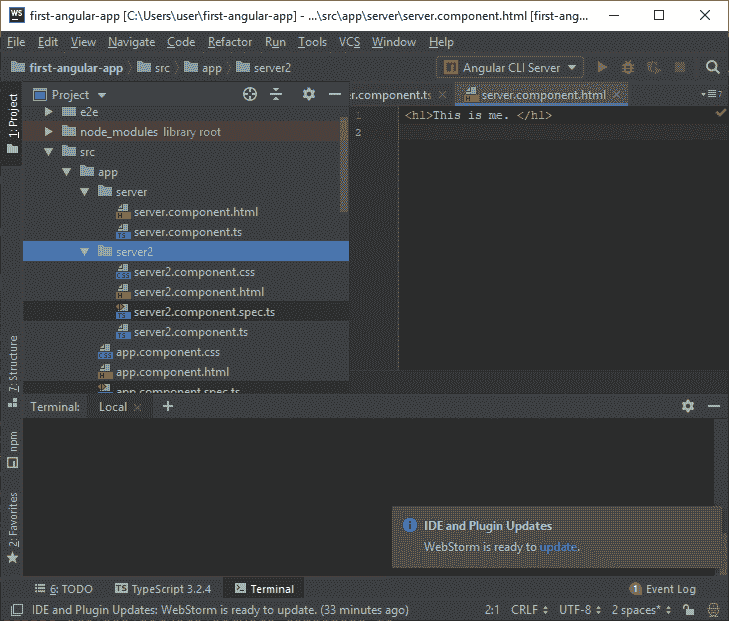
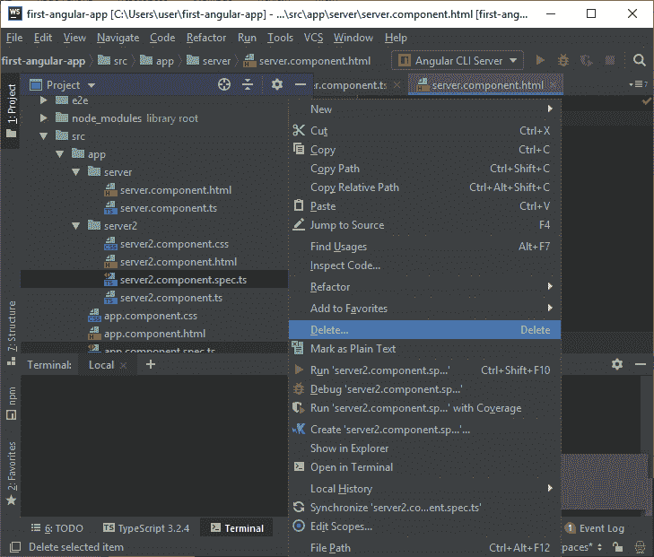
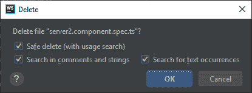

# 角度 7 分量

> 原文:[https://www.javatpoint.com/angular-7-components](https://www.javatpoint.com/angular-7-components)

组件是 Angular 的关键特性。整个应用程序是使用不同的组件构建的。

Angular 背后的核心思想是构建组件。它们将复杂的应用程序变成可重用的部分，您可以非常容易地重用它们。

## 如何创建新组件？

打开 WebStorm >>转到您的项目源文件夹> >展开应用程序目录并创建一个名为“服务器”的新目录。

现在，在服务器目录中创建组件。右键单击服务器目录，并创建一个名为“server.component.ts”的新文件。它是新创建的组件。

组件用于在 Angular 中构建网页，但它们需要模块将它们捆绑在一起。现在，您必须在模块中注册我们的新组件。

## 使用命令行界面创建组件

## 句法

```

ng generate component component_name
Or
ng g c component_name

```

让我们看看如何使用命令行创建一个新组件。

打开命令提示符，如果在浏览器上运行，则停止**命令。**

键入 **ng 生成组件服务器 2** 以创建名为服务器 2 的新组件。

也可以使用快捷方式 **ng g c server2** 来完成同样的任务。




在上图中，您可以看到创建了一个名为“server2”的新组件。它包含与我们创建第一个应用程序时看到的相同的其他组件..

```

server2.component.css
server2.component.html
server2.component.spec.ts
server2.component.ts

```

这里**server 2 . component . spec . ts**组件用于测试目的。你可以通过右键点击删除它。




* * *