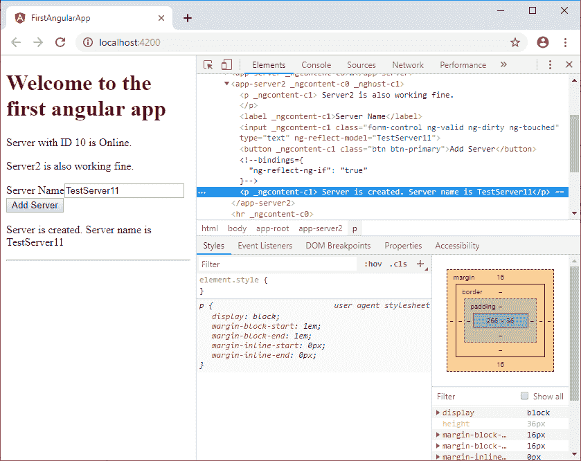

# 使用*ngIf 指令有条件地更改输出

> 原文：<https://www.javatpoint.com/angular-7-ngif-directive>

## 示例:

**组件. ts 文件:**

```js

import { Component, OnInit } from '@angular/core';

@Component({
  selector: 'app-server2',
  templateUrl: './server2.component.html',
  styleUrls: ['./server2.component.css']
})
export class Server2Component implements OnInit {
 allowNewServer = false;
 serverCreationStatus = 'No server is created.';
  serverName = 'TestServer';
  serverCreated = false;

  /*constructor() {
    setTimeout(() =>{
      this.allowNewServer = true;
    }, 5000);
  }*/

  ngOnInit() {
  }
  onCreateServer() {
    this.serverCreated = true;
    this.serverCreationStatus = 'Server is created. Name of the server is' + this.serverName;
  }
  OnUpdateServerName(event: Event) {
    this.serverName = (<HTMLInputElement>event.target).value;
  }
}

```

**component.html 文件:**

```js

<p>
  Server2 is also working fine.
</p>

<label>Server Name</label>
<!--<input type="text"
       class="form-control"
       (input)="OnUpdateServerName($event)">-->
<input type="text"
       class="form-control"
[(ngModel)]="serverName">
<!--<p>{{serverName}}</p>-->
<button
  class="btn btn-primary"
  [disabled]="allowNewServer"
  (click)="onCreateServer()">Add Server</button>
<p *ngIf="serverCreated"> Server is created. Server name is {{serverName}}</p>

```

**输出:**

输出将如下所示。


当我们更改输入值并点击“添加服务器”按钮时，您将看到以下结果:


您可以在上面的例子中看到，通过使用*ngIf 指令，我们可以相应地更改条件来显示输出。

您可以在添加服务器之前和之后检查输出的视图源。你会清楚地看到区别。

**添加服务器前:**


**添加服务器后:**



所以，你可以看到一个结构指令是如何改变 DOM 的。

## *带有 Else 条件的 ngIf 指令

您也可以在*ngIf 指令中使用 Else 条件。如果*ngIf 不为真，则用于显示输出。让我们在 component.html 文件中做一些更改。

**component.html 文件:**

```js

<p *ngIf="serverCreated; else noServer"> Server is created. Server name is {{serverName}}</p>
<ng-template #noServer>
  <p>No Server is created.</p>
</ng-template>

```

**输出:**


点击“添加服务器”按钮后:


你也可以用否定(！)签名。

```js

<p *ngIf="!serverCreated; else noServer"> Server is created. Server name is {{serverName}}</p>
<ng-template #noServer>
  <p>No Server is created.</p>
</ng-template>

```

* * *