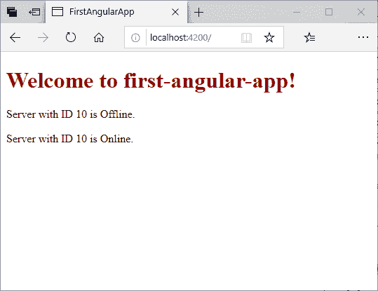
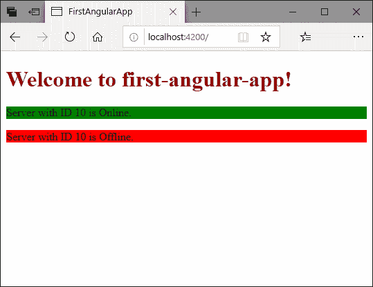
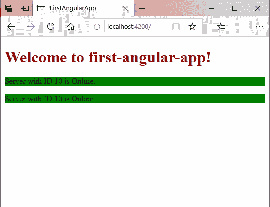
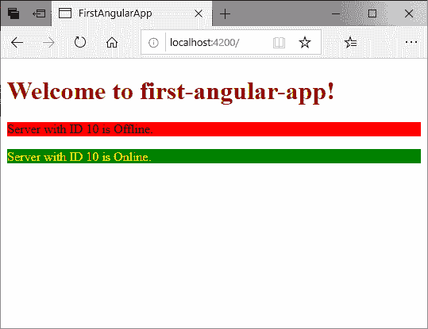

# 使用样式动态设置元素的样式

> 原文：<https://www.javatpoint.com/angular-7-ngstyle-directive>

ngStyle 属性用于更改或设置 Angular 的多个属性的样式。您可以更改值、颜色和大小等。元素。

让我们通过一个例子来看看:

**组件. ts 文件:**

```

import {Component} from '@angular/core';
@Component(
  {selector: 'app-server',
    templateUrl: 'server.component.html'})
export class ServerComponent {
  serverID: number = 10;
  serverStatus: string = 'Offline';

  constructor () {
  this.serverStatus = Math.random() > 0.5 ? 'Online' : 'Offline';
}
 getServerStatus() {
  return this.serverStatus;
  }
}

```

**component.html 文件:**

```

<p>Server with ID {{serverID}} is {{serverStatus}}. </p>

```

在这里，我们选择了一种方法来随机显示方法“在线”和“离线”。有 50%的几率。

**输出:**



让我们使用 ngStyle 来更改服务器脱机时的背景颜色“红色”和服务器联机时的“绿色”。

**component.html 文件:**

```

<p [ngStyle]="{backgroundColor: getColor()}">  Server  with ID {{serverID}} is {{serverStatus}}. </p>

```

在这里，我们创建了一个方法 getColor()来动态改变颜色。

**输出:**



如果两台服务器都在线，将显示为:



这是带有属性绑定来配置它的 ngStyle 属性的例子。

## 如何用 ngClass 动态应用 CSS 类

在上一篇文章中，我们已经看到了如何使用 ngStyle 动态地对元素进行更改。这里，我们将使用 ngClass 指令向元素应用一个 CSS 类。它便于您动态添加或删除 CSS。

### 示例:

让我们在 component.ts 文件中创建一个类，如果服务器在线，它会将文本的颜色更改为黄色。

**组件. ts 文件:**

```

import {Component} from '@angular/core';
@Component(
  {selector: 'app-server',
    templateUrl: 'server.component.html',
    styles: [`
    .Online{
      color: yellow;
    }`]

  })
export class ServerComponent {
  serverID: number = 10;
  serverStatus: string = 'Offline';

  constructor () {
    this.serverStatus = Math.random() > 0.5 ? 'Online' : 'Offline';
  }
  getServerStatus() {
    return this.serverStatus;
  }
  getColor() {
    return this.serverStatus === 'Online' ? 'green' : 'red';
  }
}

```

**component.html 文件:**

```

<p [ngStyle]="{backgroundColor: getColor()}"
[ngClass]="{Online: serverStatus === 'Online'}">  Server  with ID {{serverID}} is {{serverStatus}}. </p>

```

**输出:**



您可以看到 ngClass 指令已经改变了在线文本的颜色。这是一个带有属性绑定的 ngClass 指令动态应用 CSS 类的例子。

* * *