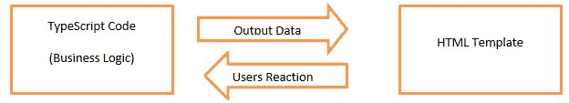

# Angular 数据绑定

> 原文：<https://www.javatpoint.com/angular-7-databinding>

数据绑定是 Angular 的一个强大功能。Angular 数据绑定用于通信。它用于在您的 TypeScript 代码(您的业务逻辑)和向用户显示的其他组件(即 HTML 布局)之间进行通信。

数据绑定是必要的，因为当我们用 TypeScript 编写代码时，它被编译成 JavaScript，结果显示在 HTML 布局上。因此，为了向用户显示正确和自然的结果，适当的交流是必要的。这就是为什么在 Angular 中使用数据绑定。

**数据绑定有两种类型:**

**单向数据绑定**

单向数据绑定是一种简单的单向通信，当我们在 TypeScript 代码中进行更改时，会更改 HTML 模板。

或者

在单向数据绑定中，视图(HTML 页面)中使用模型的值，但不能从视图中更新模型。Angular 插值/字符串插值、属性绑定和事件绑定是单向数据绑定的例子。

**双向数据绑定**

在双向数据绑定中，数据的自动同步发生在模型和视图之间。在这里，变化反映在两个组件中。每当您在模型中进行更改时，它将反映在视图中，当您在视图中进行更改时，它将反映在模型中。

这将立即自动发生，确保 HTML 模板和 TypeScript 代码随时更新。

* * *