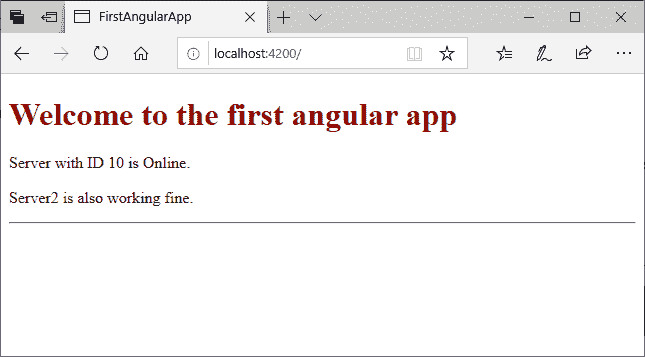

# Angular 7 字符串插值

> 原文：<https://www.javatpoint.com/angular-7-string-interpolation>

在 Angular 中，字符串插值用于在 HTML 模板上显示动态数据(在用户端)。它方便您对组件文件进行更改，并从那里获取数据到 HTML 模板(component.ts 文件)。

### 例如:

**组件. ts 文件:**

```js

import {Component} from '@angular/core';
@Component(
  {selector: 'app-server',
 templateUrl: 'server.component.html'})
export class ServerComponent {
  serverID: number = 10;
    serverStatus: string = 'Online';
}

```

这里，我们用一些值指定了服务器标识和服务器状态。让我们在“component.html”文件中使用它。

**component.html 文件:**

```js

<p>Server with ID {{serverID}} is {{serverStatus}}. </p>

```

**输出:**



## 字符串插值与属性绑定

字符串插值和属性绑定都用于相同的目的，即单向数据绑定。但问题是如何知道哪一个最适合你的应用。

在这里，我们从相似性、差异性、安全性和您收到的输出进行比较。

## 带字符串插值和属性绑定的相似性

字符串插值和属性绑定是关于单向数据绑定的。它们都将一个值从我们的组件向 HTML 元素单向流动。

**字符串插值**

```js

import { Component } from '@angular/core';
@Component({
    selector: 'my-app',
    template: `
                <h1>{{ fullName }}</h1>
              `
})
export class AppComponent {
    fullName: string = 'Robert Junior';
}

```

您可以在上面的例子中看到，Angular 从组件中获取 fullName 属性的值，并使用用于指定插值的大括号将其插入到开始和结束

# 元素之间。

**属性绑定**

```js

import { Component } from '@angular/core';
@Component({
    selector: 'my-app',
    template: `
                <h1 [innerHtml]='fullName'></h1>
              `
})
export class AppComponent {
    fullName: string = 'Robert Junior';
}

```

在属性绑定中，查看 Angular 如何从组件中提取 fullName 属性的值，并使用

# 元素的 html 属性 innerHtml 将其插入。

字符串插值和属性绑定的两个示例都将提供相同的结果。

## 字符串插值和属性绑定的区别

字符串插值是一种特殊的语法，通过 Angular 转换为属性绑定。这是属性绑定的一种方便的替代方法。

当需要连接字符串时，必须使用插值而不是属性绑定。

### 示例:

```js

@Component({
    selector: 'my-app',
    template: `<div>
                    <h1>{{citedExample}}</h1>
                </div>`
})
export class AppComponent {
    citedExample: string = 'Interpolation foe string only';

}

```

**当必须将元素属性设置为非字符串数据值时，使用属性绑定。**

### 示例:

在下面的示例中，我们通过绑定到布尔属性 isDisabled 来禁用按钮。

```js

import { Component } from '@angular/core';
@Component({
    selector: 'my-app',
    template: `<div>
    <button [disabled]='isDisabled'>Disable me</button>
                     </div>`
})
export class AppComponent {
isDisabled: boolean = true;
}

```

如果使用插值而不是属性绑定，则无论 isDisabled 类属性值为真还是假，该按钮都将始终被禁用。

```js

import { Component } from '@angular/core';
@Component({
    selector: 'my-app',
    template: `<div>
    <button disabled='{{isDisabled}}'>Disable Me</button>
                     </div>`
})
export class AppComponent {
isDisabled: boolean = true/false;
}

```

* * *