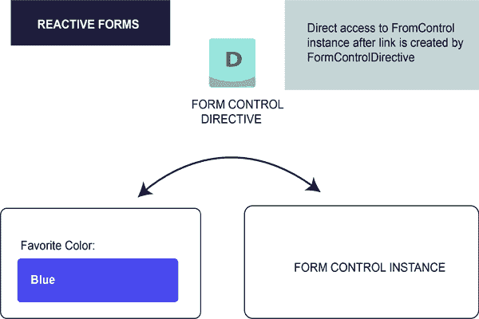

# 有角度的 7 种形式

> 原文：<https://www.javatpoint.com/angular-7-forms>

角形用于处理用户输入。我们可以在应用程序中使用 Angular 表单，使用户能够登录、更新配置文件、输入信息以及执行许多其他数据输入任务。

在 Angular 7 中，有两种通过表单处理用户输入的方法:

*   反应形式
*   模板驱动的表单

这两种方法都用于从视图中收集用户输入事件，验证用户输入，创建要更新的表单模型和数据模型，并提供跟踪更改的方法。

## 反应型表单与模板驱动型表单

反应表单和模板驱动表单管理和处理数据的方式都不同。每一种都有不同的优点。

### 反应形式

*   反应形式更加健壮。
*   反应式表单更具可伸缩性、可重用性和可测试性。
*   如果表单是您的应用程序的关键部分，或者您的应用程序已经使用反应模式构建，则最倾向于使用它们。在这两种情况下，最好使用反应形式。

### 模板驱动的表单

*   如果您想在应用程序中添加一个简单的表单，模板驱动的表单是最好的。例如:电子邮件列表注册表单。
*   模板驱动的表单在应用程序中很容易使用，但是它们不像反应表单那样可扩展。
*   如果您的应用程序需要非常基本的表单和逻辑，则主要使用模板驱动的表单。它可以很容易地在模板中管理。

## 反应式表单和模板驱动表单的区别

| 比较指数 | 反应形式 | 模板驱动的表单 |
| 设置(表单模型) | 反应形式更加明确。它们是在组件类中创建的。 | 模板驱动的表单不太明确。它们是由指令创建的。 |
| 数据模型 | 结构化的 | 无社会组织的 |
| 可预测性 | 同步的 | 异步的 |
| 表单验证 | 功能 | 指令 |
| 易变性 | 不变的 | 易变的 |
| 可量测性 | 低级应用编程接口访问 | API 之上的抽象 |

## 反应式表单和模板驱动表单之间的相似性

反应式表单和模板驱动表单都有一些共同的构建模块:

*   **表单控件:**用于跟踪单个表单控件的值和验证状态。
*   **表单组:**用于跟踪表单控件集合的相同值和状态。
*   **窗体数组:**用于跟踪窗体控件数组的相同值和状态。
*   **ControlValueAccessor:** 用于在 Angular FormControl 实例和原生 DOM 元素之间创建一个桥梁。

## 表单模型设置

表单模型设置用于跟踪角度表单和表单输入元素之间的值变化。让我们举个例子来看看表单模型是如何定义和创建的。

### 反应式表单中的表单模型设置

关于使用反应式表单实现的单个控件，请参见下面带有输入字段的组件。

```
import { Component } from '@angular/core';
import { FormControl } from '@angular/forms';
@Component({
  selector: 'app-reactive-favorite-color',
  template: `
    Favorite Color:  `
})
export class FavoriteColorComponent {
  favoriteColorControl = new FormControl('');
}

```

在反应形式中，形式模型是真理的来源。真理之源提供了给定时间点的表单元素的值和状态。

这里，在上面的例子中，表单模型是 **FormControl** 实例。



在反应式表单中，表单模型是在组件类中明确定义的。之后，反应式表单指令(这里是:FormControlDirective)使用值访问器(ControlValueAccessor 实例)将现有的 FormControl 实例链接到视图中的特定表单元素。

### 模板驱动表单中的表单模型设置

对于使用模板驱动表单实现的单个控件，请参见上述带有输入字段的组件。

```
import { Component } from '@angular/core';
@Component({
  selector: 'app-template-favorite-color',
  template: `
    Favorite Color:  `
})
export class FavoriteColorComponent {
  favoriteColor = '';
}

```

在模板驱动的表单中，真理的来源是模板本身。


表单模型抽象比结构更简单。模板驱动的表单指令 NgModel 为给定的表单元素创建和管理 FormControl 实例。它不太明确，但它取消了对表单模型的直接控制。

* * *