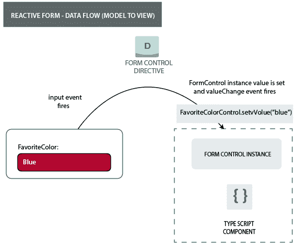
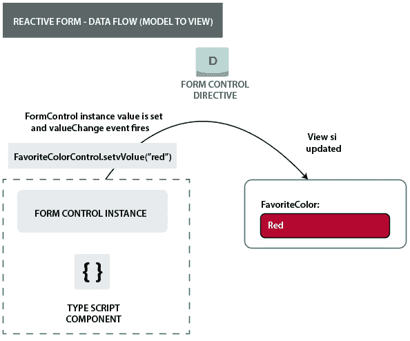
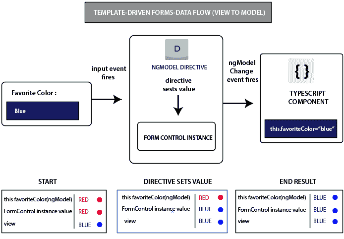
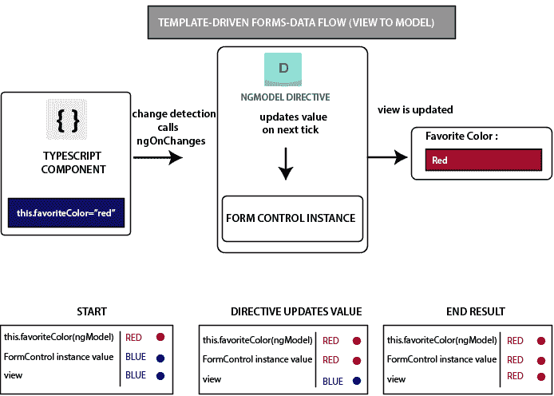

# Angular 形式的数据流

> 原文：<https://www.javatpoint.com/data-flow-in-angular-7-forms>

创建 Angular 表单时，了解框架如何处理数据流非常重要。在 Angular 中有两种类型的表单，反应型和模板驱动型，它们都遵循不同的结构来处理用户？的输入。

## 反应形式的数据流

在反应式表单中，视图中的每个表单元素都直接链接到表单模型(表单控件实例)。从视图到模型和模型到视图的任何更新都是同步的，并且不依赖于用户界面。让？让我们用图表来理解它。它将显示当我们从视图然后从模型改变输入字段的值时，数据是如何流动的。

### 从视图到模型的数据流

**以反应形式从视图到模型的数据流中的步骤:**

*   首先，用户在输入元素中键入一个值。在本例中，输入元素是“最喜欢的颜色”，键入的值是“蓝色”。
*   然后，表单输入元素发出一个带有最新类型值的“input”事件。
*   然后，控制值访问器(负责监听表单输入元素上的事件)立即将新值传递给 FormControl 实例。
*   在接收到值之后，FormControl 实例通过可观察到的值变化发出新值。
*   任何可观察到的值更改的订阅者都会收到新值。

### 从模型到视图的数据流

**以反应形式从模型到视图的数据流步骤:**

*   首先，用户调用 favoriteColorControl.setValue()方法。此方法更新 FormControl 值。
*   然后，FormControl 实例通过可观察到的值更改发出新值。
*   然后，可观察到的值变化的订户接收新值。
*   最后，表单输入元素上的控制值访问器用新值更新元素。

## 模板驱动表单中的数据流

模板驱动表单的每个表单元素都链接到一个指令，以在内部管理表单模型。让我们举一个图形例子来理解当输入字段的值从视图然后从模型改变时，数据如何以模板驱动的 Angular 形式流动。

**从视图到模型的数据流:**

**以反应形式从视图到模型的数据流步骤:**

在这里，用户必须将输入值从红色更改为蓝色。

*   首先，用户在输入元素中键入蓝色。
*   然后，输入元素发出一个值为蓝色的“输入”事件。
*   然后，附加到输入的控件值访问器触发 FormControl 实例上的 setValue()方法。
*   在 setValue()方法之后，FormControl 实例通过可观察到的值更改发出新值。
*   值的订户可观察到的变化接收新值。
*   之后，控件值访问器还调用发出 ngModelChange 事件的 NgModel.viewToModelUpdate()方法。
*   这里，组件模板**对 favoriteColor 属性使用双向数据绑定**，组件中的 favoriteColor 属性被更新为由 ngModelChange 事件(Blue)发出的值。

**从模型到视图的数据流:**

**以反应形式从模型到视图的数据流步骤:**

当 favoriteColor 元素从红色变为蓝色时，从模型到视图的数据流由以下步骤组成。

*   首先，组件中的 favoriteColor 被更新为新值。
*   变化检测开始。
*   在变更检测期间，ngOnChanges 生命周期钩子在 NgModel 指令实例上被调用，因为它的一个输入的值已经改变。
*   ngOnChanges()方法将异步任务排队，以设置内部 FormControl 实例的值。
*   变更检测现已完成。
*   然后，执行设置 FormControl 实例值的任务。
*   FormControl 实例通过可观察到的值更改发出最新值。
*   任何可观察到的值更改的订阅者都会收到新值。
*   控件值访问器使用最新的 favoriteColor 值更新视图中的表单输入元素。

* * *