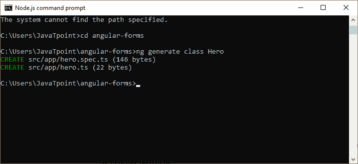
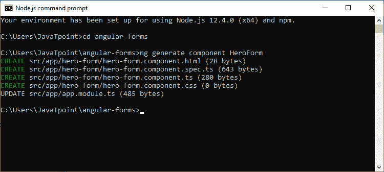
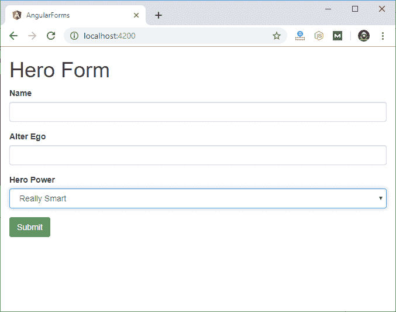
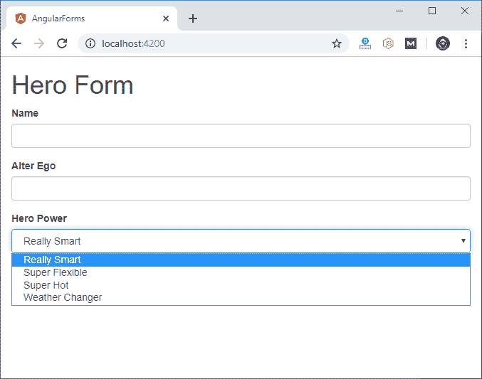

# 模板驱动的表单

> 原文：<https://www.javatpoint.com/angular-template-driven-forms>

模板驱动的表单可用于许多应用程序，如登录、提交请求、下订单、数据输入等。

**现在，让我们创建表单。按照以下步骤操作:**

## 创建项目

首先，使用以下命令创建一个名为“Angular形”的新项目:

```

ng new angular-forms 

```

现在，使用以下命令转到项目文件夹。

```

cd angular-forms

```

现在，使用 Angular CLI 命令 **ng 生成类英雄**来生成一个名为英雄的新类:

```

ng generate class Hero

```



转到你的项目文件夹**Angular形**打开 app 模块下的 hero.ts 文件。编写以下代码:

```

export class Hero {
  constructor(
    public id: number,
    public name: string,
    public power: string,
    public alterEgo?: string
  ) {  }
}

```

TypeScript 编译器为每个公共构造函数参数生成一个公共字段，当您创建新的英雄时，它会自动将参数值分配给该字段。

这里，alterEgo 是可选的，构造函数可以省略它。

## 创建表单组件

**Angular形由两部分组成:**

*   基于 HTML 的模板
*   处理数据和用户的组件类

现在，使用以下命令生成名为 **HeroForm** 的新组件:

```

ng generate component HeroForm 

```



在**英雄形态组件**中写下以下代码

```

import { Component } from '@angular/core';
import { Hero }    from '../hero';
@Component({
  selector: 'app-hero-form',
  templateUrl: './hero-form.component.html',
  styleUrls: ['./hero-form.component.css']
})
export class HeroFormComponent {
  powers = ['Really Smart', 'Super Flexible',
            'Super Hot', 'Weather Changer'];
  model = new Hero(18, 'Dr IQ', this.powers[0], 'Chuck Overstreet');
  submitted = false;
  onSubmit() { this.submitted = true; }
  // TODO: Remove this when we're done
  get diagnostic() { return JSON.stringify(this.model); }
}

```

## 修订 app.module.ts 文件

app.module.ts 文件用于定义应用程序的根模块。模板驱动的表单驻留在它们自己的模块中。在使用表单之前，您需要将表单模块添加到应用程序模块的导入数组中。

在 **app.module.ts** 文件中使用以下代码:

```

import { NgModule }      from '@angular/core';
import { BrowserModule } from '@angular/platform-browser';
import { FormsModule }   from '@angular/forms';
import { AppComponent }  from './app.component';
import { HeroFormComponent } from './hero-form/hero-form.component';
@NgModule({
  imports: [
    BrowserModule,
    FormsModule
  ],
  declarations: [
    AppComponent,
    HeroFormComponent
  ],
  providers: [],
  bootstrap: [ AppComponent ]
})
export class AppModule { }

```

这里，我们已经导入了 FormsModule，并将 FormsModule 添加到@NgModule 装饰器中定义的导入列表中。这用于访问应用程序的所有模板驱动的表单功能，包括 ngModel。

## 修改 app.component.html 文件

app.component.html 用于托管新的 HeroFormComponent。它是应用程序的根组件。在 app.component.html 写下以下代码

```

<app-hero-form></app-hero-form> 

```

## 创建一个初始的 HTML 表单模板

在 hero-form.component.html 使用以下代码

```

<div class="container">
    <h1>Hero Form</h1>
    <form>
      <div class="form-group">
        <label for="name">Name</label>
        <input type="text" class="form-control" id="name" required>
      </div>
      <div class="form-group">
        <label for="alterEgo">Alter Ego</label>
        <input type="text" class="form-control" id="alterEgo">
      </div>
      <button type="submit" class="btn btn-success">Submit</button>
    </form>
</div>

```

## 设计表单的样式

打开 style.css 并使用以下代码导入引导文件。

```

@import url('https://unpkg.com/bootstrap@3.3.7/dist/css/bootstrap.min.css');

```

## 使用* ngFor 添加电源列表

英雄形态可以从机构认可的固定权力列表中选择权力列表。在 hero-form.component.html 的“另一个自我”组下面使用下面的 HTML 代码

```

<div class="form-group">
  <label for="power">Hero Power</label>
  <select class="form-control" id="power" required>
    <option *ngFor="let pow of powers" [value]="pow">{{pow}}</option>
  </select>
</div>

```

基本的模板驱动表单现在已经完成。您可以使用 ng serve 命令来运行项目。

**输出:**



你可以在这里查看英雄的力量。



* * *