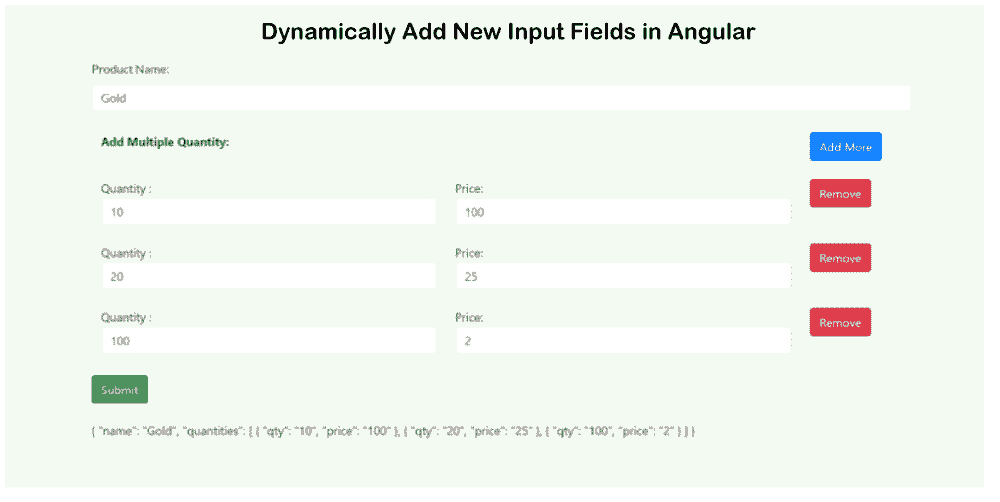

# 在 Angular 中动态添加和删除表单域

> 原文：<https://www.javatpoint.com/dynamically-add-and-remove-fields-in-angular>

在本节中，我们将使用 Angular，这样我们就可以动态地在表单中添加和删除字段。下面的例子对我们学习这个概念非常有用。我们可以在各种版本的 [Angular](https://www.javatpoint.com/angularjs-tutorial) 中做到这一点，比如 [6](https://www.javatpoint.com/angular-6) 、 [7](https://www.javatpoint.com/angular-7-tutorial) 、 [8](https://www.javatpoint.com/angular-8) 和 9。

在下面的例子中，我们将创建一个包含产品名称的表单。它还将包含“添加多个数量”选项，用户可以在其中选择多个数量和价格。在我们的 angular 应用程序中，我们将使用 formarray 和 formgroup 创建一个动态表单。为了添加和删除字段，我们将描述一些步骤，如下所示:

**第一步:**

这是第一步，这一步我们将**导入表单模块**。

**src/app/app.module.ts:**

```

import { NgModule } from '@angular/core';
import { BrowserModule } from '@angular/platform-browser';
import { FormsModule, ReactiveFormsModule } from '@angular/forms';

import { AppComponent } from './app.component';

@NgModule({
  imports:      [ BrowserModule, FormsModule, ReactiveFormsModule ],
  declarations: [ AppComponent ],
  bootstrap:    [ AppComponent ]
})
export class AppModule { }

```

**第二步:**

这一步我们要去**更新 TS 文件**。为此，我们将使用 Angular 表单库来导入表单数组、表单控件、表单生成器和表单组。

**src/app/app.component.ts**

```

import { Component } from '@angular/core';
import { FormGroup, FormControl, FormArray, FormBuilder } from '@angular/forms'

@Component({
  selector: 'my-app',
  templateUrl: './app.component.html',
  styleUrls: [ './app.component.css' ]
})
export class AppComponent  {
  name = 'Angular';

  productForm: FormGroup;

  constructor(private fb:FormBuilder) {

    this.productForm = this.fb.group({
      name: '',
      quantities: this.fb.array([]) ,
    });
  }

  quantities() : FormArray {
    return this.productForm.get("quantities") as FormArray
  }

  newQuantity(): FormGroup {
    return this.fb.group({
      qty: '',
      price: '',
    })
  }

  addQuantity() {
    this.quantities().push(this.newQuantity());
  }

  removeQuantity(i:number) {
    this.quantities().removeAt(i);
  }

  onSubmit() {
    console.log(this.productForm.value);
  }

```

**第三步:**

在这一步中，我们将创建**模板代码**。为此，我们将使用 ngModel，这样我们就可以编写 html 形式的代码。我们将使用文件 app.component.html 添加下面的代码。在下面的形式中，我们还可以使用 Bootstrap 类。

**src/app/app . component . html**

```

<div class="container">

  <h1> Dynamically Add New Input Fields in Angular </h1>

  <form [formGroup]="productForm" (ngSubmit)="onSubmit()">

    <p>
      <label for="name">Product Name:</label>
      <input type="text" id="name" name="name" formControlName="name" class="form-control">
    </p>

    <table class="table table-bordered" formArrayName="quantities">
      <tr>
        <th colspan="2">Add Multiple Quantity:</th>
        <th width="150px"><button type="button" (click)="addQuantity()" class="btn btn-primary">Add More</button></th>
      </tr>
      <tr *ngFor="let quantity of quantities().controls; let i=index" [formGroupName]="i">
        <td>
            Quantity :
            <input type="text" formControlName="qty" class="form-control">
        </td>
        <td>
            Price:
            <input type="text" formControlName="price" class="form-control">
        </td>
        <td>
            <button (click)="removeQuantity(i)" class="btn btn-danger">Remove</button>
        </td>
      </tr>
    </table>

    <button type="submit" class="btn btn-success">Submit</button>

  </form>

  <br/>
  {{this.productForm.value | json}}
</div>

```

现在，上面的应用程序可以运行了。下面的命令将用于运行我们上面的应用程序。

```

ng serve

```

运行此命令后，将生成以下输出:



* * *