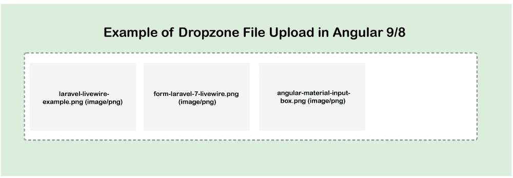

# 以Angular 9/8 上传拖放区图像

> 原文：<https://www.javatpoint.com/dropzone-image-upload-in-angular-9-or-8>

在本节中，我们将学习如何在 Angular 9 或 [angular 8](https://www.javatpoint.com/angular-8) 中使用 dropzone 上传图像。我们还将看到使用拖放上传图像。在我们的示例中，我们将在 angular 9/8 中使用 ngx dropzone。

在我们的 angular 9 应用程序中，我们将使用 dropzone 的组件简单地上传多个图像。为了进行拖放图像上传，我们将使用一个 ngx-dropzone npm 包。在下面的应用程序中，我们将使用 dropzone js 上传图像。我们还将使用 php 来创建 web 服务。我们可以使用 API 在 serve0072 上上传一个或多个图像或文件。上传图像的分步过程如下:

**第一步:**

这一步，我们将**新建 App** 。为此，我们将使用以下命令来创建我们的 angular app。

```

ng new my-dropzone-app

```

**第二步:**

第二步，我们去**安装 ngx-dropsone 包**。在我们的例子中，我们需要 angular 中的 angular js。为此，我们需要安装 ngx-dropzone 的软件包。将运行以下命令来安装它:

```

 npm install --save ngx-dropzone

```

**第三步:**

第三步，我们将**导入模块**。在下面的例子中，我们将使用 app.module.ts 文件，然后我们将为此文件导入两个模块，即 NgxDropzone Module 和 HttpClientModule。我们将通过使用以下代码来导入这两者:

**src/app/app.module.ts**

```

import { BrowserModule } from '@angular/platform-browser';
import { NgModule } from '@angular/core';

import { AppComponent } from './app.component';

import { HttpClientModule } from '@angular/common/http';
import { NgxDropzoneModule } from 'ngx-dropzone';

@NgModule({
  declarations: [
    AppComponent
  ],
  imports: [
    BrowserModule,
    HttpClientModule,
    NgxDropzoneModule
  ],
  providers: [],
  bootstrap: [AppComponent]
})
export class AppModule { }

```

**第四步:**

这一步，我们将**更新查看文件**。为了更新，我们将使用我们的 html 文件。我们将使用我们的视图文件，并简单地创建 dropzone 的组件。为此，我们将放入代码，描述如下:

**src/app/app . component . html:**

```

<h1> Example of Dropzone File Upload in Angular 9/8 </h1>

<ngx-dropzone (change)="onSelect($event)">
  <ngx-dropzone-label>Drop it, baby!</ngx-dropzone-label>
  <ngx-dropzone-preview *ngFor="let f of files" [removable]="true" (removed)="onRemove(f)">
    <ngx-dropzone-label>{{ f.name }} ({{ f.type }})</ngx-dropzone-label>
  </ngx-dropzone-preview>
</ngx-dropzone>

```

**第五步:**

在这一步中，我们将**使用组件 ts 文件**。我们将使用 HttpClient 并更新一个名为 component.ts 的文件。之后，我们将通过写入方法选择图像。为此，我们将使用本地 api 文件的 url，即“http://localhost:8001/upload . PHP”。因此，我们将更新以下代码。

**src/app/app . component . ts:**

```

import { Component } from '@angular/core';
import { HttpClient } from '@angular/common/http';

@Component({
  selector: 'app-root',
  templateUrl: './app.component.html',
  styleUrls: ['./app.component.css']
})
export class AppComponent {
    title = 'dropzone';

    files: File[] = [];

    constructor(private http: HttpClient) { }

    onSelect(event) {
        console.log(event);
        this.files.push(...event.addedFiles);

        const formData = new FormData();

        for (var i = 0; i < this.files.length; i++) { 
          formData.append("file[]", this.files[i]);
        }

        this.http.post('http://localhost:8001/upload.php', formData)
        .subscribe(res => {
           console.log(res);
           alert('Uploaded Successfully.');
        })
    }

    onRemove(event) {
        console.log(event);
        this.files.splice(this.files.indexOf(event), 1);
    }
}

```

现在我们上面的例子可以运行了。我们将使用 PHP，这样我们就可以创建 api 文件。在我们的例子中，我们将使用上传文件夹来创建一个 update.php 文件。之后，我们将使用不同的端口运行它并调用它。以下命令用于创建 upload.php 文件。

上传. php:

```

<?php

header("Access-Control-Allow-Origin: *");
header("Access-Control-Allow-Methods: PUT, GET, POST");
header("Access-Control-Allow-Headers: Origin, X-Requested-With, Content-Type, Accept");

$folderPath = "upload/";
$postdata = file_get_contents("php://input");
$request = json_decode($postdata);

foreach ($request->fileSource as $key => $value) {

    $image_parts = explode(";base64,", $value);

    $image_type_aux = explode("image/", $image_parts[0]);

    $image_type = $image_type_aux[1];

    $image_base64 = base64_decode($image_parts[1]);

    $file = $folderPath . uniqid() . '.'.$image_type;

    file_put_contents($file, $image_base64);
}

```

现在我们的两个代码都可以运行了。我们可以在 angular app 上使用以下命令来运行它。

```

ng serve

```

之后，我们将像这样运行 PHP API:

```

php -S localhost:8001

```

当我们运行这个 api 时，我们将得到以下输出:



* * *