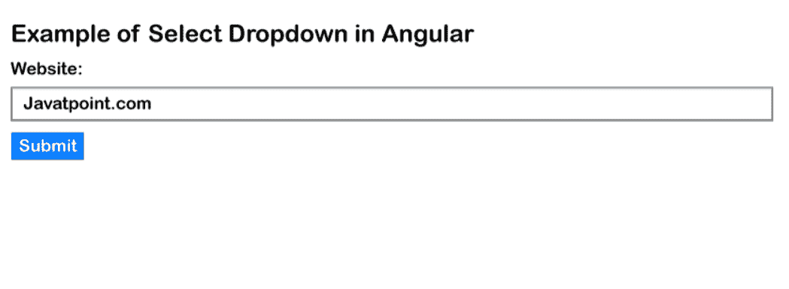

# Angular 9/8 选择下拉示例

> 原文：<https://www.javatpoint.com/angular-9-or-8-select-dropdown-example>

在本节中，我们将学习如何在 Angular 8 或 Angular 9 中选择下拉菜单。为此，我们将提供一个非常简单的示例来选择 [Angular 8](https://www.javatpoint.com/angular-8) 或 Angular 9 中的下拉列表。Angular 9/8 包含绑定选择下拉列表。我们将从下拉选择的更改事件开始。

为了创建一个包含下拉框的反应式表单，我们将使用循环。在本节中，我们将提供两个选择下拉列表的示例。在第一个例子中，当我们点击提交按钮时，我们能够得到所选下拉框的值。在第二个示例中，当变更事件发生时，我们能够获得所选下拉框的值。在我们的两个例子中，我们将使用“网站列表”变量创建下拉列表。下面描述了获取下拉列表的两个例子。为此，首先，我们必须从验证中添加，为此，我们将遵循 Angular 9 中的一些步骤，如下所述:

**示例 1:在表单提交上获取选定的下拉值**

**第一步:**

这一步，我们将**导入表单模块**。如果我们试图使用 Angular 应用程序创建表单，我们需要导入 FormsModule。我们将从@angular/forms 库中导入此内容。因此，我们将使用 app.module.ts 文件并添加以下代码:

**src/app/app.module.ts:**

```

import { BrowserModule } from '@angular/platform-browser';
import { NgModule } from '@angular/core';

import { AppComponent } from './app.component';
import { FormsModule, ReactiveFormsModule } from '@angular/forms';

@NgModule({
  declarations: [
    AppComponent
  ],
  imports: [
    BrowserModule,
    FormsModule,
    ReactiveFormsModule
  ],
  providers: [],
  bootstrap: [AppComponent]
})
export class AppModule { }

```

**第二步:**

在第二步中，我们将使用模型执行**表单。为此，我们将使用 html 表单并用 ngModel 向其中写入代码。所以我们将使用文件 app.component.html 来添加下面的代码。在我们的表单中，我们将使用引导类。**

**src/app/app . component . html:**

```

<div class="container">
    <h1> Example of Select Dropdown in Angular </h1>

    <form [formGroup]="form" (ngSubmit)="submit()">

        <div class="form-group">
            <label for="website">Website:</label>
            <select formControlName="website" class="form-control">
                <option disabled>Select Website</option>
                <option>Choose Website</option>
                <option *ngFor="let web of websiteList">{{web}}</option>
            </select>
            <div *ngIf="f.website.touched && f.website.invalid" class="alert alert-danger">
                <div *ngIf="f.website.errors.required">Name is required.</div>
            </div>
        </div>

        <button class="btn btn-primary" type="submit" [disabled]="!form.valid">Submit</button>
    </form>
</div>

```

**第三步:**

这一步，我们将**更新 Ts 文件**。为此，我们将编写一个名为 submit()的函数，之后，我们就能够获得输入字段的所有值。因此，我们将使用 app.component.ts 文件添加以下代码:

**src/app/app . component . ts:**

```

import { Component } from '@angular/core';
import { FormGroup, FormControl, Validators} from '@angular/forms';

@Component({
  selector: 'app-root',
  templateUrl: './app.component.html',
  styleUrls: ['./app.component.css']
})
export class AppComponent {
  websiteList: any = ['Javatpoint.com', 'HDTuto.com', 'Tutorialandexample.com]

  form = new FormGroup({
    website: new FormControl('', Validators.required)
  });

  get f(){
    return this.form.controls;
  }

  submit(){
    console.log(this.form.value);
  }

}

```

现在，我们将使用以下命令运行上面的示例:

```

ng serve

```

**示例 2:在变更事件中获取选定的下拉值**

**第一步:**

这一步，我们将**导入表单模块**。如果我们试图使用 Angular 应用程序创建表单，我们需要导入 FormsModule。我们将从@angular/forms 库中导入此内容。因此，我们将使用 app.module.ts 文件并添加以下代码:

**src/app/app.module.ts:**

```

import { BrowserModule } from '@angular/platform-browser';
import { NgModule } from '@angular/core';

import { AppComponent } from './app.component';
import { FormsModule, ReactiveFormsModule } from '@angular/forms';

@NgModule({
  declarations: [
    AppComponent
  ],
  imports: [
    BrowserModule,
    FormsModule,
    ReactiveFormsModule
  ],
  providers: [],
  bootstrap: [AppComponent]
})
export class AppModule { }

```

**第二步:**

在第二步中，我们将使用模型执行**表单。为此，我们将使用 html 表单并用 ngModel 向其中写入代码。所以我们将使用文件 app.component.html 来添加下面的代码。在我们的表单中，我们将使用引导类。**

**src/app/app . component . html:**

```

<div class="container">
    <h1> Example of Select Dropdown in Angular </h1>

    <form [formGroup]="form" (ngSubmit)="submit()">

        <div class="form-group">
            <label for="website">Website:</label>
            <select formControlName="website" class="form-control" (change)="changeWebsite($event)">
                <option disabled>Select Website</option>
                <option>Choose Website</option>
                <option *ngFor="let web of websiteList">{{web}}</option>
            </select>
            <div *ngIf="f.website.touched && f.website.invalid" class="alert alert-danger">
                <div *ngIf="f.website.errors.required">Name is required.</div>
            </div>
        </div>

        <button class="btn btn-primary" type="submit" [disabled]="!form.valid">Submit</button>
    </form>
</div>

```

**第三步:**

这一步，我们将**更新 Ts 文件**。为此，我们将编写一个名为 submit()的函数，之后，我们就能够获得输入字段的所有值。因此，我们将使用 app.component.ts 文件添加以下代码:

**src/app/app.component.ts**

```

import { Component } from '@angular/core';
import { FormGroup, FormControl, Validators} from '@angular/forms';

@Component({
  selector: 'app-root',
  templateUrl: './app.component.html',
  styleUrls: ['./app.component.css']
})
export class AppComponent {
  websiteList: any = ['Javatpoint.com', 'HDTuto.com', 'Tutorialandexample.com]

  form = new FormGroup({
    website: new FormControl('', Validators.required)
  });

  get f(){
    return this.form.controls;
  }

  submit(){
    console.log(this.form.value);
  }
  changeWebsite(e) {
    console.log(e.target.value);
  }

}

```

现在，我们将使用以下命令运行上面的示例:

```

ng serve

```

运行上述命令后，我们将看到以下输出:



* * *