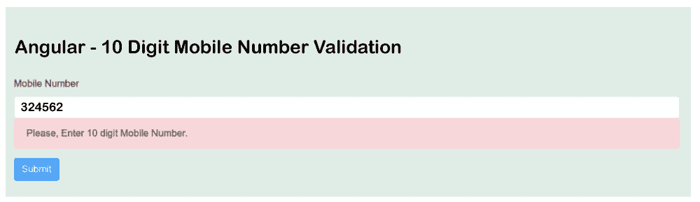

# 10 位数手机号码验证

> 原文：<https://www.javatpoint.com/10-digit-mobile-number-validation-in-angular>

在本节中，我们将学习十位数手机号码的验证。我们将使用 Angular 来实现这一点。在下面的示例中，我们将使用Angular反应形式来验证手机号码。我们可以在不同版本的 Angular 应用程序中执行它，如 Angular 6、7、8、9、10 和 11。

在下面的示例中，我们将使用 Angular 应用程序和 Reactive 表单来验证十位数的手机号码。Reactive 将提供仅接受该号码的功能。它不接受任何号码，只接受 10 位数的手机号码。电话号码字段将不接受任何特殊字符或字母，因为它们被阻止。特殊字符可以是逗号、括号、星号、百分比、空格等。它不允许复制粘贴选项。

加号(+)将不被允许，因为如果我们在下拉列表中输入我们的国家，它将单独添加该国家代码。如果用户输入的号码不正确，它将显示一条警告消息“请输入 10 位数的手机号码。”如果用户输入的数字正确，它将允许我们点击提交按钮，并且不会显示任何警告消息。

为了验证十位数，我们必须使用一些代码，描述如下:

```

this.form = fb.group({
  mobileNumber: ['', [Validators.required, Validators.pattern("^((\\+91-?)|0)?[0-9]{10}$")]]
})

```

**示例:**

**src/app/app . component . html:**

```

<div class="container">
    <h1> Angular - 10 Digit Mobile Number Validation </h1>
      <form [formGroup]="form" (ngSubmit)="submit()">
            <div class="form-group">
            <label for="mobileNumber">Mobile Number</label>
            <input 
                formControlName="mobileNumber"
                id="mobileNumber" 
                type="text" 
                class="form-control">
            <div *ngIf="f.mobileNumber.touched && f.mobileNumber.invalid" class="alert alert-danger">
                <div *ngIf="f.mobileNumber.errors.required">Mobile Number is required.</div>
                <div *ngIf="f.mobileNumber.errors.pattern">Please, Enter 10 digit Mobile Number.</div>
            </div>
        </div>
  <button class="btn btn-primary" type="submit" [disabled]="!form.valid">Submit</button>
    </form>
</div>

```

**src/app/app.component.ts**

```

import { Component } from '@angular/core';
import { FormBuilder, FormGroup, FormControl, Validators} from '@angular/forms';
   @Component({
  selector: 'app-root',
  templateUrl: './app.component.html',
  styleUrls: ['./app.component.css']
})
export class AppComponent {
  form: FormGroup = new FormGroup({});
   constructor(private fb: FormBuilder) {
    this.form = fb.group({
      mobileNumber: ['', [Validators.required, Validators.pattern("^((\\+91-?)|0)?[0-9]{10}$")]]
    })
  }
get f(){
    return this.form.controls;
  }
submit(){
    console.log(this.form.value);
  }
  }

```

现在我们上面的代码已经准备好了，我们可以运行它了。当我们运行它时，将生成以下输出:



* * *