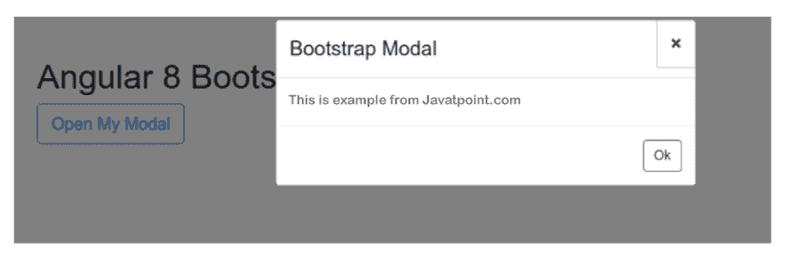

# Angular 9/8 中的引导模式弹出窗口

> 原文：<https://www.javatpoint.com/bootstrap-modal-popup-in-angular-9-8>

在本节中，我们将了解引导模型弹出窗口。我们将使用 Angular 8 或 Angular 9 来实现这一点。在我们的应用程序中，我们将使用 Bootstrap 模型弹出窗口。我们将使用引导，这样我们就可以使用引导模型弹出窗口。

Bootstrap 开发了非常流行的 Ng [Bootstrap](https://www.javatpoint.com/bootstrap-tutorial) 。Bootstrap 3 和 [Bootstrap 4](https://www.javatpoint.com/bootstrap-4) 的原生Angular属性由 Ng Bootstrap 提供，如日期选择器、模型、按钮和分页等。引导用户界面可以很容易地被引导程序使用。在我们的 [Angular 8](https://www.javatpoint.com/angular-8) 应用程序中只需创建一个模型弹出窗口。创建模型弹出窗口的逐步过程描述如下:

**第一步:**

这一步，我们要去**新建 App** 。我们将使用以下命令来创建我们的 Angular 应用程序，如下所示:

```

ng new my-new-app

```

**第二步:**

在这一步中，我们将去**安装引导程序 4** 。我们将安装 Bootstrap 的核心包。安装引导数据库的命令如下所示:

```

npm install bootstrap --save

```

当我们成功安装 Bootstrap 时，我们要求包含 Bootstrap CSS，比如“node _ modules/Bootstrap/dist/CSS/Bootstrap . min . CSS”。现在，我们将使用 angular.json 文件，如下所示添加它:

**Angular。json**

```

.....
    "styles": [
      "node_modules/bootstrap/dist/css/bootstrap.min.css",
      "src/styles.css"
    ],
.....

```

**第三步:**

在这一步中，我们将去**安装 Ng Bootstrap** 。我们将安装 Ng Bootstrap 的软件包。为此，需要引导用户界面。安装它的命令如下:

```

npm install --save @ng-bootstrap/ng-bootstrap

```

**第四步:**

这一步，我们要去**导入模块**。我们将使用 app.module.ts 文件来导入 ModuleOfNg。我们将把下面的代码放入该文件:

**src/app/app.module.ts**

```

import { BrowserModule } from '@angular/platform-browser';
import { ModuleOfNg } from '@angular/core';

import { AppComponent } from './app.component';

import {ModuleOfNgb} from '@ng-bootstrap/ng-bootstrap';

@ModuleOfNg({
  declarations: [
    AppComponent
  ],
  imports: [
    ModuleOfBrowser, 
    ModuleOfNgb
  ],
  providers: [],
  bootstrap: [AppComponent]
})
export class AppModule { }

```

**第五步:**

在这一步中，我们将去**更新视图文件**。为此，我们将使用我们的 html 文件。我们将简单地创建引导模型的模板文件，并放入以下代码:

**src/app/app . component . html**

```

<h1>Angular 8 Bootstrap Modal Popup Example</h1>

<button class="btn btn-lg btn-outline-primary" (click)="open(mymodal)">Open My Modal</button>

<ng-template #mymodal let-modal>
  <div class="modal-header">
    <h4 class="modal-title" id="modal-basic-title">Bootstrap Modal</h4>
    <button type="button" class="close" aria-label="Close" (click)="modal.dismiss('Cross click')">
      <span aria-hidden="true">?</span>
    </button>
  </div>
  <div class="modal-body">
    This is example from Javatpoint.com
  </div>
  <div class="modal-footer">
    <button type="button" class="btn btn-outline-dark" (click)="modal.close('Save click')">Ok</button>
  </div>
</ng-template>

```

**第六步:**

在这一步中，我们将使用**组件文件**。我们将创建 Bootstrap 模型的打开和关闭函数，并编写其代码，描述如下:

**src/app/app.component.ts**

```

import { Component } from '@angular/core';

import {ModalOfNgb, ModalOfDismissReasons} from '@ng-bootstrap/ng-bootstrap';

@Component({
  selector: 'app-root',
  templateUrl: './app.component.html',
  styleUrls: ['./app.component.css']
})
export class AppComponent {
  title = 'appBootstrap';

  closeResult: string;

  constructor(private modalService: ModalOfNgb) {}

  open(content) {
    this.modalService.open(content, {ariaLabelledBy: 'modal-basic-title'}).result.then((result) => {
      this.closeResult = `Closed with: ${result}`;
    }, (reason) => {
      this.closeResult = `Dismissed ${this.getDismissReason(reason)}`;
    });
  }

  private getDismissReason(reason: any): string {
    if (reason === ModalOfDismissReasons.ESC) {
      return 'by pressing ESC';
    } else if (reason === ModalOfDismissReasons.BACKDROP_CLICK) {
      return 'by clicking on a backdrop';
    } else {
      return  `with: ${reason}`;
    }
  }
}

```

现在我们上面的代码可以运行了。为了运行上述代码，我们将使用以下命令:

```

ng serve

```

当我们运行此命令时，将生成以下输出:



* * *