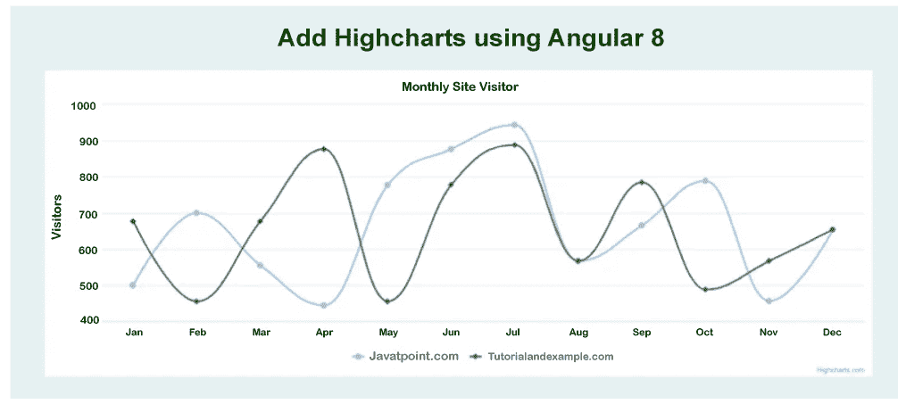

# 使用 Angular 9/8 添加高图表

> 原文：<https://www.javatpoint.com/add-highcharts-using-angular-9-8>

在这个例子中，我们将学习高级图表。我们将使用 Angular 8 或 Angular 9 来实现这一点。在我们的 Angular 应用程序中，将使用高图表创建样条曲线图表。为了创建图表，我们将使用 highcharts angular 9/8 并安装 highcharts 和 highcharts angular 的 npm 包。为了添加高图表，我们将使用分步过程，描述如下:

**第一步:**

在这一步，我们将创建新的应用程序。以下命令将用于创建一个像这样的 Angular 应用程序:

```js

ng new myHighcharts

```

**第二步:**

在这一步中，我们将安装 Npm 包。我们将在 Angular 中安装高图表和高图表的 npm 包。

```js

npm install highcharts --save
npm install highcharts-angular --save

```

**第三步:**

在这一步中，我们将导入高 chartsChartComponent。我们将使用高 Angular 图表来导入这个。之后，我们将添加声明部分。然后我们将使用一个名为 app.module.ts 的文件，并对其进行如下更新:

**src/app/app.module.ts**

```js

import { ModuleOfBrowser  } from '@angular/platform-browser';
import { ModuleOfNg } from '@angular/core';
import { HighchartsChartComponent } from 'highcharts-angular';

import { AppComponent } from './app.component';

@ModuleOfNg({
  declarations: [
    AppComponent,
    ComponentOfHighchartsChart
  ],
  imports: [
    ModuleOfBrowser 
  ],
  providers: [],
  bootstrap: [AppComponent]
})
export class AppModule { }

```

**第四步:**

在这一步中，我们将使用高级图表。在这里，我们将使用一个名为 app.component.ts 的文件，并对其进行更新。该文件用于创建一个数据 Json 数组，然后将其转发给 highcharts 选项变量。我们将使用应用编程接口来使用服务，这样我们就可以获得动态数据。

**src/app/app.component.ts**

```js

import { Component } from '@angular/core';
import * as Highcharts from 'highcharts';

@Component({
  selector: 'app-root',
  templateUrl: './app.component.html',
  styleUrls: ['./app.component.css']
})
export class AppComponent {
    title = 'myHighchart';

    data = [{
            name: 'Javatpoint.com',
            data: [500, 700, 555, 444, 777, 877, 944, 567, 666, 789, 456, 654]
         },{
            name: 'Tutorialandexample.com',
            data: [677, 455, 677, 877, 455, 778, 888, 567, 785, 488, 567, 654]
         }];

    highcharts = Highcharts;
    chartOptions = {   
      chart: {
         type: "spline"
      },
      title: {
         text: "Monthly Site Visitor"
      },
      xAxis:{
         categories:["Jan", "Feb", "Mar", "Apr", "May", "Jun", "Jul", "Aug", "Sep", "Oct", "Nov", "Dec"]
      },
      yAxis: {          
         title:{
            text:"Visitors"
         } 
      },
      series: this.data
    };
}

```

**第五步:**

在这一步中，我们将显示高级图表。在本文中，我们将使用 HTML 文件，然后我们将像这样更新该文件:

**src/app/app . component . html**

```js

<h1> Add Highcharts using Angular 8 </h1>

<highcharts-chart
   [Highcharts] = "highcharts" 
   [options] = "chartOptions" 
   style = "width: 100%; height: 400px; display: block;">
</highcharts-chart>

```

现在我们上面的代码可以运行了。为了运行上述代码，我们将使用以下命令:

```js

ng serve

```

当我们运行此命令时，将生成以下输出:



* * *