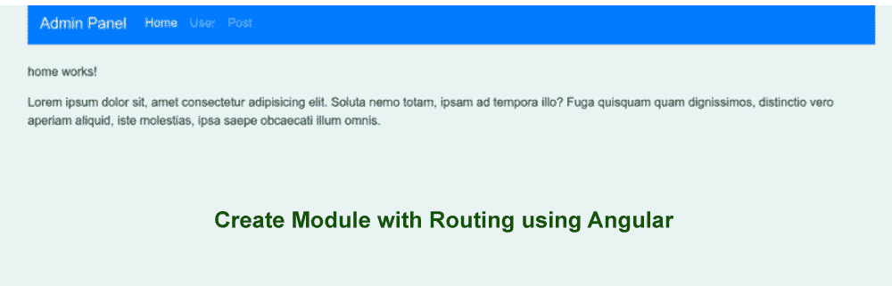

# Angular 9 创建带布线的模块

> 原文：<https://www.javatpoint.com/angular-9-create-module-with-routing>

在本节中，我们将学习如何创建带有路由的模块。我们将使用 Angular 9 来实现这一点。如果我们不了解 Angular 9 路由模块，这个例子将帮助我们了解这一点。

在下面的 Angular 应用程序中，我们将创建一个管理模块。在管理模块下，将创建三个组件:主页、用户和帖子。该组件用于调用模块路由文件。在我们的应用程序中，我们将使用分步过程创建一个带有路由的模块，如下所述:

**第一步:**

这一步，我们要去**新建 App** 。以下命令将用于创建我们的 Angular 应用程序，如下所示:

```js

ng new my-module-app

```

**第二步:**

在这一步中，我们将进入**创建管理模块**。当我们成功创建我们的 angular app 时，我们需要创建一个模块。我们将使用 Angular cli 命令来创建模块。在 Angular 应用程序中，我们可以使用 Angular 提供的命令创建一个包含模块的模块。因此，我们将使用以下命令创建管理模块:

```js

ng g module admin --routing

```

当我们成功执行上述命令时，我们将创建如下文件:

```js

src/app/admin/admin.module.ts
src/app/admin/admin-routing.module.ts

```

**第三步:**

在这一步中，我们将**为模块**创建组件。以下命令将用于创建管理模块的组件。因此，在我们的管理模块中，我们将创建三个组件，如主页、用户和帖子。

```js

ng g component admin/home
ng g component admin/user
ng g component admin/post

```

当我们成功执行上述命令时，它将创建一个包含一些文件的文件夹，如下所示:

```js

src/app/admin/home/*
src/app/admin/user/*
src/app/admin/post/*

```

上面显示了三个组件:主页、用户和带有 HTML 文件的帖子。如果我们想检查演示，我们可以用我们的内容对该文件进行更改。

**第四步:**

在这一步中，我们将进入**为组件**创建添加路线。这里我们将使用创建的组件来添加路线。之后，我们将使用名为 admin-routing module 的文件，并对其进行如下更新:

**src/app/admin/admin-routing . module . ts**

```js

import { NgModule } from '@angular/core';
import { Routes, RouterModule } from '@angular/router';
import { HomeComponent } from './home/home.component';
import { UserComponent } from './user/user.component';
import { PostComponent } from './post/post.component';

const routes: Routes = [
  {path : '', component : HomeComponent},
  {path : 'user', component : UserComponent},
  {path : 'post', component : PostComponent}
];

@NgModule({
  imports: [RouterModule.forChild(routes)],
  exports: [RouterModule]
})
export class AdminRoutingModule { }

```

**第五步:**

这一步，我们要去**更新组件 HTML 文件**。我们将使用路线出口添加所有路线的链接。所以我们将这样更新:

在这个文件中，我们使用引导。如果我们的系统上没有 Bootstrap，我们将使用以下链接在我们的系统上为我们的应用程序安装 Bootstrap，如下所示:

[https://www . javatpoint . com/angular-7-with-bootstrap #:~:text = How % 20 to % 20 install % 20 bootstrap % 20 for，% 3E % 20 the % 20% 403% 20 is % 20 important](https://www.javatpoint.com/angular-7-with-bootstrap#:~:text=How%20to%20install%20Bootstrap%20for,%3E%20The%20%403%20is%20important)！

**src/app/app . component . html**

```js

<div class="container">
  <nav class="navbar navbar-expand-lg navbar-dark bg-primary">
    <a class="navbar-brand" href="#">Admin Panel</a>

    <div class="collapse navbar-collapse" id="navbarSupportedContent">
      <ul class="navbar-nav mr-auto">
        <li class="nav-item active">
          <a class="nav-link" href="#home" routerLink="/">Home <span class="sr-only">(current)</span></a>
        </li>
        <li class="nav-item">
          <a class="nav-link" href="#user" routerLink="/user">User</a>
        </li>
        <li class="nav-item">
          <a class="nav-link" href="#post" routerLink="/post">Post</a>
        </li>
      </ul>
    </div>
  </nav>
</div>

<div class="container">
    <router-outlet></router-outlet>
</div>

```

**第六步:**

在这一步中，我们将进入**导入-模块到模块. ts 文件**。使用以下方式，我们将像这样更新该文件:

**src/app/app.module.ts**

```js

import { BrowserModule } from '@angular/platform-browser';
import { NgModule } from '@angular/core';

import { AppRoutingModule } from './app-routing.module';
import { AppComponent } from './app.component';
import { AdminModule } from './admin/admin.module';

@NgModule({
  declarations: [
    AppComponent
  ],
  imports: [
    BrowserModule,
    AppRoutingModule,
    AdminModule
  ],
  providers: [],
  bootstrap: [AppComponent]
})
export class AppModule { }

```

现在我们上面的代码可以运行了。为了运行上述代码，我们将使用以下命令:

```js

ng serve

```

当我们运行此命令时，将生成以下输出:



* * *