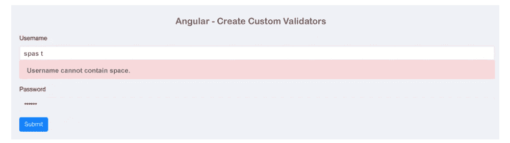

# Angular形验证不允许空白

> 原文：<https://www.javatpoint.com/angular-form-validation-no-whitespace-allowed>

在本节中，我们将学习表单验证。在这种形式下，我们不允许任何空白。我们将使用 Angular 来实现这一点。很多时候，我们的应用程序需要一个没有任何空格的表单来接受输入。在我们的反应形式中，我们可以使用不允许空白的自定义验证。使用这种自定义验证，我们可以轻松地验证不允许空白。为了验证不允许空白，我们可以使用 Angular 的不同版本，如 Angular 6、7、8、9、10 和 11。

如果我们试图通过使用“If 条件”或任何其他东西来添加不允许表单中有任何空白的验证。但是这种方式非常困难。因此，我们找到了一种简单的方法来验证不允许空白。我们将创建自定义验证，其中包含许多验证规则。在下面的示例中，将创建新的自定义验证，这将不允许在输入字段中包含空格。在我们的表单中，用户名不允许带空格进入。为此，我们必须遵循以下步骤:

**第一步:**

这一步，我们要去**安装 Angular app** 。在这里，我们将创建一个新的 ng-app。我们不需要创建一个 Angular 应用程序，如果我们已经创建了它。为了创建新的 ng-app，将使用如下命令:

```

ng new my-custom-val-app

```

**第二步:**

这一步，我们要去**导入表单模块**。在我们的 Angular 应用程序中，我们需要创建一个表单。我们将使用@angular/forms 库来导入它。现在我们将使用一个名为 app.module.ts 的文件，并在其中添加以下代码:

**src/app/app.module.ts**

```

import { ModuleOfBrowser } from '@angular/platform-browser';
import { ModuleOfNg } from '@angular/core';
import { ModuleOfForms, ModuleOfReactiveForms } from '@angular/forms';

import { AppComponent } from './app.component';

@ModuleOfNg({
  declarations: [
    AppComponent
  ],
  imports: [
    ModuleOfBrowser,
    ModuleOfForms,
    ModuleOfReactiveForms
  ],
  providers: [],
  bootstrap: [AppComponent]
})
export class AppModule { }

```

**第三步:**

在这一步中，我们将使用模型创建表单。这里，将编写一个 HTML 表单的代码。在这个表单中，我们将使用 Bootstrap 类。如果我们没有 Bootstrap，我们可以使用以下链接将其安装到我们的系统中:

[https://www . javatpoint . com/angular-7-with-bootstrap #:~:text = How % 20 to % 20 install % 20 bootstrap % 20 for，% 3E % 20 the % 20% 403% 20 is % 20 important](https://www.javatpoint.com/angular-7-with-bootstrap#:~:text=How%20to%20install%20Bootstrap%20for,%3E%20The%20%403%20is%20important)！

现在我们将使用一个名为 app.component.html 的文件，并将下面的代码添加到其中，如下所示:

**src/app/app . component . html**

```

<h1> Angular - Create Custom Validators </h1>

<form [formGroup]="form" (ngSubmit)="submit()">

    <div class="form-group">
        <label for="username">Username</label>
        <input 
            formControlName="username"
            id="username" 
            type="text" 
            class="form-control">
        <div *ngIf="f.username.touched && f.username.invalid" class="alert alert-danger">
            <div *ngIf="f.username.errors.required">Username is required.</div>
            <div *ngIf="f.username.errors.minlength">Username should be 3 character.</div>
            <div *ngIf="f.username.errors.cannotContainSpace">Username cannot contain space.</div>
        </div>
    </div>

    <div class="form-group">
        <label for="password">Password</label>
        <input 
            formControlName="password"
            id="password" 
            type="password" 
            class="form-control">
        <div *ngIf="f.password.touched && f.password.invalid" class="alert alert-danger">
            <div *ngIf="f.password.errors.required">Password is required.</div>
        </div>
    </div>

    <button class="btn btn-primary" type="submit">Submit</button>
</form>

```

**第四步:**

这一步，我们要去**更新 Ts 文件**。该文件用于编写 submit()。它还用于获取输入字段的所有值。现在我们将使用一个名为 app.component.ts 的文件，并将下面的代码添加到其中，如下所示:

**src/app/app.component.ts**

```

import { Component } from '@angular/core';
import { FormGroup, FormControl, Validators} from '@angular/forms';
import { UsernameValidator } from './username.validator';

@Component({
  selector: 'app-root',
  templateUrl: './app.component.html',
  styleUrls: ['./app.component.css']
})
export class AppComponent {
  form = new FormGroup({
    username: new FormControl('', [Validators.required, Validators.minLength(3), UsernameValidator.cannotContainSpace]),
    password: new FormControl('', Validators.required)
  });

  get f(){
    return this.form.controls;
  }

  submit(){
    console.log(this.form.value);
  }
}

```

**第五步:**

在这一步中，我们将进入**创建自定义验证文件**。在这里，我们将创建一个名为“username.validator.ts”的自定义文件，然后将如下代码添加到其中:

**src/app/username . validator . ts**

```

import { AbstractControl, ValidationErrors } from '@angular/forms';

export class UsernameValidator {
    static cannotContainSpace(control: AbstractControl) : ValidationErrors | null {
        if((control.value as string).indexOf(' ') >= 0){
            return {cannotContainSpace: true}
        }

        return null;
    }
}

```

现在我们上面的代码可以运行了。为了运行上述代码，我们将使用以下命令:

```

ng serve

```

当我们运行此命令时，将生成以下输出:



* * *