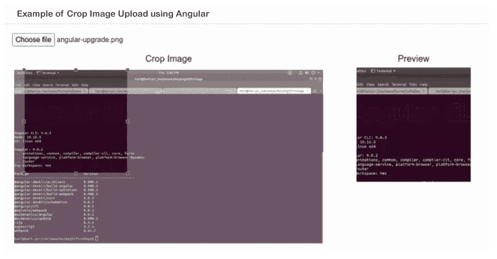

# 带裁剪、缩放、缩放的 Angular 图像上传

> 原文：<https://www.javatpoint.com/angular-image-upload-with-crop-zoom-scale>

在这一步中，我们将学习如何上传带有缩放、裁剪和缩放的图像。我们将使用 Angular 来实现这一点。如果我们想下载裁剪后的图像，我们可以在 base64 中下载。我们可以使用不同版本的 Angular 应用程序，如 Angular 6、7、8、9、10 和 11。

ngx-image-cropper 的 npm 包在我们想使用图片上传的时候会很有用。它将在加载时为我们提供缩放、裁剪、缩放和预览等功能。我们可以非常容易地在 Angular 应用程序中使用它。为了上传带有裁剪的图像，步骤描述如下:

**第一步:**

这一步，我们要去**新建 App** 。以下命令将有助于创建新的 Angular 应用程序，如下所示:

```js

ng new ngImageCrop

```

**第二步:**

这一步，我们要去**安装 Npm 包**。在我们的 Angular app 中，我们可以使用 ngx-image-cropper 的 npm 包上传图像裁剪功能。

```js

npm install ngx-image-cropper --save

```

**第三步:**

在这一步中，我们将进入**导入图像对话框**。我们将使用 ngx-image-cropper 导入它。之后，我们将使用声明部分来添加它。现在我们将使用名为 app.module.ts 的文件，并对其进行如下更新:

**src/app/app.module.ts**

```js

import { BrowserModule } from '@angular/platform-browser';
import { NgModule } from '@angular/core';

import { AppComponent } from './app.component';

import { ImageCropperModule } from 'ngx-image-cropper';

@NgModule({
  declarations: [
    AppComponent
  ],
  imports: [
    BrowserModule,
    ImageCropperModule
  ],
  providers: [],
  bootstrap: [AppComponent]
})
export class AppModule { }

```

**第四步:**

在这一步中，我们将进入**更新组件 ts 文件**。此文件用于写入 imageLoaded()、fileChangeEvent()、loadImageFailed()、fileChangeEvent()和 cropperReady()。所有这些功能都由 ngx-image-cropper 提供。现在我们将打开 app.component.ts 文件，如下所示进行更新:

**src/app/app.component.ts**

```js

import { Component } from '@angular/core';
import { ImageCroppedEvent } from 'ngx-image-cropper';

@Component({
  selector: 'app-root',
  templateUrl: './app.component.html',
  styleUrls: ['./app.component.css']
})
export class AppComponent {
  title = 'ngImageCrop';

  imageChangedEvent: any = '';
    croppedImage: any = '';

    fileChangeEvent(event: any): void {
        this.imageChangedEvent = event;
    }
    imageCropped(event: ImageCroppedEvent) {
        this.croppedImage = event.base64;
    }
    imageLoaded() {
        /* show cropper */
    }
    cropperReady() {
        /* cropper ready */
    }
    loadImageFailed() {
        /* show message */
    }
}

```

**第五步:**

这一步，我们要去**更新 HTML 文件**。在这个表单中，我们将使用 Bootstrap 类。如果我们没有 Bootstrap，我们可以使用以下链接将其安装到我们的系统中:

[https://www . javatpoint . com/angular-7-with-bootstrap #:~:text = How % 20 to % 20 install % 20 bootstrap % 20 for，% 3E % 20 the % 20% 403% 20 is % 20 important](https://www.javatpoint.com/angular-7-with-bootstrap#:~:text=How%20to%20install%20Bootstrap%20for,%3E%20The%20%403%20is%20important)！

现在我们将打开我们的 HTML 文件，并像这样更新它:

**src/app/app . component . html**

```js

<div class="container">
    <div class="card">
      <div class="card-header">
          Example of Crop Image Upload using Angular 
      </div>
      <div class="card-body">
        <input type="file" (change)="fileChangeEvent($event)" />
        <div class="row" style="margin-top: 15px;">
            <div class="text-center col-md-8">
                <h5>Crop Image</h5>
                <image-cropper 
                [imageChangedEvent]="imageChangedEvent" 
                [maintainAspectRatio]="true" 
                [aspectRatio]="4 / 4"
                [resizeToWidth]="256" 
                format="png" 
                (imageCropped)="imageCropped($event)" 
                (imageLoaded)="imageLoaded()"
                (cropperReady)="cropperReady()" 
                (loadImageFailed)="loadImageFailed()"></image-cropper>
            </div>
            <div class="text-center col-md-4">
                <h5>Preview</h5>
                
            </div>
        </div>
      </div>
    </div>
</div>

```

现在我们上面的代码可以运行了。为了运行上述代码，我们将使用以下命令:

```js

ng serve

```

当我们运行此命令时，将生成以下输出:



* * *