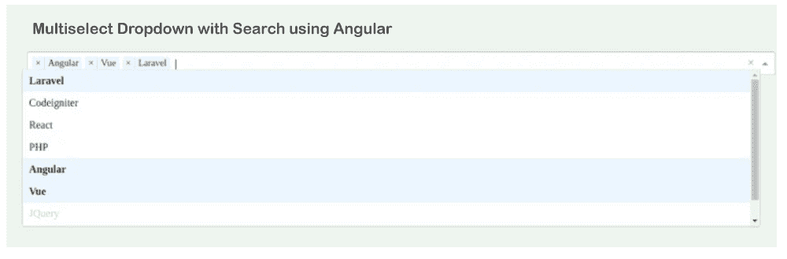

# 使用角度 11/10 的多选下拉菜单

> 原文：<https://www.javatpoint.com/multi-select-dropdown-using-angular-11-10>

在本节中，我们将学习多选下拉菜单。我们将使用角度 10 或角度 11 来实现这一点。如果我们不知道多重选择下拉选项，这个例子将提供很好的知识。

在 Angular 应用程序中，我们将使用 ng-select 的 npm 包进行多选下拉。这个包用于提供 set 方法，该方法提供下拉选项。为了获得选定的选项值，该包还提供了更改事件。为了在 Angular 中获得多选下拉列表，我们必须遵循以下步骤:

**第一步:**

这一步，我们要去**新建 App** 。以下命令将用于创建新的 Angular 应用程序，如下所示:

```

ng new myMultiselect

```

**第二步:**

这一步，我们要去**安装 NPM 包**。在这里，我们将首先安装@ng-select 或一个 ng-select npm 包，然后我们将使用它来创建图表。在 Angular 应用程序中，我们将使用多个选择下拉列表来创建图表。安装 ng-select 的命令描述如下:

```

npm install --save @ng-select/ng-select

```

**第三步:**

在这一步中，我们将进入**导入选择模块**。在我们的应用程序中，我们将使用 ng-select 来导入它。之后，我们将进行申报。我们将使用名为 app.module.ts 的文件，并对其进行如下更新:

**src/app/app.module.ts**

```

import { NgModule } from '@angular/core';
import { BrowserModule } from '@angular/platform-browser';
import { FormsModule } from '@angular/forms';

import { AppComponent } from './app.component';

import { NgSelectModule } from '@ng-select/ng-select'; 

@NgModule({
  imports:      [ BrowserModule, FormsModule, NgSelectModule ],
  declarations: [ AppComponent ],
  bootstrap:    [ AppComponent ]
})
export class AppModule { }

```

**第四步:**

这一步，我们要去**导入一个 CSS 文件**。在这里，我们将使用一个名为 ng-select 主题 CSS 的文件并导入它。利用这个，我们将得到多个选择下拉框的设计。我们将使用一个名为 styles.css 的文件，然后像这样导入它:

src/styles . CSS

```

/* Add application styles & imports to this file! */
@import "~@ng-select/ng-select/themes/default.theme.css";

```

**第五步:**

在这一步中，我们将进入**更新 ts 文件**。在这里，我们将使用一个名为 app.component.ts 的文件并更新该文件。该文件用于包含“类别”数组，该数组将包含类别列表。在我们的应用程序中，我们将创建一个下拉框选项。如果我们的应用程序需要创建带有默认选择选项的“选择”数组，我们也可以这样做。最后，我们将创建 getSelectedValue()，用于获取选定的值并调用点击事件，如下所述:

**src/app/app.component.ts**

```

import { Component } from '@angular/core';

@Component({
  selector: 'my-app',
  templateUrl: './app.component.html',
  styleUrls: [ './app.component.css' ]
})
export class AppComponent  {
  name = 'Angular';

  categories = [
    {id: 1, name: 'Laravel'},
    {id: 2, name: 'Codeigniter'},
    {id: 3, name: 'React'},
    {id: 4, name: 'PHP'},
    {id: 5, name: 'Angular'},
    {id: 6, name: 'Vue'},
    {id: 7, name: 'JQuery', disabled: true},
    {id: 8, name: 'Javascript'},
  ];

  selected = [
    {id: 5, name: 'Angular'},
    {id: 6, name: 'Vue'}
  ];

  getSelectedValue(){
    console.log(this.selected);
  }
}

```

**第六步:**

这一步，我们要去**更新布局文件**。这里我们将使用 HTML 并像这样更新该文件:

**src/app/app . component . html**

```

<h1> Multiselect Dropdown with Search using Angular </h1>

<ng-select [items]="categories"
               bindLabel="name"
               placeholder="Select Category"
               appendTo="body"
               [multiple]="true"
               [(ngModel)]="selected">
</ng-select>

<button (click)="getSelectedValue()">Get Selected Values</button>

```

现在我们上面的代码可以运行了。为了运行上述代码，我们将使用以下命令:

```
ng serve
```

当我们运行此命令时，将生成以下输出:



* * *