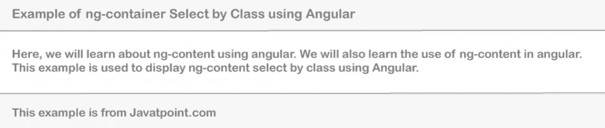

# 集装箱 Angular 形

> 原文：<https://www.javatpoint.com/ng-container-angular>

在本节中，我们将了解 ng 容器。我们可以在应用程序中使用任意版本的 Angular，如 Angular 6、7、8 和 Angular 8。在这里，我们将使用 ng-content 和 ng-container。

使用 ng-container 和 ng-content，我们可以为可重用组件再提供一个解决方案。在我们的 Angular 应用程序中，我们可以通过使用 ng-container 和 ng-content 轻松创建一个可重用的组件。在我们的组件中，我们可以轻松地动态传递数据。

在下面的例子中，我的卡组件将被创建。为了创建这个，ng-content 将与 ng-container 一起使用。在我们的例子中，id 和 dom 元素也可以使用。我们还将使用 Bootstrap 4。我们将它用于内容、标题和页脚文本。我们可以动态地传递这些参数，并在 Angular 应用程序的任何地方调用我们的组件。为了创建含有 ng 含量的 ng 容器，分步过程描述如下:

**第一步:**

这一步，我们要去**新建 App** 。以下内容将用于创建我们新的 Angular 应用程序，如下所示:

ng 新 appngcontent

**第二步:**

在这一步中，我们将进入**创建新组件**。为此，将创建一个名为 my-card 的新组件。在这里，我们还将使用自举卡。我们将使用视图文件并像这样更新它:

ng 组件 my-card

现在我们将使用一个名为 my-card.components.ts 的文件，并像这样更新它们的代码:

**src/app/my-card/my-card . component . ts**

```js

import { Component, OnInit } from '@angular/core';

@Component({ 
  selector: 'my-card',
  templateUrl: './my-card.component.html',
  styleUrls: ['./my-card.component.css']
})
export class MyCardComponent implements OnInit {

  constructor() { }

  ngOnInit() {
  }

}

```

这里，将使用 Bootstrap 4 的卡布局。如果我们的系统没有引导，我们可以使用以下链接将其安装到我们的系统中:

[https://www.javatpoint.com/angular-7-with-bootstrap](https://www.javatpoint.com/angular-7-with-bootstrap)

现在我们将使用我们的 HTML 视图文件，并像这样更新它:

**src/app/my-card/my-card . component . html**

```js

<div class="card">
    <div class="card-header">
        <ng-content select=".header"></ng-content>
    </div>
    <div class="card-body">
        <ng-content select=".content"></ng-content>
    </div>
    <div class="card-footer">
        <ng-content select=".footer"></ng-content>
    </div>
</div>

```

**第三步:**

在这一步中，我们将使用组件。在这里，我们将使用动态数据，并这样调用我们的组件:

**src/app/app . component . html**

```js

<my-card>
  <ng-container class="header">
     Example of ng-container Select by Class using Angular
  </ng-container>
  <ng-container class="content">
     Here, we will learn about ng-content using angular. We will also learn the use of ng-content in angular. This example is used to display ng-content select by class using Angular. 
  </ng-container>
  <ng-container class="footer">
     This example is from Javatpoint.com
  </ng-container>
</my-card>

```

现在我们上面的代码可以运行了。为了运行上述代码，我们将使用以下命令:

```js

ng serve

```

当我们运行此命令时，将生成以下输出:



* * *