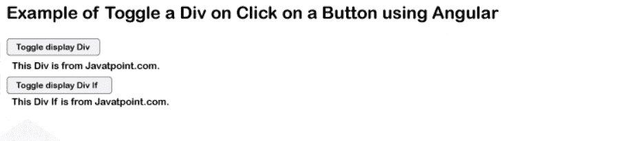

# 在按钮上切换刻度单击 Angular

> 原文：<https://www.javatpoint.com/toggle-a-div-on-button-click-angular>

在本节中，我们将学习如何通过单击按钮来切换 Div。我们将使用 Angular 来实现这一点。在下面的例子中，我们将学习切换元素的使用。在我们的应用程序中，我们将使用 ngIf 和 hidden 在按钮点击事件上切换 div。在我们的 Angular 应用程序中，我们可以使用 Angular 的不同版本，如 Angular 6、7、8、9、10 和 11，来显示、使用和隐藏点击事件的切换 div。

在我们的部分，我们将解释两个例子来了解点击时切换元素。在第一个例子中，我们将使用 if 和*ngIf。在第二个例子中，我们将使用 if 和[hidden]。我们将使用两种方法来创建按钮。当我们点击该函数时，它将被设置为 true，变量将被设置为 false 值。我们的元素或 div 可以通过变量来显示或隐藏。

**例 1:**

在第一个例子中，我们将使用 if 和*ngIf。

**app.component.html**

```

<h1> Example of Toggle a Div on Click on a Button using Angular /h1>
<button (click)=toggleDisplayDiv() >Toggle display Div</button>
<div [hidden]="isShowDiv">This Div is from Javatpoint.com.</div>/div>

```

**app.component.ts**

```

import { Component } from '@angular/core';

@Component({
  selector: 'app-root',
  templateUrl: './app.component.html',
  styleUrls: ['./app.component.css']
})
export class AppComponent {
  title = 'appComponent';

  isShowDiv = false;

  toggleDisplayDiv() {
    this.isShowDiv = !this.isShowDiv;
  }
}

```

**例 2:**

在第二个例子中，我们将使用 if 和[hidden]。

**app.component.html**

```

<h1> Example of Toggle a Div on Click on a Button using Angular </h1>
<button (click)=toggleDisplayDivIf() >Toggle display Div If</button>
<div *ngIf="!isShowDivIf"> This Div If is from Javatpoint.com.</div>

```

**app.component.ts**

```

import { Component } from '@angular/core';

@Component({
  selector: 'app-root',
  templateUrl: './app.component.html',
  styleUrls: ['./app.component.css']
})
export class AppComponent {
  title = 'appComponent';

  isShowDivIf = false;

  toggleDisplayDivIf() {
    this.isShowDivIf = !this.isShowDivIf;
  }
}

```

现在我们上面的代码已经准备好了，我们可以在本地运行它。当我们运行它时，将生成以下输出:



* * *