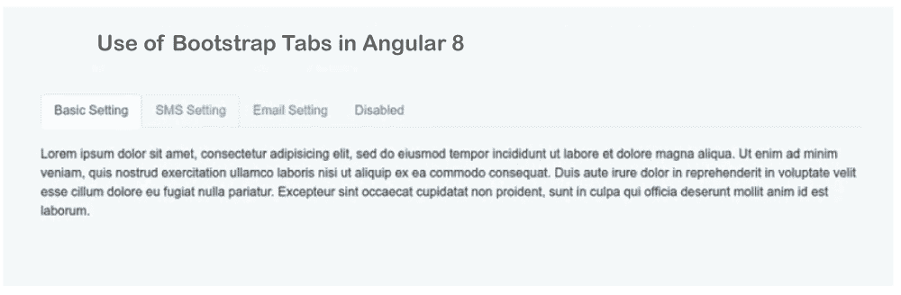

# 使用带Angular的引导标签

> 原文：<https://www.javatpoint.com/use-bootstrap-tabs-with-angular>

在这一步中，我们将了解引导选项卡的使用。我们将使用 Angular 来实现这一点。我们可以通过使用不同版本的 Angular 来使用 Bootstrap 选项卡，如 Angular 6、7、8、9、10 和 11。如果我们不知道 ngx-bootstrap 标签，我们就在正确的宫殿。以下示例将提供一种学习引导标签的简单方法。

Bootstrap 提供了 Ng Bootstrap 的工具。Bootstrap 版本 3 和 4 的所有本机Angular指令将由 Ng Bootstrap 提供，如日期选择器、工具提示、按钮、模型、选项卡、分页等。通过使用 Ng Bootstrap，我们可以轻松地使用 Bootstrap UI。在我们下面的示例中，将简单地创建四种类型的选项卡，创建后我们可以在应用程序中使用它。为了使用引导标签，分步过程描述如下:

**第一步:**

这一步，我们要去**新建 App** 。以下命令对于创建这样的新应用程序非常有用:

ng 新 my-new-app

**第二步:**

在这一步中，我们将去**安装引导程序 4** 。在这里，我们将使用引导 CSS 来安装引导的核心包。下面的命令将有助于像这样安装它:

npm 安装引导-保存

执行此命令后，我们将添加 Bootstrap CSS，如“node _ modules/Bootstrap/dist/CSS/Bootstrap . min . CSS”。现在我们将使用一个名为 angular.json 的文件，并像这样添加它:

**Angular。json**

```

.....
    "styles": [
      "node_modules/bootstrap/dist/css/bootstrap.min.css",
      "src/styles.css"
    ],
.....

```

**第三步:**

在这一步中，我们将去**安装 Ng Bootstrap** 。在这里，我们将使用引导用户界面来安装 Ng 引导的包。下面的命令将用于像这样安装它:

npm 安装-保存@ng-bootstrap/ng-bootstrap

**第四步:**

这一步，我们要去**导入模块**。在这里，我们将导入 NGB 模块。现在我们将使用一个名为 app.module.ts 的文件，并像这样导入它:

**src/app/app.module.ts**

```

import { BrowserModule } from '@angular/platform-browser';
import { NgModule } from '@angular/core';

import { AppComponent } from './app.component';

import {NgbModule} from '@ng-bootstrap/ng-bootstrap';

@NgModule({
  declarations: [
    AppComponent
  ],
  imports: [
    BrowserModule, 
    NgbModule
  ],
  providers: [],
  bootstrap: [AppComponent]
})
export class AppModule { }

```

**第五步:**

这一步，我们要去**更新查看文件**。在这里，我们将使用我们的名为 HTML 的文件并更新它。我们将使用一个名为 app.component.html 的文件，并在其中添加以下代码。现在，我们将创建四种类型的引导标签，描述如下:

**src/app/app . component . html**

```

<div class="container">

<h1> Use of Bootstrap Tabs in Angular 8 </h1>

<ngb-tabset [destroyOnHide]="false">

  <ngb-tab title="Basic Setting">
    <ng-template ngbTabContent>
      <p>Lorem ipsum dolor sit amet, consectetur adipisicing elit, sed do eiusmod
      tempor incididunt ut labore et dolore magna aliqua. Ut enim ad minim veniam,
      quis nostrud exercitation ullamco laboris nisi ut aliquip ex ea commodo
      consequat. Duis aute irure dolor in reprehenderit in voluptate velit esse
      cillum dolore eu fugiat nulla pariatur. Excepteur sint occaecat cupidatat non
      proident, sunt in culpa qui officia deserunt mollit anim id est laborum.</p>
    </ng-template>
  </ngb-tab>

  <ngb-tab>
    <ng-template ngbTabTitle>SMS Setting</ng-template>
    <ng-template ngbTabContent>
        <p>This is SMS Setting</p>
    </ng-template>
  </ngb-tab>

  <ngb-tab>
    <ng-template ngbTabTitle>Email Setting</ng-template>
    <ng-template ngbTabContent>
        <p>This is Email Setting</p>
    </ng-template>
  </ngb-tab>

  <ngb-tab title="Disabled" [disabled]="true">
    <ng-template ngbTabContent>
      <p>This is Disabled</p>
    </ng-template>
  </ngb-tab>

</ngb-tabset>
</div>

```

现在我们上面的代码可以运行了。为了运行上述代码，我们将使用以下命令:

ng 发球

当我们运行此命令时，将生成以下输出:



* * *