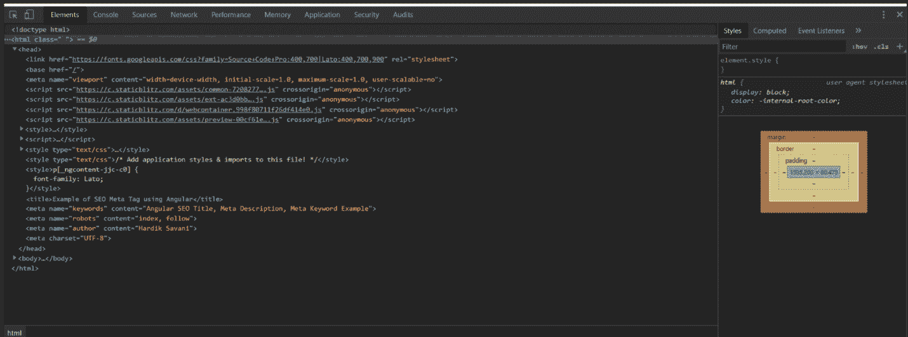

# 使用 Angular 9/8 SEO 添加页面标题和元标签

> 原文:[https://www . javatpoint . com/add-page-title-meta-tags-use-angular-9or 8-SEO](https://www.javatpoint.com/add-page-title-and-meta-tags-using-angular-9or8-seo)

在本节中，我们将学习添加页面标题和元标签。我们将使用 Angular 9/8 来实现这一点。这里我们将解释通用动态元标签。在这里，我们还将了解 SEO 元标签的设置。元服务和标题由 Angular 提供。这些标签和 HTML 元标签彼此相似。它们被用来使我们的 Angular 应用程序对搜索引擎优化友好。Angular 有一个名为 Meta 的服务，属于类族。Angular 通过提供大量元服务，提供了更新、添加、移除和读取 HTML 元元素的工具。使用 Angular Meta 标签，我们可以快速地为不同的页面设置不同的 Meta 标签。

[**元标签**](https://www.javatpoint.com/html-meta-tag) 和页面标题是 HTML 代码的组成部分，包含在所有网页中。元标签用于向搜索引擎显示我们页面内容的细节。对于我们的 Angular [SEO](https://www.javatpoint.com/seo-tutorial) ，设置正确的 Meta 标签非常重要。 [HTML](https://www.javatpoint.com/html-tutorial) 的 [<头部>](https://www.javatpoint.com/html-head) 部分只会显示 Meta Tags，用户是看不到的。它可以被社交媒体网站或搜索引擎使用，这样他们就可以搜索更多关于我们页面的信息。HTML 页面的标题由**页面标题**描述。它也被称为标题标签。作为搜索引擎的结果，页面标题将显示在浏览器的标题栏上。搜索引擎可以使用页面标题来识别浏览器包含的信息。搜索项包含在页面标题中。利用这一点，网站得到了优化。

在我们的 Angular 应用程序中，我们将使用 Meta 服务添加一个 Meta 标签和页面标题。我们将使用@angular/platform-browser 获得标题和元服务。在这里，我们将解释许多函数，如 addTag()、getTag()、updateTag()和 removeTag()。我们也可以使用这些函数来操作元标签。为了添加元标签和页面标题，逐步过程描述如下:

**第一步:**

这一步，我们要去**添加标签**。它用于添加一个元标签。为此，我们将使用一个名为 app.component.ts 的文件，并向其中添加如下代码:

```

import { OnInit, Component } from '@angular/core';
import { Title, Meta } from '@angular/platform-browser';

@Component({
  selector: 'my-app',
  templateUrl: './app.component.html',
  styleUrls: [ './app.component.css' ]
})
export class AppComponent implements OnInit {
  name = 'Angular';

  constructor(
    private titleService: Title,
    private metaTagService: Meta
  ) { }

  ngOnInit() {
    this.titleService.setTitle("Example of SEO Meta Tag using Angular");

    this.metaTagService.addTags([
      { name: 'keywords', content: 'Angular SEO Title, Meta Description, Meta Keyword Example' },
      { name: 'robots', content: 'index, follow' },
      { name: 'writer, content: 'John Smith' },
      { charset: 'UTF-8' }
    ]);

  }
}

```

**第二步:**

在这一步中，我们将使用 **getTag()** 。它被指定的元选择器用来获取如下的 html 元元素:

**src/app/app.component.ts**

```

ngOnInit() {
	this.titleService.setTitle("Example of SEO Meta Tag using Angular");

	this.metaTagService.addTags([
	  { name: 'keywords', content: 'Angular SEO Title, Meta Description, Meta Keyword Example' },
	  { name: 'robots', content: 'index, follow' },
	  { name: 'writer', content: 'John Smith' },
	  { charset: 'UTF-8' }
	]);

	const writer = this.metaTagService.getTag('name=writer');
	console.log(writer.content); //John Smith

}

```

**第三步:**

在这一步中，我们将使用 **updateTag()** 。它在 Angular 元素中用于更新元标签，如下所示:

**src/app/app.component.ts**

```

ngOnInit() {
	this.titleService.setTitle("Example of SEO Meta Tag using Angular");

	this.metaTagService.addTags([
	  { name: 'keywords', content: 'Angular SEO Title, Meta Description, Meta Keyword Example' },
	  { name: 'robots', content: 'index, follow' },
	  { name: 'writer', content: 'John Smith' },
	  { charset: 'UTF-8' }
	]);

	this.metaTagService.updateTag({ name: 'writer', content: 'Harry Potter' });

}

```

**第四步:**

在这一步中，我们将使用 **removeTag()** 。它被指定的选择器用来删除元标签，如下所示:

**src/app/app.component.ts**

```

ngOnInit() {
	this.titleService.setTitle("Example of SEO Meta Tag using Angular");

	this.metaTagService.addTags([
	  { name: 'keywords', content: 'Angular SEO Title, Meta Description, Meta Keyword Example' },
	  { name: 'robots', content: 'index, follow' },
	  { name: 'writer', content: 'John Smith' },
	  { charset: 'UTF-8' }
	]);

	this.metaTagService.removeTag('name="writer"');

}

```

现在我们上面的代码可以运行了。当我们运行这段代码时，将生成以下输出:



* * *