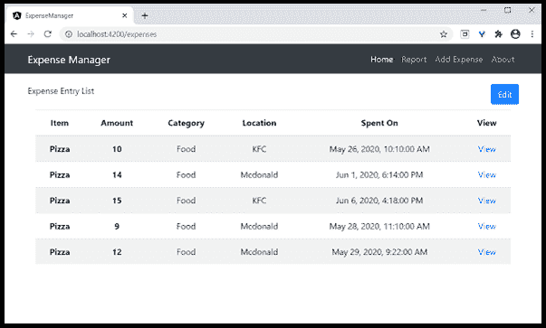
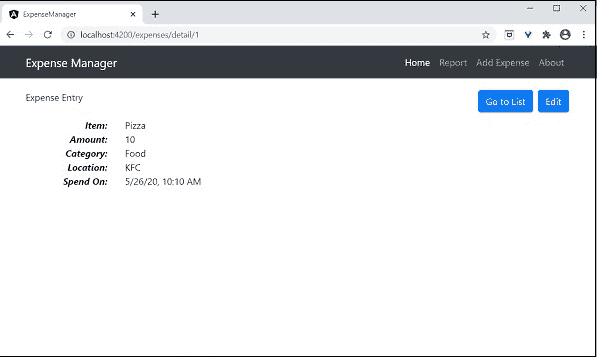

# Angular 路由

> 原文：<https://www.javatpoint.com/angular-routing>

导航是 web 应用程序的一个重要方面。单页应用程序( **SPA** )没有多页概念，它从一个视图(费用列表)移动到另一个视图。

它提供了清晰易懂的导航元素，决定了应用程序的成功。

Angular 提供了一套全面的导航功能，以适应复杂环境中的简单场景。

定义导航元素和相关视图的过程称为“Angular”中的路线。Angular 提供了一个单独的模块，即路由器模块，用于在 Angular 应用程序中设置导航。

### 配置路由

Angular CLI 完全支持在应用程序构建过程中设置路由和处理应用程序。让我们使用下面的命令创建一个启用了路由器的新应用程序-

### ng 新路由-app

Angular CLI 生成一个新模块，用于路由目的的 AppRoutingModule。代码如下-

```js

import { NgModule } from '@angular/core';
import { Routes, RouterModule } from '@angular/router';
const routes: Routes = [];
@NgModule({
  imports: [RouterModule.forRoot(routes)],
  exports: [RouterModule]
})
export class AppRoutingModule { }

```

路由器模块和路由**@ angular/路由器包。**

RouterModel 提供了在应用程序中配置和执行路由的功能。

路线是用于设置导航规则的类型。

*   路由是本地变量(路由类型)，用于配置应用程序的实际导航规则。
*   RouterMoudle.forRoot()方法将设置路由变量中配置的导航规则。

在 Angular CLI 中，应用组件包括如下所述的生成的估算模块-

```js

import { BrowserModule } from '@angular/platform browser;
import { NgModule } from '@angular/core';
import { AppRoutingModule } from './app-routing.module';
import { AppComponent } from './app.component';
@NgModule({
  declarations: [
    AppComponent
  ],
  imports: [
    BrowserModule,
    AppRoutingModule
  ],
  providers: [],
  bootstrap: [AppComponent]
})
export class AppModule { }

```

**这里，**

**AppRoutingModule** 使用 AppComponent 导入元数据导入模块。

Angular CLI 提供了在现有应用程序中设置路由的选项。

```js

ng generate module my-module --routing

```

它将生成一个启用了路由功能的新模块。要在现有模块(AppModule)中启用路由功能，我们需要包括一个如下所述的附加选项-

```js

ng generate module app-routing --module app --flat

```

**这里，**

**-模块 app** 在 AppModule 模块中配置路由模块。

打开命令提示符。

```js

cd /go/to/expense-manager
Generate routing module using below command -
ng generate module app-routing --module app --flat

```

**输出:**

```js
CREATE src/app/app-routing.module.ts (196 bytes) 
UPDATE src/app/app.module.ts (785 bytes)

```

在这里，

命令行界面生成**许可模块**，并在**应用模块中进行配置。**

**创建路线**

创建路线的信息如下-

```js

const routes: Routes = [
  { path: 'about', component: AboutComponent },
];

```

在这里，

**路线**是**近似模块中的变量。**

当用户请求 http://localhost:4200/about url 时，Path 匹配 about 规则，然后调用 **AboutComponent** 。

### 访问路线

在需要的地方使用 **routerLink** 属性。

在这里，路由链接使用路径设置要调用的路由。

路由链接活动设置路由活动时使用的 CSS 类。

有时，我们需要访问组件内部的路由，而不是模板。然后，我们必须遵循下面给出的步骤-

将路由器和活动路由实例注入到各自的组件中。

```js

import { Router, ActivatedRoute } from '@angular/router'; 
constructor(private router: Router, private route: ActivatedRoute)

```

在这里，

**路由器**提供进行**路由操作的功能。**

**路线**指当前**激活路线。**

## 相对路径

根路径类似于网页网址，也支持相对路径。要从另一个组件访问 AboutComponent，比如主页组件，在 web url 或文件夹路径中简单使用。

要访问组件中的相对路径-

```js

import { NavigationExtras } from '@angular/router'; 
this.router.navigate(['about'], { relativeTo: this.route });

```

### 路线排序

路由排序是路由配置中的一项重要内容。如果同一路径被配置多次，将调用第一个路径。如果第一个匹配由于任何原因失败，将调用第二个匹配。

**重定向路线**

Angular 路由允许将一条路径重定向到另一条路径。有一个选项可以将重定向路径设置为重定向。路线如下-

```js

const routes: Routes = [ 
   { path: '', redirectTo: '/about' }, 
];

```

在这里，

如果实际路径与空字符串匹配，重定向将被设置为重定向路径。

**通配符路由**

通配符路由将匹配任何路径。它是使用**构建的，将用于处理应用程序中不存在的路径。如果第二个路径不匹配，则通过在配置末尾放置通配符路由来调用它。

示例代码如下-

```js

const routes: Routes = [
  { path: 'about', component: AboutComponent },
  { path: '',   redirectTo: '/about', pathMatch: 'full' },
  { path: '**', component: PageNotFoundComponent },  // Wildcard route for a 404 page
];

```

如果调用一个不存在的页面，前两条路由将失败。但是，最后一个通配符路由将会成功，并且将调用 **PageNotFoundComponent** 。

### 访问路径参数

在 Angular 中，我们可以使用参数向路径附加附加信息。可以使用 paramMap 接口在组件中访问参数。在路由中创建新参数的语法如下-

```js

const routes: Routes = [
  { path: 'about', component: AboutComponent },
  { path: 'item/:id', component: ItemComponent },
  { path: '',   redirectTo: '/about', pathMatch: 'full' },
  { path: '**', component: PageNotFoundComponent },
];

```

我们在路径中附加了**id**。使用两种技术在**项目组件**中访问。

*   使用可观察的。
*   使用快照(不可观察选项)。
*   使用可观察的

Angular 提供了一个特殊的接口 paramMap，用于访问路径参数。parmaMap 有以下方法-

**为(名称)** -如果指定的名称在路径(参数列表)中可用，则返回真。

get(name) -返回路径(参数列表)中指定的名称。

返回路径中指定名称的多个值。get()方法只在有多个值可用时返回第一个值。

键-返回路径中所有可用的参数。

使用参数图访问参数的步骤如下-导入 **@angular/router** 包中提供的**参数图**。

使用 **ngOnInit()** 中的**参数映射**来访问参数。

```js

ngOnInit() {
    this.route.paramMap.subscribe(params => {
        this.id = params.get('id);
    });
}

```

我们在休息服务中使用**管道**方法直接使用。

```js

this.item$ = this.route.paramMap.pipe(
    switchMap(params => {
      this.selectedId = Number(params.get('id'));
      return this.service.getItem(this.selectedId);
    })
);

```

## 使用快照

**快照**类似于**可观测，**不支持可观测，无法获取参数值。

```js

let id = this.route.snapshot.paramMap.get('id');

```

## 嵌套路由

路由器出口将放在应用程序的根组件中。但是，路由器插座可以用于任何组件。当路由器出口用于根组件以外的组件时，特定组件的路由必须配置为父组件的子组件。这被称为嵌套路由。

让我们考虑一个组件，假设项目组件配置了路由器出口，它有两个路由器链接，如下所述-

```js

<h2>Item Component</h2> 
<nav> 
   <ul> 
      <li><a routerLink="view">View</a></li> 
      <li><a routerLink="edit">Edit</a></li> 
   </ul>
</nav> 
<router-outlet></router-outlet>

```

项目组件的路由配置为**嵌套路由**，如下所示-

```js

const routes: Routes = [
{ 
   path: 'item',
   component: ItemComponent,
   children: [
   {
      path: 'view',
      component: ItemViewComponent
   },
   {
   path: 'edit',
   component: ItemEditComponent
   }
   ]
}]

```

打开命令提示符并转到项目根文件夹。

```js

cd /go/to/expense-manager

```

使用以下命令生成路由模块。

```js

ng generate module app-routing --module app --flat

```

**输出:**

输出-

```js
CREATE src/app/app-routing.module.ts (196 bytes) UPDATE src/app/app.module.ts (785 bytes)

```

命令行界面生成**许可模块**，并在**应用模块中进行配置。**

如下所述更新**许可模块(src/app/app.module.ts)**

```js

import { NgModule } from '@angular/core'; 
import { Routes, RouterModule } from '@angular/router'; import { ExpenseEntryComponent } from './expense-entry/expense-entry.component'; 
import { ExpenseEntryListComponent } from './expense-entry-list/expense-entry-list.component'; 
const routes: Routes = [ 
   { path: 'expenses', component: ExpenseEntryListComponent }, 
   { path: 'expenses/detail/:id', component: ExpenseEntryComponent }, 
   { path: '', redirectTo: 'expenses', pathMatch: 'full' }]; 

```

```js

@NgModule({ 
   imports: [RouterModule.forRoot(routes)], 
   exports: [RouterModule] }) 
export class AppRoutingModule { }

```

```js

<!-- Navigation --> 
<nav class="navbar navbar-expand-lg navbar-dark bg-dark static-top"> 
<div class="container"> 
   <a class="navbar-brand" href="#">{{ title }}</a> <button class="navbar-toggler" type="button" data-toggle="collapse" data-target="#navbarResponsive" aria-controls="navbarResponsive" aria-expanded="false" aria-label="Toggle navigation"> 
      <span class="navbar-toggler-icon"></span> 
   </button> 
   <div class="collapse navbar-collapse" id="navbarResponsive"> 
      <ul class="navbar-nav ml-auto"> 
         <li class="nav-item active"> 
            <a class="nav-link" href="#">Home 
               <span class="sr-only" routerLink="/">(current)</span> 
            </a> 
         </li> 
         <li class="nav-item"> 
            <a class="nav-link" routerLink="/expenses">Report</a> 
         </li> 
         <li class="nav-item"> 
            <a class="nav-link" href="#">Add Expense</a> 
         </li> 
         <li class="nav-item"> 
            <a class="nav-link" href="#">About</a> 
         </li> 
      </ul> 
   </div> 
</div> 
</nav> 
<router-outlet></router-outlet>
</textarea></div>
<p>Open <strong>ExpenseEntryListComponent</strong> template <strong>(src/app/expense-entry-list/expense-entry-list.component.html)</strong> and view option for each expense entries.</p>
<div class="codeblock"><textarea name="code" class="java">
<table class="table table-striped"> 
   <thead> 
      <tr> 
         <th>Item</th>
         <th>Amount</th> 
         <th>Category</th> 
         <th>Location</th> 
         <th>Spent On</th> 
         <th>View</th> 
      </tr> 
   </thead> 
   <tbody> 
      <tr *ngFor="let entry of expenseEntries"> 
         <th scope="row">{{ entry.item }}</th> 
         <th>{{ entry.amount }}</th> 
         <td>{{ entry.category }}</td> 
         <td>{{ entry.location }}</td> 
         <td>{{ entry.spendOn | date: 'medium' }}</td> 
         <td><a routerLink="../expenses/detail/{{ entry.id }}">View</a></td> 
      </tr> 
   </tbody> 
</table>

```

我们已经更新了费用列表，并添加了一个新列来显示视图选项。

打开**expense entry component(src/app/expense-entry/expense-entry . component . ts)**，添加功能获取当前选中的费用条目。首先通过参数映射获取标识，然后使用**费用查询服务的**方法获取费用。****

```js

this.expenseEntry$ = this.route.paramMap.pipe(  
   switchMap(params => { 
      this.selectedId = Number(params.get('id')); 
      return 
this.restService.getExpenseEntry(this.selectedId); })); 
   this.expenseEntry$.subscribe( (data) => this.expenseEntry = data );
Update ExpenseEntryComponent and add option to expense list.
goToList() { 
   this.router.navigate(['/expenses']); 
}

```

**费用组件**的完整代码如下-

```js

import { Component, OnInit } from '@angular/core'; import { ExpenseEntry } from '../expense-entry'; import { ExpenseEntryService } from '../expense-entry.service'; 
import { Router, ActivatedRoute } from '@angular/router'; 
import { Observable } from 'rxjs';
import { switchMap } from 'rxjs/operators'; 
@Component({ 
   selector: 'app-expense-entry', 
   templateUrl: './expense-entry.component.html', 
   styleUrls: ['./expense-entry.component.css'] 
}) 
export class ExpenseEntryComponent implements OnInit { 
   title: string; 
   expenseEntry$ : Observable; 
   expenseEntry: ExpenseEntry = {} as ExpenseEntry; 
   selectedId: number; 
   constructor(private restService : ExpenseEntryService, private router : Router, private route : 
ActivatedRoute ) { } 
   ngOnInit() { 
      this.title = "Expense Entry"; 
   this.expenseEntry$ = this.route.paramMap.pipe( 
      switchMap(params => { 
         this.selectedId = Number(params.get('id')); 
         return 
this.restService.getExpenseEntry(this.selectedId); })); 
   this.expenseEntry$.subscribe( (data) => this.expenseEntry = data ); 
   } 
   goToList() { 
      this.router.navigate(['/expenses']); 
   } 
} 
```

打开**expense entry component(src/app/expense-entry/expense-entry . component . html)**模板，添加按钮导航费用列表页面。

```js

<div class="col-sm" style="text-align: right;"> 
   <button type="button" class="btn btn-primary" (click)="goToList()">Go to List</button>  
   <button type="button" class="btn btn-primary">Edit</button> 
</div>

```

我们在**之前增加了**进入列表**按钮，编辑**按钮。

**使用下面给出的命令运行应用程序-**

```js

ng serve

```

输出-



单击条目的查看选项将导航到详细信息页面并显示所选费用-



* * *