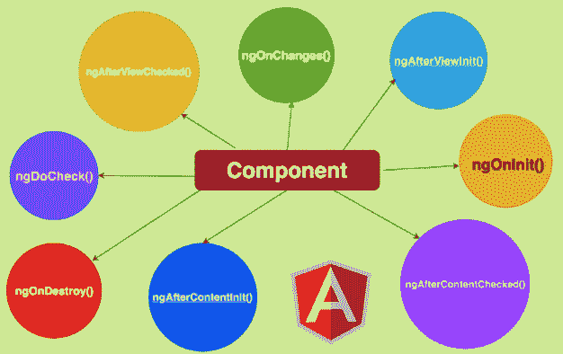

# 角度生命周期

> 原文:[https://www.javatpoint.com/angular-lifecycle](https://www.javatpoint.com/angular-lifecycle)

Angular 是一个占主导地位且分类广泛的**客户端**平台，给数百万开发者留下了深刻印象。自从 Angular 平台问世以来，让应用变得比以往任何时候都容易。Angular 广泛用于**移动**和**桌面**的数据可视化和建筑应用。利用数据的无缝潜力使 angular 在同类产品中独一无二。随着每年新功能的加入，angular 已经捕捉到了营销趋势，并且 Angular 的生命周期每年都在以极快的速度发展。

早在 2009 年，当谷歌推出 angular 时，它的生命周期依赖和功能有限，最初是一个服务于 [HTML](https://www.javatpoint.com/html-tutorial) 和 [JavaScript](https://www.javatpoint.com/javascript-tutorial) 的计划。然而，在最新版本中， [**TypeScript**](https://www.javatpoint.com/typescript-tutorial) 已经取代了以前的 JavaScript 和其他流行的脚本语言。从另一个角度来看，Angular 让开发人员可以自由地构建在足迹更少的**网络、移动、**和**桌面**上运行的应用程序。现在让我们讨论 Angular 生命周期的更多方面。

## 什么是 Angular 生命周期？

在[角度](https://www.javatpoint.com/angularjs-tutorial)中，每个组件在其生命周期中经历 8 个不同的阶段。准确地说，它首先被初始化，然后根被创建，然后被呈现给它的组件。每当组件在应用程序开发过程中被加载并逐渐更新时，它总是被检查。当组件保持未使用时，通过抽取并将其从 **DOM** 中排出来接近死亡阶段。

有趣的是，Angular 可以监督其组件和指令的所有生命周期，并且可以利用之前的数据智能地理解结果，使应用程序的集成变得顺畅。总的来说，组件构成了版本的主要构建块，指令通过构建将这些版本通道化。

Angular 生命周期的另一个有趣之处在于，每个组件都有自己的生命周期，在每个阶段，生命周期都是从初始化到销毁。每个组件经历 8 个阶段。这些步骤可以从以下几点来解释。

1.  在初始化任何 Angular 生命周期组件时，它会创建并呈现给其根组件，这些根组件是为继承人设计的。
2.  下一个阶段包括在应用程序开发过程中加载的组件，数据绑定技术会逐渐改变和更新。
3.  后面的部分涉及未使用的组件，这些组件没有被利用，已经接近死亡阶段，并被移出 DOM。

## 挂钩生命周期概述

组件生命周期中发生的所有事件在 Angular 中被称为“**生命周期挂钩**”。钩子只是简单的函数，开发者可以在 Angular 应用程序中随时调用。您可以将钩子视为回调方法，它会引发组件生命周期中发生的积极事件。如前所述，八个阶段极大地决定了 Angular 的生命周期。让我们了解一下他们。

### 在线与构造器

作为一名程序员，生成并引入您的组件是很重要的。您总是需要保留两个选项，即要么利用构造函数，要么在 nt 生命周期方法中使用**。无论何时使用该组件，都会自动触发**on nit life cycle**e 方法。**

虽然 Constructor 和 **OnInt** 方法都可以用于同一个原因，但是开发人员更喜欢使用 **ngOnInit** 进行声明或初始化，并且大多数情况下避免使用构造函数。

### 连接

接口是生命周期方法中 hook 的重要资产，因为应用程序的组件类必须在虚拟接口中实现。根据建议，触发实现的方法，即 **AfterViewInit** ，应该适合**ngafterviewit**。

### ngOnchanges

这是一个回调函数，用于绑定组件发生的数据属性变化。简单地说，您可以将其视为一个事件，当组件中的输入控件被更新时，该事件就会被执行。当 Angular 收到更改的数据时，会对其进行映射，并将当前和以前的数据封装在一个简单的更改中。因此，通过使用这些生命周期钩子，父组件可以很容易地与其子组件通信，只要装饰器暴露给子组件的**@ InputDecorator】**。即使父组件偏离了输入属性的轨道，这个钩子也会自动调用到子组件。这有助于开发人员减少对实现细节的担心。因此，它的一些属性包括利用所有有输入的组件，当输入改变时调用，以及在 **ngOnInit 之前得到一个初始调用。**

这个阶段的属性包括所有输入组件的实际使用，只要值发生变化就会调用这些组件，以及在 **ngOnInit** 之前发起初始调用。

### ngOnInit

在 Angular 完成创建和引入回调后，它将被初始化并显示一些数据绑定属性。此事件仅在 **ngOnChanges** 事件和构造函数调用之后发生。有了这个钩子，组件的逻辑被初始化，所有 **ongOnInit** 的属性都可以使用。在钩子被触发之前，不能使用属于这些属性的任何子级。

这个阶段的一些属性包括组件钩子初始化。一旦设置了输入，钩子就会得到它的调用，并被添加到所有组件的默认 Angular CLI 中。需要注意的是，所有这些行为只发生一次。

### ngdoccheck

在这个阶段对钩子进行排序之后，仍然有活力来检查与组件和指令相关的输入和属性。你可以很容易地在这里检查你的逻辑。准确地说，您可以通过自定义检查来查看测试用例，然后将它们实现到组件中。这个钩子在 **ngOnInit** 之后就派上用场了，这个钩子的主要功能是即使组件的属性没有变化也能执行。在任何情况下，如果 Angular 错误地检测到输入属性的任何变化，这个钩子就会出现。这个钩子的一些属性包括变化检测和自动函数调用。

### ngAfterContentInit

当**ngdoccheck**被标记为完成时，该阶段被提升。**ngaftercontentit**中的每个组件都将首次引入并检查。通常，只要 Angular 完成一些内容项目和组件视图，就会实现这种方法。当属性被标记为 **ContentChild** 或**content child**时，调用此方法，确保所有这些属性都已初始化。另一方面，通过放置**<【ng-content】>****</ng-content>**标签，可以使用该方法包含外部子组件。因此，对于所有的生命周期组件，这个钩子只被调用一次。此阶段的一些属性可能包括不初始化内容，因为它发生在**ngdoccheck**之后。

### ngAfterContentChecked

这种挂钩方法旨在使用角度变化检测设备来调查内容的变化。即使没有进行任何修改，它也能执行任务，确保一切正常。这个钩子刚好在**ngaftercontentit**之后得到它的调用，并且在每次执行**ngdoccheck**之后自动执行。它在子组件初始化中起着至关重要的作用。

这种方法的一些主要属性包括等待 **ngContentInit** 被执行，并确保一切都在**ngdoccheck**之后执行。

### ngAfterViewInit

这个生命周期方法在**ngafterecontentchecked**之后被调用，并且只使用组件。这个方法类似于**ngaftercontentnit**，只在组件和子视图之后调用。此方法仅在初始化视图后调用，并且只调用一次。

### ngAfterViewChecked

当有后续的签入、组件检查和子视图时，会触发此方法。该方法在**之后调用，然后使用**检查方法在**检查。像上面讨论的一些其他生命周期方法一样，这个方法只用于组件，当子组件等待执行时，它会派上用场。**

一旦初始化和检查完成，这个方法的一些属性就会被调用，并且在**ngafterecontentcheck**方法之后，它就开始执行。

### ngOnDestroy

当 Angular 销毁所有指令或组件时，将调用此方法。这是清理所有构建的逻辑并从可观察的事物中取消订阅它们的正确地方。这分离了所有的事件处理程序，只是为了消除内存泄漏或缓冲区相关的问题。

这个钩子的主要功能或属性之一是在组件从 DOM 中移除后获取调用。

## 结论

Angular 中的组件在应用程序开发中起着主要作用。自从 Angular 来到附近，它就有很多依赖项，并且很难实现钩子。尽管如此，由于这些天发生的巨大进步，Angular 的生命周期方法已经被划分成了您在本文中看到的不同阶段。您学习了不同类型的 Angular 生命周期方法，以及平滑地驱动这些方法的钩子。

由于组件在 Angular 中被认为是应用程序的主要构建块，因此了解生命周期处理方法非常重要，这样它们就可以在您的应用程序中轻松实现。

* * *