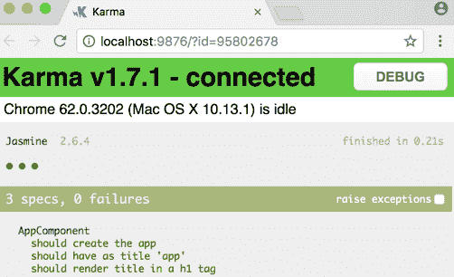

# Angular 单元测试

> 原文：<https://www.javatpoint.com/angular-unit-testing>

测试 Angular 应用程序有助于我们确定您的应用程序是否如您预期的那样工作。测试文档通过由 **Angular CLI** 创建的示例应用程序，为 Angular 应用程序的单元和集成测试提供了一些技术。

### 先决条件

如果在为 **Angular App 编写测试用例之前，您对以下概念有一个基本的了解，**将会有所帮助:

### Angular 基础

*   java 描述语言
*   HTML
*   半铸钢ˌ钢性铸铁(Cast Semi-Steel)
*   Angular 命令行界面

您可以在浏览器中浏览测试代码，同时阅读指南以获得实际体验。

如果您想尝试本指南中描述的应用程序，您可以在浏览器中运行它，或者下载并在本地运行它。

### 设置测试

[Angular](https://www.javatpoint.com/angularjs-tutorial) CLI 使用 **Jasmine 测试框架**下载并安装我们测试 Angular 应用程序所需的一切。

您使用命令行界面创建的项目已准备好进行测试。运行 **ng-test cli** 命令:

```

content_copy test

```

**ng-test** 命令使应用程序处于监视模式，并启动因果报应测试运行程序。

**控制台输出如下:**

```

content_copy10% building modules 1/1 modules 0 active
...INFO [Karma]: Karma v1.7.1 server started at http://0.0.0.0:9876/
...INFO [launcher]: Launching browser Chrome ...
...INFO [launcher]: Starting browser Chrome
...INFO [Chrome ...]: Connected on socket ...
Chrome ...: Executed 3 of 3 SUCCESS (0.135 secs / 0.205 secs)

```

一个 Chrome 浏览器打开并显示“Jasmine HTML Reporter”测试输出，如下所示。



您可以单击测试行仅重新运行该测试，或者单击详细信息重新运行所选测试组(“**测试套件**”)中的测试。

ng-test 命令正在观察变化。

要查看它的运行情况，请在 **app.component.ts** 中做一个小改动。测试再次运行，新的测试结果出现。

### 配置

您可以通过编辑项目根文件夹中的 **karma.conf.js** 文件和 **src/文件夹**中的 **test.ts** 文件来微调几个选项。

**karma.conf.js** 文件是一种配置文件。命令行界面在内存中创建一个完整的运行时配置，该配置基于由 **karma.config.js** 实现的 **angular.json** 文件中指定的应用程序结构。

### 其他测试框架

您也可以使用其他测试库和测试运行器测试 Angular 应用程序。每个库和 runner 都有自己特定的安装过程、配置和语法。搜索网页了解更多信息。

### 测试文件名和位置

查看 src/app 文件夹。

命令行界面为应用组件生成了一个名为**的测试文件。**

*   测试文件扩展名为. spec.ts，这样工具就可以将它识别为测试文件(即特定的文件)。
*   app.component.ts 和 app.component.spec.ts 文件位于同一文件夹中。两个文件的根文件名(应用程序组件)相同。
*   对于每种类型的测试文件，在您的项目中遵循这两个约定。
*   它将您的特定文件放在它测试的文件旁边。
*   这种测试很容易获得。
*   您一眼就能看出您的应用程序的任何部分都缺少测试。
*   测试可以揭示一个零件在环境中的表现。
*   重命名源文件时，必须记住重命名测试文件。
*   将您的特定文件放在测试文件夹中。

应用程序集成规范可以测试文件夹和模块的多个部分的交互。最好在测试目录中为它们创建一个合适的文件夹。

测试助手正在测试的规范位于它们各自文件旁边的测试文件夹中。

### 设置持续集成

保持项目无 bug 的最好方法是测试套件，但是很容易忘记一直运行测试。**持续集成(CI)** 服务器允许我们设置您的项目存储库，以便我们可以测试每个提交和拉取请求。

有像 Circle CI 和 Travis CI 这样的付费 CI 服务，您可以在 Jenkins 的帮助下托管您的代码。Circle CI 和 Travis CI 是付费服务，他们为开源项目免费提供。对 Angular 存储库的贡献由整套 Circle CI 测试运行。

### 为圆形配置项配置项目

**步骤 1:** 创建文件夹**。项目根处的 circleci** 。

**步骤 2:** 在新文件夹中创建一个名为 config.yml 的文件，其内容如下:

```

content_copyversion: 2
jobs:
  build:
    working_directory: ~/my-project
    docker:
      - image: circleci/node:10-browsers
    steps:
      - checkout
      - restore_cache:
          key: my-project-{{ .Branch }}-{{ checksum "package-lock.json" }}
      - run: npm install
      - save_cache:
          key: my-project-{{ .Branch }}-{{ checksum "package-lock.json" }}
          paths:
            - "node_modules"
      - run: npm run test -- --no-watch --no-progress --browsers=ChromeHeadlessCI

```

配置缓存 **node_modules/** 使用 [npm run](https://docs.npmjs.com/cli/run-script) 运行 CLI 命令，因为@angular/cli 不是全局安装的。双**破折号(- )** 用于将参数传递给**NPM 脚本**。

**步骤 3:** 提交更改并将其推送到存储库。

**第四步:**报名**圈 CI** 在那里添加你的项目。您的项目将开始构建。

### 为 GitLab 配置项目

**第一步**:创建一个名为**的文件。gitlab-ci.yml** 在项目根。

```

content_copyimage: node:14.15-stretch
variables:
  FF_USE_FASTZIP: "true"

cache:
  untracked: true
  policy: push
  key: ${CI_COMMIT_SHORT_SHA}
  paths:
    - node_modules/

.pull_cached_node_modules:
  cache:
    untracked: true
    key: ${CI_COMMIT_SHORT_SHA}
    policy: pull

stages:
  - setup
  - test

install:
  stage: setup
  script:
    - npm ci
test:
  stage: test
  extends: .pull_cached_node_modules
  before_script:
    - apt-get update
    - wget https://dl.google.com/linux/direct/google-chrome-stable_current_amd64.deb
    - apt install -y ./google-chrome*.deb;
    - export CHROME_BIN=/usr/bin/google-chrome
  script:
    - npm run test -- --no-watch --no-progress --browsers=ChromeHeadlessCI

```

配置在安装作业中缓存**节点模块/** ，并在测试作业中重用缓存的**节点模块/** 。

**第二步:**报名 **GitLab CI** 。您需要推送一个新的提交来触发构建。

**步骤 3:** 提交您的更改并将其推送到存储库。

### 为 GitHub 操作配置项目

**步骤 1:** 创建一个名为**的文件夹。github/工作流**是您项目的基础

**步骤 2:** 在新文件夹中创建一个名为 **main.yml** 的文件，内容如下:

```

content_copyname: CI Angular app by Github Actions
on: push
jobs:
  build:
    runs-on: ubuntu-latest
    steps:
      - uses: actions/checkout@v2
      - name: Use Node.js 14.x
        uses: actions/setup-node@v1
        with:
          node-version: 14.x
      - name: Setup
        run: npm ci
      - name: Test
        run: |
          npm test -- --no-watch --no-progress --browsers=ChromeHeadlessCI

```

**第 3 步:**您需要推送一个新的提交来触发构建。

**第 4 步:**提交您的更改。

### 在 Chrome 中为配置项测试配置命令行界面

您可能需要调整您的配置来运行 Chrome 浏览器测试，而 CLI 命令 **ng-test** 在您的环境中运行 **CI 测试**。

**我们在下面的例子中使用无头 Chrome:**

```

content_copybrowsers: ['ChromeHeadlessCI'],
customLaunchers: {
  ChromeHeadlessCI: {
    base: 'ChromeHeadless',
    flags: ['--no-sandbox']
  }
},

```

现在，运行命令使用 **-无沙盒**标志:

```

content_copyng test --no-watch --no-progress --browsers=ChromeHeadlessCI

```

#### 注意:如果你在 Windows 上运行这些代码，你必须包含- disable-GPU 标志。

* * *