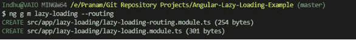
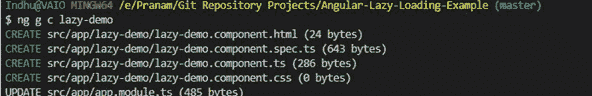
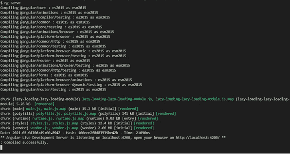
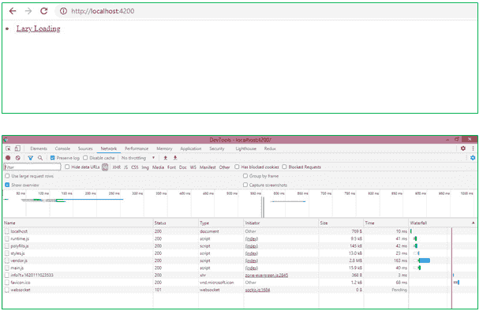
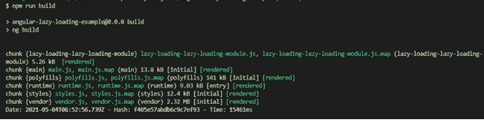
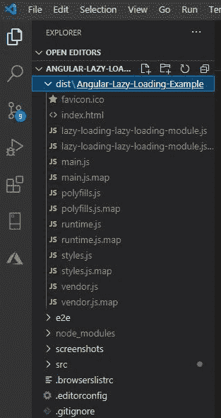
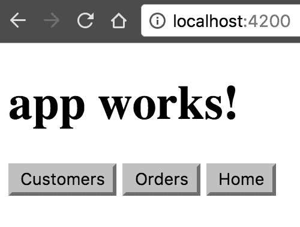

# Angular 延迟加载

> 原文：<https://www.javatpoint.com/angular-lazy-loading>

惰性加载是一种有 Angular 的技术，允许您在特定路线被激活时加载 JavaScript 组件。它通过将应用程序分成许多包来提高应用程序加载的速度。当用户通过应用程序导航时，会根据需要加载包。

延迟加载有助于保持包的小尺寸，这有助于减少加载时间。我们必须使用类装饰器来创建一个 [Angular](https://www.javatpoint.com/angularjs-tutorial) 模块 **@NgModule** ，并且装饰器使用一个定义该模块的元数据对象。

**主要属性有:**

*   **导入:**该模块的组件与 Array 一起用于其他模块。
*   **声明:**它接收一个组件数组。
*   **导出:**定义其他模块使用的组件、指令和管道的数组。
*   **提供者:**声明如果是根模块，整个应用程序都可以使用的服务。

**本地根模块示例:**

```

import { BrowserModule } from '@angular/platform browser;
import { NgModule } from '@angular/core';
import { AppComponent} from './app.component';
import { AppRoutingModule } from './app-routing.module';

@NgModule({
  Announcement: [
    AppComponent
  ],
  import: [
    browser module,
    app routing module
  ],
  Providers: [], //Os service declarados and Propried providers do modulo root ficum disponivis m toda a applicacao
  bootstrap: [AppComponent] //define some or module root um bootstrap
})
export class AppModule { }

```

在上面的示例代码中，我们使用@NgModule 装饰器将 AppModule 类转换为 Angular 模块。

### 惰性加载基础

本节介绍**延迟加载路由配置**的基本流程。

在惰性加载 Angular 模块中，在您的**approxing module**根配置中使用加载子模块，如下所示。

```

AppRoutingModule (excerpt)
content_copyconst routes: Routes = [
  {
    path: 'item',
    loadChildren: () => import('./items/items.module').then(m => m.ItemModule)
  }
];

```

在延迟加载的路由模块中为组件添加路由。

**延迟加载模块的路由模块**

```

content_copyconst routes: Routes = [
  {
    path: '',
    component: ItemsComponent
  }
];

```

继续页面的以下部分，了解关于延迟加载模块的逐步说明。

### 请按照以下步骤在 Angular 项目中实现延迟加载:

**第一步:**

创建一个新的 Angular 项目，

```

 ng new angular-lazy-loading

```

**第二步:**

独立路由的目的是用 Angular 惰性加载模块处理所有组件。

```

 ng g m lazy-loading-routing

```



**第三步:**

在惰性加载模块中创建一个名为惰性演示的组件，

```

 ng g c lazy demode

```



**第四步:**

向标题添加链接将实现延迟加载。

**app.component.html**

```

<li class="nav-item">
   <a class="nav-link" [routerLink]="['/lazy-loading']">
      slow loading
   </a>
</li>

```

**第五步:**

在这里，我们将使用 load children 延迟加载模块。

**app-routing.module.ts**

```

{
   path: 'lazy-loading',
   load children: () => import('./lazy-loading/lazy-loading.module')
   .then(m => m.LazyLoadingModule)
},

```

**第六步:**

在 lazy-loading-routing.module.ts 中设置路由。

**延迟加载路由模块**

```

import { NgModule } from '@angular/core';
import {RouterModule, Routes} from '@angular/router';
import { LazyDemoComponent } from './lazy-demo/lazy-demo.component';
const route: route = [
 { path: '', component: LazyDemoComponent }
];
 @NgModule({
    import: [routerModule. for child (route)],
    export: [routermodule]
})
export class LazyLoadingRoutingModule { }

```

**如果上述导入选项出现错误，则尝试此操作，**

```

import { LazyDemoComponent } from "E:/Pranam/Git Repository Projects/Angular-Lazy-Loading-Example/src/app/lazy-demo/lazy-demo.component";

```

运行应用程序。

到终端执行“ng 服务”命令。



现在转到**浏览器 https://localhost:4200。**



刷新浏览器后，您会看到 main.js 正在运行。只有当根/延迟加载被命中时，延迟加载模块才会被加载。

### 验证延迟加载

运行以下命令来生成构建，



```

 npm run build

```

上图验证了为惰性加载模块生成了一个单独的部分。

在那里，您将看到一个单独的文件，用于使用延迟加载的模块。



安装延迟加载功能模块有两个步骤:

*   使用- route 标志用 CLI 构建功能模块。
*   配置路由。

### 设置应用程序

如果您没有应用程序，可以按照以下步骤使用命令行界面创建应用程序。如果你已经有了一个应用程序，走配置好的路线。在下面输入命令，其中 customer-app 是应用程序的名称:

```

content_copy new client-app --routing

```

它创建了一个名为 client-app 的应用程序和一个名为 routing flag app-routing . module . ts 的文件，这是设置惰性加载的重要文件之一。通过发出 cd client-app 命令导航到该项目。

### 创建带工艺路线的模块

加载客户端功能模块的路径是通过- route 选项指定的客户端:

```

content_copyng new customer-app --routing

```

它创建了一个名为 client-app 的应用程序，而- routing 标志创建了一个名为 app-routing.module.ts 的文件，这是为您的功能模块设置惰性加载所需的文件之一。通过发出 cd client-app 命令导航到该项目。

-路由选项使用了 Angular/CLI 版本 8.1 或更高版本。

它在 **Customer.module.ts** 文件中定义了一个新的可延迟加载的便利模块 CustomersRoutingModule，在 customers-routing.module.ts 文件中定义了路由模块 customersrouting module。

```

content_copyconst routes: Routes = [
  {
    path: 'customers',
    loadChildren: () => import('./customers/customers.module').then(m => m.CustomersModule)
  }
];

```

### 基于字符串的惰性加载

在 import()语法中不推荐使用 loadChildren 路由的字符串语法。可以选择使用基于字符串的惰性加载 **(loadChildren:')。/path/to/module#Module'** )在 tsconfig 文件中包含延迟加载的路由，包括延迟加载编译。

默认情况下，CLI 将使用 import()语法创建严格的文件包含项目。

### 添加另一个功能模块

使用相同的命令创建一个带有路由及其存根组件的延迟加载模块。

```

content_copyng generate module orders --route orders --module app. module

```

它创建了一个名为订单的新文件夹，其中包含**订单模块**、**订单路由模块**，以及新的订单组件源文件。

```

src/app/app-routing.module.ts
content_copyconst routes: Routes = [
  {
    path: 'customers',
    loadChildren: () => import('./customers/customers.module').then(m => m.CustomersModule)
  },
  {
    path: 'orders',
    loadChildren: () => import('./orders/orders.module').then(m => m.OrdersModule)
  }
];

```

### 设置用户界面

您可以在地址栏中键入网址，导航用户界面对用户来说既简单又常见。

```

src/app/app.component.html
content_copy<h1>
  {{title}}
</h1>
<button routerLink="/customers">Customers</button>
<button routerLink="/orders">Orders</button>
<button routerLink="">Home</button>
<router-outlet></router-outlet>

```

要在浏览器中查看您的应用程序，请在终端窗口中输入下面给出的命令:

### 内容复制服务

转到 localhost:4200，可以看到“**客户-app** ”和三个按钮。



按钮起作用是因为命令行界面将路线添加到**应用模块**的路线数组中的特征模块。

### 导入和路由配置

CLI 在应用程序级别将每个功能模块添加到路线图中。在 app-routing.module.ts 文件中，更新路由数组:

```

src/app/app-routing.module.ts
content_copyconst routes: Routes = [
  {
    path: 'customers',
    loadChildren: () => import('./customers/customers.module').then(m => m.CustomersModule)
  },
  {
    path: 'orders',
    loadChildren: () => import('./orders/orders.module').then(m => m.OrdersModule)
  },
  {
    path: '',
    redirectTo: '',
    pathMatch: 'full'
  }
];

```

到**客户模块**和**订单模块**的前两条路线。

如果您使用的是命令行界面，请执行页面中提到的以下步骤。

```

src/app/customers/customers.module.ts
import { CommonModule } from '@angular/common';
import { CustomersRoutingModule } from './customers-routing.module';
content_copyimport { NgModule } from '@angular/core';
import { CustomersComponent } from './customers.component';
@NgModule({
  imports: [
    CommonModule,
    customersRoutingModule
  ],
  declarations: [customersComponent]
})
export class customersModule { }

```

客户模块文件导入客户路由模块和客户组件文件。CustomersRoutingModule 列在@NgModule 导入数组中，并允许 Customers 模块访问其路由模块。客户组件声明在数组中，这意味着客户组件属于客户模块。

特定于功能的路由定义文件导入其在 customer-routing.module.ts 文件和 JavaScript 导入语句中定义的功能组件。

```

src/app/customers/customers-routing.module.ts
content_copyimport { NgModule } from '@angular/core';
import { Routes, RouterModule } from '@angular/router';

import { CustomersComponent } from './customers.component';

const routes: Routes = [
  {
    path: '',
    component: CustomersComponent
  }
];

@NgModule({
  imports: [RouterModule.forChild(routes)],
  exports: [RouterModule]
})
export class CustomersRoutingModule { }

```

其他功能模块的路由模块配置类似。

```

src/app/orders/orders-routing.module.ts (excerpt)
content_copyimport { OrdersComponent } from './orders.component';

const routes: Routes = [
  {
    path: '',
    component: OrdersComponent
  }
];

```

### forRoot()和 forChild()

您可以看到命令行界面将 **RouterModule.forRoot(路由**)添加到 AppRoutingModule 导入数组中。

它指定 Angular AppRoutingModule 是一个路由模块，而 forRoot()指定一个路由模块。它配置您通过的所有路由，让您访问路由器的指令，并注册路由器服务。

CLI 还将 RouterModule.forChild 添加到功能路由模块中。forRoot()方法负责路由器的全局注入器配置。forChild()方法中没有喷油器配置。它使用路由器出口和路由器链接等指令。

### 预加载

预加载通过在后台加载部分应用程序来改善 UX。您可以预加载模块或组件数据。

**预加载模块**

预加载模块通过在后台加载应用程序的部分来改进 UX，因此用户在激活 root 时不会等待元素下载。

要启用延迟加载模块的预加载，请从路由器导入预加载模块令牌。

```

AppRoutingModule (excerpt)
content_copyimport { PreloadAllModules } from '@angular/router';

```

在 approuting 模块中，在 forRoot()中指定预加载策略。

```

AppRoutingModule (excerpt)
content_copyRouterModule.forRoot(
  appRoutes,
  {
    preloadingStrategy: PreloadAllModules
  }
)

```

### 预加载组件数据

您可以使用解析器来预加载组件数据。解析器通过阻止页面直到页面上显示必要的数据来改进 UX。

### 下决心者

使用命令行界面，创建解析器服务。生成服务的命令如下:

### **内容 _ 复制生成服务**

在新创建的服务中实现@angular/router 包提供的解析接口:

```

Resolver service (excerpt)
content_copyimport { Resolve } from '@angular/router';

...

/* An interface that represents your data model */
export interface Crisis {
  id: number;
  name: string;
}

export class CrisisDetailResolverService implements Resolve {
  resolve(route: ActivatedRouteSnapshot, state: RouterStateSnapshot): Observable {
    // your logic goes here
  }
}

```

将解析器导入模块的路由模块。

### 功能模块的路由模块

```

content_copyimport { CrisisDetailResolverService } from './crisis-detail-resolver.service';

```

将解析对象添加到组件的路由配置中。

```

content_copy{
  path: '/your-path',
  component: YourComponent,
  resolve: {
    crisis: CrisisDetailResolverService
  }
}

```

在组件的构造函数中，注入一个代表当前路由的激活路由类。

### 组件的构造函数

```

content_copyimport { ActivatedRoute } from '@angular/router';

@Component({ ... })
class YourComponent {
  constructor(private route: ActivatedRoute) {}
}

```

使用激活路由类的注入实例来访问与给定路由相关联的数据。

### 组件的非信息生命周期挂钩

```

content_copyimport { ActivatedRoute } from '@angular/router';

@Component({ ... })
class YourComponent {
  constructor(private route: ActivatedRoute) {}

  ngOnInit() {
    this.route.data
      .subscribe(data => {
        const crisis: Crisis = data.crisis;
        // ...
      });
  }
}

```

### 延迟加载的优点

*   减少应用程序启动时间。
*   由于按需加载，应用程序消耗的内存较少。
*   避免了对服务器的不必要的请求。

### 延迟加载的缺点

*   向现有代码中添加额外的代码行来实现延迟加载。
*   与 JavaScript 集成时的附加代码
*   用户体验会影响。例如，如果页面结构不是最佳的，回溯是不可能的。

* * *