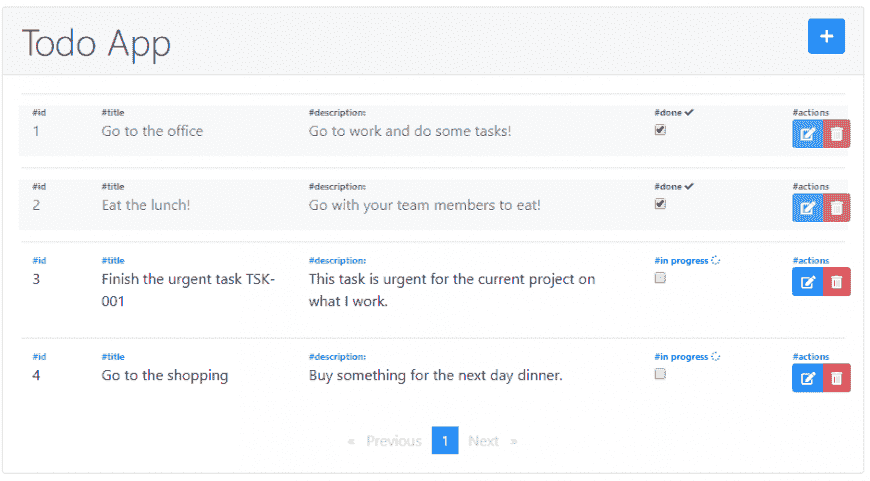

# Angular 缩小

> 原文：<https://www.javatpoint.com/angular-redux>

Redux 是一个反应状态管理库，由脸书开发，用于 React 库。它基于**通量模式**。Flux 和 Redux 的区别在于它们处理任务的方式；在 Flux 的情况下，我们有多个存储和一个调度器，而在 Redux 中，只有一个存储，这意味着不需要调度器。

我们可以使用 NgX 库在 Angular 框架中使用 Redux。这是一个反应状态管理库。借助 NGRX，我们可以从 Angular 应用程序中获取所有事件(数据)，并将它们全部保存在一个地方。

当我们想要使用存储的数据时，我们必须使用 RxJS 库从商店接收(发送)它。[的反应式扩展 JavaScript](https://www.javatpoint.com/javascript-tutorial) 是一个基于 Angular 中使用的可观察模式的库，用于处理异步操作。

我们使用服务在组件之间共享数据(确保每次取消订阅可观察到的数据；否则，你就冒着不必要地在后台运行可观察对象的风险，这会消耗资源 is)，或者我们可以使用输入/输出数据流(**确保组件具有父子关系**)。

我们可以对嵌套组件使用 ViewChild。但是在大型项目的情况下，这些解决方案增加了项目的复杂性。如果我们有多个组件，我们就有可能失去对一个组件内数据流的控制。

它在 Angular: Store 和单向数据流中使用 Redux 来降低应用程序的复杂性。对于新团队成员来说，流程清晰易懂。

### 2.项目设置

本文将展示使用 Redux 和 NgX 库创建一个简单的 Todo 应用程序是多么容易。但是在开始开发之前，我们必须确保我们已经在计算机上安装了 angular-cli。要检查它，请打开命令提示符或终端并键入 ng - version。现在一切都准备好了，我们准备好了


**检查是否安装了 Angular CLI。**

第一步是在终端中使用以下命令生成一个新的 Angular CLI 应用程序:

**ng new ngrix-todo。**


**生成新项目。**

本文将展示使用 Redux 和 NgX 库构建一个简单的 Todo 应用程序是多么容易。但是在开始开发之前，我们必须确保我们已经在计算机上安装了 angular-cli。要检查这一点，请打开命令提示符或终端并键入 ng - version。现在一切都设置好了，我们准备启动 Todo 应用程序。

```js

npm install @ng-bootstrap/ng-bootstrap bootstrap @ngrx/core @ngrx/effects @ngrx/store ngrx-store-logger ngx-pagination

```

为了保存 ToDo 应用程序的数据，我们将使用 REST API，因为我们想要执行一些 CRUD 操作。我们将使用 JSON 服务器将 ToDo 保存在 JSON 文件中，以便使用来自 Angular 的 HttpClient 访问该文件。

### 3.履行

项目一旦建立，我们就开始实施我们的 **Todo 应用程序**。第一步是为我们的应用程序创建一个新模块(我们需要这样做，因为我们将把应用程序模块视为整个应用程序的主要模块)。

为此，我们在终端中运行 ng g 模块待办事项，然后；我们将该模块导入 app.module.ts 文件，如下所示:

```js

import { BrowserModule } from '@angular/platform browser;
import { NgModule } from '@angular/core';

import { AppRoutingModule } from './app-routing.module';
import { TodosModule } from './modules/todos/todos.module';

import { AppComponent } from './app.component';

@NgModule({
  declarations: [
    AppComponent
  ],
  imports: [
    BrowserModule,
    AppRoutingModule,
    TodosModule
  ],
  providers: [],
  bootstrap: [AppComponent]
})
export class AppModule { }

```

图 3。app.module.ts 文件。

下面是我们将用于组件和公共文件(服务、头、模型等)的**到**模块的文件夹结构。):


**项目文件结构**。

完成应用程序结构后，我们可以开始编码了。第一步是导入我们需要在 **todos.module.ts** 中使用的模块:

```js

imports: [
    CommonModule,
    HttpClientModule,
    NgbModule,
    FormsModule,
    ReactiveFormsModule,
    NgxPaginationModule,
    StoreModule.forRoot({})
  ],
  providers: [TodosService]

```

**todos.module.ts 文件，导入数组**。

通过添加商店模块，我们的模块现在有了商店。

在 NgX 中，**存储**就像一个反映我们应用程序状态的内部数据库。商店模块的所有数据都将包含在商店中。现在我们可以写下我们要做的事情了。

一个**动作**是实现 NgRx 动作接口的类。动作类有两个属性:

*   **类型**:描述动作代表什么的只读字符串。例如 **GET_TODO** 。
*   **有效载荷**:该属性类型取决于需要发送给减速器的数据动作类型。在前面的示例中，有效负载将是一个包含待办事项的字符串。不是所有的动作都需要有一个有效载荷。

**例如，要获取待办事项列表，我们需要以下操作:**

```js

import { Action } from '@ngrx/store';
import { Todo } from '../../models/todo';

export enum TodosActionType {
  GET_TODOS = 'GET_TODOS',
  GET_TODOS_SUCCESS = 'GET_TODOS_SUCCESS',
  GET_TODOS_FAILED = 'GET_TODOS_FAILED'
}

export class GetTodos implements Action {
  readonly type = TodosActionType.GET_TODOS;
}

export class GetTodosSuccess implements Action {
  readonly type = TodosActionType.GET_TODOS_SUCCESS;
  constructor(public payload: Array) { }
}

export class GetTodosFailed implements Action {
  readonly type = TodosActionType.GET_TODOS_FAILED;
  constructor(public payload: string) { }
}

export type TodosActions = GetTodos |
  GetTodosSuccess |
  GetTodosFailed; 
```

**一切行动。**

为了从 REST API 获取待办事项列表，我们将为每种类型的调用设置一个操作。这些动词将用在缩略词中。

减速器是一个知道如何处理动作的功能。减速器将从商店获取应用程序的最后一个位置，并返回到新位置。此外，减速器是一个纯粹的功能。在 JavaScript 中，纯函数意味着它的返回值对于相同数量的参数是相同的，并且没有副作用(外部范围没有改变)。要获取待办事项列表，请使用如下所示的减压器:

```js

import { TodosActions, TodosActionType } from './todos.actions';
import { Todo } from '../../models/todo';

```

```js

export const initialState = {};

export function todosReducer(state = initialState, action: TodosActions) {

  switch (action.type) {

    case TodosActionType.GET_TODOS: {
      return { ...state };
    }

    case TodosActionType.GET_TODOS_SUCCESS: {
      let msgText = '';
      let bgClass = '';

      if (action.payload.length < 1) {
        msgText = 'No data found';
        bgClass = 'bg-danger';
      } else {
        msgText = 'Loading data';
        bgClass = 'bg-info';
      }

      return {
        ...state,
        todoList: action.payload,
        message: msgText,
        infoClass: bgClass
      };
    }

    case TodosActionType.GET_TODOS_FAILED: {
      return { ...state };
    }
}

```

**托多减少。**

通过 GET_TODOS_SUCCESS 操作，我们可以看到 reducer 返回了一个包含待办事项列表、消息和 CSS 类的对象。该对象将用于在我们的应用程序中显示待办事项列表。

此外，动词也可以有效使用。

一种效果使用流来提供新的动作源，以减少基于外部交互的状态，比如:REST 应用编程接口请求或网络套接字消息。实际上，效果是一种中间件，我们使用它来获取存储数据的新状态。例如，要获得 todos 列表，我们必须有以下服务:

```js

import { Injectable } from '@angular/core';
import { HttpClient } from '@angular/common/http';
import { catchError } from 'rxjs/operators';
import { throwError } from 'rxjs';
import { Todo } from './../../models/todo';
import { headers } from '../../headers/headers';

@Injectable({
  providedIn: 'root'
})
export class TodosService {

  baseUrl: string;

  constructor(private http: HttpClient) {
    this.baseUrl = 'http://localhost:3000';
  }

  getAPITodos() {
    return this.http.get(`${this.baseUrl}/todos`, { headers })
      .pipe(catchError((error: any) => throwError(error.message)));
  }
}

```

**一切服务。**

这是一种从应用编程接口获取数据的简单方法。方法返回一个可观测值。

这项服务的效果如下:

```js

import { Injectable } from '@angular/core';
import { Actions, Effect, ofType } from '@ngrx/effects';

import { TodosService } from './../../services/todos/todos.service';

import {
  TodosActionType,
  GetTodosSuccess, GetTodosFailed,
  AddTodoSuccess, AddTodoFailed,
  UpdateTodoSuccess, UpdateTodoFailed,
  DeleteTodoSuccess,
  DeleteTodoFailed
} from './todos.actions';
import { switchMap, catchError, map } from 'rxjs/operators';
import { of } from 'rxjs';

import { Todo } from '../../models/todo';

@Injectable()
export class TodosEffects {

  constructor(
    private actions$: Actions,
    private todosService: TodosService
  ) { }

  @Effect()
  getTodos$ = this.actions$.pipe(
    ofType(TodosActionType.GET_TODOS),
    switchMap(() =>
      this.todosService.getAPITodos().pipe(
        map((todos: Array) => new GetTodosSuccess(todos)),
        catchError(error => of(new GetTodosFailed(error)))
      )
    )
  );
} 
```

**Todo 效果。**

如果我们从应用编程接口获取数据，效果将返回 GetTodosSuccess，如果失败，效果将返回 GetTodosFailed。

要访问数据，我们需要向 todo-list.component.ts 中的存储发送一个操作:

```js

import { Component, OnInit } from '@angular/core';
import { Todo } from './../../common/models/todo';
import { Store } from '@ngrx/store';
import * as Todos from '../../common/store/todos/todos.actions';

@Component({
  selector: 'app-todo-list',
  templateUrl: './todo-list.component.html',
  styleUrls: ['./todo-list.component.scss']
})
export class TodoListComponent implements OnInit {

  todos: Array;
  message: string;
  bgClass: string;
  p = 1;

  constructor(private store: Store<any>) { }

  ngOnInit() {
    this.store.dispatch(new Todos.GetTodos());
    this.store.select('todos').subscribe(response => {

      this.todos = response.todoList;
      this.message = response.message;
      this.bgClass = response.infoClass;

      setTimeout(() => {
        this.message = '';
      }, 2000);

    }, error => {
      console.log(error);
    });
  } 
}</any> 
```

**todo-list.component.ts 文件。**

**待办事项组件的模板如下:**

```js

<div class="container-fluid" *ngIf="todos">
  <div class="row">

    <div class="col-12">

      <div class="card mt-5">
        <div class="card-header">
          <h1 class="display-6 d-inline">Todo App</h1>

          <app-add-todo></app-add-todo>

        </div>
        <div class="card-body">
          <table class="table">
            <tbody>
              <tr *ngFor="let todo of todos | paginate: { itemsPerPage: 10, currentPage: p }">
                <td>
                  <code>{{todo | json}}</code>
                </td>
              </tr>
            </tbody>
          </table>

          <pagination-controls (pageChange)="p = $event"></pagination-controls>
        </div>
      </div>

    </div>

  </div>
</div>

```

**待办事项组件的模板文件。**

GET 操作的结果如下所示:


**获取操作结果。**

获取您选择待办事项列表并在您的商店中订阅的项目列表。您也可以从**到**向导入数组添加新元素。然后，您需要为您的模块添加商店(**功能**)、减压器和效果:

```js

imports: [
    CommonModule,
    HttpClientModule,
    NgbModule,
    FormsModule,
    ReactiveFormsModule,
    NgxPaginationModule,
    StoreModule.forRoot({}),
    StoreModule.forFeature('todos', todosReducer, { metaReducers }),
    EffectsModule.forRoot([]),
    EffectsModule.forFeature([TodosEffects])
  ],

```

**todos.module.ts 更新导入数组。**

GET 待办事项列表的 NgRx 工作流图。按照这些步骤，我们可以完成从 CRUD 操作到 GET 操作的应用程序。下面是使用 NgX 库进行 GET 操作的示意图:


本文的其他 CRUD 操作(创建、更新和删除)可以在 Github 上的源代码中找到，完成应用程序后，它应该如下所示:



**完成待办事项申请。**

### 结论

我们可以看到将 NGRX 库添加到 Angular 项目是多么容易。在我结束之前，以下是我的一些结论:

*   如果我们想在大型应用程序中使用 NgX 库，它是很棒的。我们需要做一些配置。如果你有超过 20-30 个组件，这个库会有帮助)。
*   一个大型应用程序使用**NgX**库，这对于一个新的团队成员来说更容易理解。
*   易于跟踪数据流和调试应用程序。
*   通过在 Angular 应用程序中使用 Redux，NgRx 库变得更加健壮和灵活。

* * *