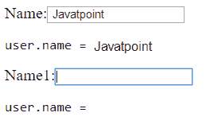

# Angular 模块

> 原文：<https://www.javatpoint.com/angular-ng-module>

**在 Angular 中，n model**通过引用而不是通过值来存储变量。模型的绑定是输入对象(例如日期)或集合(例如数组)。

创建的电话对象有几个用于验证目的的字段。我们正在列出重要的。

*   ng-touch
*   ng-未触及
*   ng-待定
*   ng-原始
*   ng-有效
*   ng-无效
*   肮脏

### 用 getter 和 setter 绑定 ngModel

每当用其**零参数**调用函数时，它代表模型。当用参数调用时，它设置值。所以 ngModel 指的是地址；它不会将更改的值保存到对象中。相反，它将其保存在内部状态(**变量名)中。值**)。

当有内部表示时，为模型使用 getter 和 setter 会很有用，因为 getter 和 setter 函数在代码中使用得更频繁。

**语法:**

```

ng-model-options="{ getterSetter: true }"

```

**示例:**

```

<html>
<head>
<script src="https://ajax.googleapis.com/ajax/libs/angularjs/1.6.9/angular.min.js">
</script>
</head>
<body ng-app="myApp">
  <div ng-controller="myController">
  <form>
  Name:<input type="text" name="Name"
             ng-model="user.name"
             ng-model-options="{ getterSetter: true }" />
  <pre>user.name = <span ng-bind="user.name()"></span></pre>
  Name1:<input type="text" name="Name1"
             ng-model="user.name1"
             ng-model-options="{ getterSetter: true }" />
  <pre>user.name = <span ng-bind="user.name1()"></span></pre>
  </form>
 </div>
<script>
angular.module('myApp', [])
  .controller('myController', ['$scope', function($scope) {
    name = 'Javatpoint';
    name1 = "";
    $scope.user = {
      name: function(Name) {
      return arguments.length ? (name = Name) : name;
      },
      name1: function(Name1) {
      return arguments.length ? (name1 = Name1) : name1;
      } 
    };
  }]);
</script>
</body>
</html>

```

我们已经用字符串*初始化了名称，用空字符串初始化了 Javapoint*和**名称 1** 。



### 性能

| 财产 | 描述 |
| 推翻 | 它为视图模型设置新值，并发出 ngModelChange 事件。 |
| 控件:窗体控件 | ***只读*** |
| @Input('disabled')
为空:布尔值 | 它将跟踪控件是否被禁用。 |
| @Input('ngModel')
模型:任意 | 它跟踪绑定到该指令的值。 |
| @Input('ngModelOptions')
选项:{ name？:字符串；独立的？:布尔值；更新？:FormHooks} | 它跟踪此 ngModel 实例的配置选项。
Standalone: ngModel 不会向其父窗体注册自己，并且会表现得好像它不在窗体中一样。默认为 false。如果父窗体不存在，此选项不会影响它。
更新:它定义了事件更新的值和有效性。默认为“更改”。可能的值:“替换“&#124;”出现的模糊“&#124;”。 |
| @ output(' ngModelChange ')
Update:event emitter | 事件发射器，用于在视图模型更新后创建模型更改事件。 |
| 路径:字符串[] | ***只读*** |
| 形式导演:任何 | ***【只读】***
此控件存在顶级指令，否则为空。 |

FormControl 跟踪控件的值、用户交互和验证状态，以保持视图与模型同步。如果它被用作父指令，该指令也会注册自己。

如果使用[()]进行双向绑定，用户界面中的语法值将始终同步回您的类的域模型。

若要检查关联的 FormControl，请使用 NgModel 作为键将指令导出到本地模板变量。直接访问控制最常用的资产也存在。请参见抽象控制指令中可用属性的完整列表。

### 在独立控件上使用 ngModel

这些示例显示了一个使用 ngModel 的简单独立控件:

```

content_copyimport {Component} from '@angular/core';
@Component({
  selector: 'example-app',
  template: `
    <input [(ngModel)]="name" #ctrl="ngModel" required>

    <p>Value: {{ name }}</p>
    <p>Valid: {{ ctrl.valid }}</p>

    <button (click)="setValue()">Set value</button>
  `,
})
export class SimpleNgModelComp {
  name: string = '';

  setValue() {
    this.name = 'Nancy';
  }
}

```

在<**表单** >标签中使用 ngModel 时，您还可以提供一个名称属性，以该名称向父表单注册控件。

提交表单时，必要时使用变量。在父窗体的上下文中，通常没有必要包含单向或双向绑定，因为父窗体会为您同步值。如果您需要在表单中填充初始值，只要您在提交时使用导出表单的值而不是**域模型**的值，使用到 ngModel 的单向绑定就足够了。

### 在窗体中使用 ngModel

```

content_copyimport {component} from '@angular/core';
import {ngForm} from '@angular/forms';

@Component({
  selector: 'example-app',
  template: `
    <form #f="ngForm" (ngSubmit)="onSubmit(f)" novalidate>
      <input name="first" ngModel required #first="ngModel">
      <input name="last" ngModel>
      <button>Submit</button>
    </form>

    <p>First name value: {{ first.value }}</p>
    <p>First name valid: {{ first.valid }}</p>
    <p>Form value: {{ f.value | json }}</p>
    <p>Form valid: {{ f.valid }}</p>
  `,
})
export class SimpleFormComp {
  onSubmit(f: NgForm) {
    console.log(f.value);  // { first: '', last: '' }
    console.log(f.valid);  // false
  }
}

```

### 在组内使用独立的模型

该示例向我们展示了如何在表单中使用独立的 ngModel 控件。它控制窗体的显示，但不包含窗体数据。

```

content_copy<form>
   <input name="login" ngModel placeholder="login">
   <input type="checkbox" ngModel [ngModelOptions]="{standalone: true}">Show more options?
</form>
<!-- Form Value: {login: ''} ->

```

### 通过选项设置模型名称属性

这里，标识为 name 的属性用于自定义表单控件组件。

```

content_copy<form>
  <my-custom-form-control name="Nancy" ngModel [ngModelOptions]="{name: 'user'}">
  </my-custom-form-control>
</form>
<!-- form value: {user: ''} -->

```

### 吴模范

从域模型创建一个 FormControl 实例，并将其绑定到一个 **FormControl 元素**。

### 描述

FormControl 实例跟踪**控件的值、用户交互、**和**验证状态**，并保持视图与模型同步。如果用作父控件，该指令也会将自己注册为子控件。

该指令接受域模型作为可选输入。如果您使用[]语法单向绑定到一个 NgModel，则更改组件类中的域模型的值会在视图中设置该值。如果您在用户界面中使用[()]语法值双向绑定，则同步回您的类的域模型。

若要检查关联的 FormControl，请使用 NgModel 作为键将指令导出到本地模板变量。然后，您可以使用指令的“控件”属性来访问控件。

### 在独立控件上使用 ngModel

示例显示了使用**模型**的独立控件:

```

content_copyimport {Component} from '@angular/core';

@Component({
  selector: 'example-app',
  template: `
    <input [(ngModel)]="name" #ctrl="ngModel" required>

    <p>Value: {{ name }}</p>
    <p>Valid: {{ ctrl.valid }}</p>

    <button (click)="setValue()">Set value</button>
  `,
})
export class SimpleNgModelComp {
  name: string = '';

  setValue() {
    this.name = 'Nancy';
  }
}

```

当我们在一个 **<表单>** 标签中使用 NgModel 时，您提供了一个名称属性，以该名称向父表单注册控件。

如果需要在表单中填充初始值，只要使用导出表单的值而不是顶点处的域模型的值，使用到 NgModel 的单向绑定就足够了。

### 在组内使用独立的模型

该示例向您展示了窗体中的一个独立的 ngModel 控件。它控制窗体的显示，但不能包含窗体数据。

```

content_copy<form>
  <input name="login" ngModel placeholder="Login">
  <input type="checkbox" ngModel [ngModelOptions]="{standalone: true}"> Show more options?
</form>
<!-- form value: {login: ''} -->

```

### 通过选项设置 ngModel 名称属性

在自定义窗体控件组件中使用了标识为 name 的属性。为了能够指定**模型**的名称，您必须使用**模型选项**输入来指定它。

```

content_copy<form>
  <my-custom-form-control name="Javatpoint" ngModel [ngModelOptions]="{name: 'user'}">
  </my-custom-form-control>
</form>
<!-- form value: {user: ''} -->

```

* * *