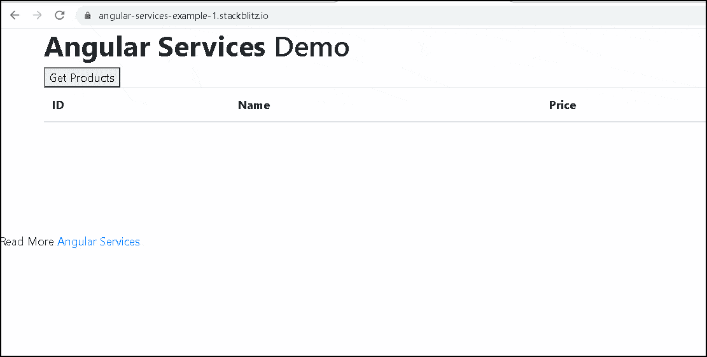

# 什么是角度服务？

> 原文:[https://www.javatpoint.com/what-is-an-angular-service](https://www.javatpoint.com/what-is-an-angular-service)

服务是一段具有特定目的的可重用代码。您将在应用程序的多个组件中使用的代码。

我们的组件需要访问数据。您可以在每个组件中编写数据访问代码，但是这非常低效，并且打破了单一责任的规则。组件应该专注于向用户呈现数据。

从后端服务器接收数据的任务应该委托给另一个类。我们称类为服务类，因为它为每个组件提供所需的数据。

### Angular Services 用于什么？

独立于日志服务等组件的功能

*   跨组件共享逻辑或数据
*   封装外部交互，如数据访问
*   服务更容易测试。
*   它们更容易调试。
*   我们可以在很多地方重复使用这项服务。

### 如何在 Angular 中创建服务

Angular 服务只是一个 JavaScript 函数。我们所要做的就是创建一个类，并添加方法和属性。然后，我们可以在组件中创建这个类的实例，并调用它的方法。

服务的最佳用途之一是从数据源获取数据。让我们创建一个简单的服务，它接收产品数据并将其发送给我们的组件。

### 乘积模型

请在 src/app 文件夹下创建一个新文件，并将其称为 product.ts

**产品**

```

export class Product { 
 constructor(productID:number,    name: string ,   price:number) {
        this.productID=productID;
        this.name=name;
        this.price=price;
    }
    productID:number ;
    name: string ;
    price:number;
}

```

上面的产品类是我们的领域模型。

### 产品角度服务

接下来，我们创建一个 Angular 服务，它返回一个产品列表。

请在 src/app 文件夹下新建一个文件，并将其命名为 product . service . ts .**product . service . ts**

```

 mport {Product} from './product'
export class ProductService{ 
    public  getProducts() { 
        let products:Product[]; 
        products=[
            new Product(1,'Memory Card',500),
            new Product(1,'Pen Drive',750),
            new Product(1,'Power Bank',100)
        ] 
        return products;               
    }
}

```

首先，我们将产品模型设置为从产品导入

接下来，创建一个产品服务类并将其导出。我们需要导出，以便组件和其他服务类导入并使用它

获取产品方法返回产品集合。在这个例子中，我们已经对产品进行了硬编码。在现实生活中，您会向后端应用编程接口发送一个 HTTP GET 请求，以使数据服务准备就绪。

注意，上面的类是一个简单的 JavaScript 函数。它没有任何棱角。

### 调用产品服务

下一步是从组件调用产品服务。打开 app.componet.ts 并添加以下代码。

**app.component.ts**

```

	 import { Component } from '@angular/core';
import { ProductService } from './product.service';
import { Product } from './product';
@Component({
  selector: 'app-root',
  templateUrl: './app.component.html',
})
export class AppComponent
{ 
   products:Product[];
   productService; 
   constructor(){
     this.productService=new ProductService();
   } 
   getProducts() {     
     this.products=this.productService.getProducts();
   }  
} 

```

### 我们从导入产品和产品服务开始

我们在 AppComponent 的构造函数中创建一个 ProductSerivce 实例。在现实中的 Angular 应用程序中，我们在 Angular 中使用依赖注入将 ProductSerivce 注入构造函数。我们将在下一个教程中学习这一点。

方法调用产品服务的方法。它返回一个产品列表，我们将其存储在局部变量产品中。



**将服务注入组件**

在这个例子中，我们直接在组件中实例化了产品服务，如下所示:

```

this.ProductService = new ProductService();

```

如上所示，实例化服务有几个缺点。

*   产品服务与组件紧密结合。如果我们改变产品服务类的定义，我们必须更新使用服务的每个代码。
*   如果我们想用更好的服务取代产品服务，我们必须在使用产品服务的地方进行搜索，并手动替换。
*   使得测试变得困难。我们可能需要提供假冒产品服务进行测试，并使用产品服务进行生产。

我们可以通过使用角度依赖注入来解决这个问题。

**添加服务**

英雄之旅英雄组件目前正在接收和显示虚假数据。

在本教程的重构之后，HeroesComponent 将变得更加精简，并专注于支持视图。使用模拟服务进行单元测试也更容易。

有关本页描述的示例应用程序，请参见实时示例/下载示例。

服务是在彼此不认识的类之间共享信息的好方法。您将创建一个 MessageService，并将其注入两个位置。

*   注入到 HeroService 中，使用该服务发送消息。
*   注入消息组件，当用户点击英雄时显示消息标识。

### 创建英雄服务

使用 Angular CLI，创建一个名为 Hero 的服务。

```

generate content_copy service hero

```

该命令在 **src/app/hero.service.ts** 中生成一个骨架 HeroService 类，如下所示:

```

src/app/hero.service.ts (new service)
content_copyimport { Injectable } from '@angular/core';
@Injectable({
  providedIn: 'root',
})
export class HeroService {
  constructor() { }
}
@Injectable () services

```

请注意，新服务导入了 Angular 可注射符号，并用@ Injectable()装饰器注释了该类。它标记了参与依赖注入机制的类。

HeroService 类将提供一个可注射的服务，也可能有它的可注射依赖项。它还没有任何依赖关系，但很快就会有。

@ Injectable()装饰器接受服务的元数据对象，就像@Component()装饰器接受组件类一样。

### 获取英雄数据

HeroService 可以从任何地方获取 Hero 数据——web 服务、本地存储或模拟数据源。

从组件中移除数据访问意味着您可以随时改变对实现的想法，而无需接触任何组件。他们不知道这项服务是如何运作的。

### 导入英雄和英雄。

```

src/app/hero.service.ts
content_copyimport { Hero } from './hero';
import { HEROES } from './mock-heroes';
Add a getHeroes method to return the mock heroes.
src/app/hero.service.ts
content_copygetHeroes(): Hero[] {
  return HEROES;
}

```

### 提供英雄服务

通过注册一个提供者，您需要在 Angular 将 HeroService 注入到 HeroesComponent 之前，使它对依赖注入系统可用。提供商可以创建或交付服务；在这种情况下，它实例化了 HeroService 类来提供服务。

为了确保 HeroService 可以提供该服务，请向 Injector 注册它，Injector 是负责在应用程序需要的地方选择和注入提供者的对象。

默认情况下，Angular CLI 命令 ng 服务通过在@ Injectable()装饰器中包含提供的提供程序元数据:“root”来向您的服务的根注入程序注册提供程序。

```

content_copy@Injectable({
  providedIn: 'root',
})

```

当您在根级别提供服务时，Angular 会创建一个单一的、共享的 HeroService 实例，并将其注入任何需要它的类中。在**@可注射的**元数据中注册提供者允许 Angular 通过删除不再使用的服务来定制应用程序。

HeroService 现在可以插入 HeroesComponent 了。

这是一个临时的代码示例，允许您提供和使用 HeroService。代码将在“最终代码审查”中与英雄服务分离。

### 更新英雄组件

打开 HeroesComponent 类文件。

删除英雄导入，因为你不再需要它了。请改为导入英雄服务。

```

src/app/heroes/heroes.component.ts (import HeroService)
content_copyimport { HeroService } from '../hero.service';

```

用声明替换英雄属性的定义。

```

src/app/heroes/heroes.component.ts
content_copyheroes: Hero[] = [];

```

### 注入英雄服务

向构造函数中添加一个类型为 heroService 的私有 HeroService 参数。

```

src/app/heroes/heroes.component.ts
content_copyconstructor(private heroService: HeroService) {}

```

该参数同时定义了一个私有的英雄服务属性，并将其标识为英雄服务注入站点。

当 Angular 创建一个 HeroesComponent 时，依赖注入系统将 HeroService 参数设置为 heroService 的单例实例。

### 添加 getHeroes()

创建一个从服务中检索英雄的方法。

```

src/app/heroes/heroes.component.ts
content_copygetHeroes(): void {
  this.heroes = this.heroService.getHeroes();
}

```

### 在 ngOnInit()中调用它

虽然可以在构造函数中调用 getHeroes()，但这不是最佳实践。

保留构造函数用于最小化初始化，例如将构造函数参数连接到属性。构造函数不应该做任何事情。它当然不应该调用一个作为实际数据服务向远程服务器发出 HTTP 请求的函数。

相反，在 ngOnInit 生命周期钩子内部调用 getHeroes()，并让 Angular 在创建 HeroesComponent 实例后的适当时间调用 ngOnInit()。

```

src/app/heroes/heroes.component.ts
content_copyngOnInit() {
  this.getHeroes();
}

```

浏览器刷新后，应用程序应该像以前一样运行，当你点击英雄名称时，显示英雄列表和英雄详细视图。

### 可观察的数据

HeroService.getHeroes()方法有一个*同步签名，*表示 HeroService 可以同步获取英雄。HeroesComponent 使用 getHeroes()结果，就好像可以同步获取英雄一样。

```

src/app/heroes/heroes.component.ts
content_copythis.heroes = this.heroService.getHeroes();

```

它在实际应用中不起作用。现在你可以逃脱惩罚了，因为该服务目前会返回假英雄。但是很快，应用程序将从远程服务器获取英雄，这是一个固有的异步操作。

HeroService 必须等待服务器响应，getHeroes()可能不会立即返回 hero 数据，在服务等待期间浏览器也不会阻塞。

HeroService.getHeroes()将返回一个可观测值，因为它最终将使用 Angular HttpClient.get 方法获取英雄，而 HttpClient.get()将返回一个可观测值。

### 可观察的英雄服务

可观察是 RxJS 库的主要类之一。

在稍后关于 HTTP 的教程中，您将了解到 Angular 的 HttpClient 方法返回 RxJS Observables。本教程将模拟使用 RxJS of()函数从服务器获取数据。

打开 HeroService 文件，从 RxJS 导入可观察的对象和符号。

```

src/app/hero.service.ts (Observable imports)

```

content_copyimport { Observable，of }来自“rjs”；

**将 getHeroes()方法替换为:**

```

src/app/hero.service.ts
content_copygetHeroes(): Observable {
  const heroes = of(HEROES);
  return heroes;
} 
```

Of (HEROES)返回一个可观察的<hero>，它发出一个*单值*模拟英雄阵列。</hero>

在 HTTP 教程中，您将调用 HttpClient.get < Hero []>()它还返回一个可观察的< Hero []>，该可观察的< Hero []>从 HTTP 响应的主体中发出*单个值*英雄数组。

### 在英雄组件中订阅

用于返回英雄的方法。现在它返回一个可观察的 **<hero>。</hero>**

你必须适应这种差异。

找到 getHeroes 方法，并用下面的代码替换它。

```

heroes.component.ts (Observable)
heroes.component.ts (Original)
content_copygetHeroes(): void {
  this.heroService.getHeroes()
      .subscribe(heroes => this.heroes = heroes);
}

```

**Observable.subscribe()** 是关键的区别。

以前的版本为组件的英雄属性提供了英雄数组。当服务器可能会立即返回英雄，或者在等待服务器响应时浏览器 UI 可能会冻结时，分配就会发生。

新版本等待可观测者发出英雄阵列，这可能会在几分钟后发生。subscribe()方法将发出的数组传递给回调，设置组件的 heroes 属性。

当 HeroService 从服务器请求英雄时，这种异步方法将会起作用。

### 本节包含以下内容:

*   消息添加组件，在屏幕底部显示应用程序消息
*   创建一个可注射的、应用程序范围的消息服务，用于发送消息进行显示
*   将消息服务注入到英雄服务中
*   当英雄服务成功获取英雄时显示消息

### 创建消息组件

使用命令行界面创建消息组件。内容复制组件生成消息

CLI 在 src/app/messages 文件夹中创建组件文件，并在 AppModule 中声明 MessagesComponent。

修改应用组件模板以显示生成的消息组件。

**src/app/app . component . html**

```

content_copy<h1>{{title}}</h1>
<app-heroes></app-heroes>
<app-messages></app-messages>

```

您应该会在页面底部看到 MessagesComponent 中的默认段落。

### 创建消息服务

*   使用命令行界面在 src/app 中创建消息服务。
*   content _ copyng 生成服务消息

**打开 MessageService，用以下内容替换其内容。**

**src/app/message . service . ts**

```

content_copyimport { Injectable } from '@angular/core';
@Injectable({
  providedIn: 'root',
})
export class MessageService {
  messages: string[] = [];
  add(message: string) {
    this.messages.push(message);
  }
  clear() {
    this.messages = [];
  }
}

```

该服务公开其消息缓存和两种方法:一种是向缓存添加()消息，另一种是清除()缓存。

### 把它注入英雄服务

在英雄服务中，导入消息服务。

src/app/hero.service.ts(导入消息服务)

```

content_copyimport { MessageService } from './message.service';

```

使用声明私有 messageService 属性的参数修改构造函数。Angular 将在创建 HeroService 时将单例消息服务注入该属性。

**src/app/hero.service.ts**

```

content_copyconstructor(private messageService: MessageService) { }

```

这是典型的*“服务中的服务”*场景:您将消息服务注入到英雄服务中，注入到英雄组件中。

### 从 HeroService 发送消息

修改 getHeroes()方法，以便在获取英雄时发送消息。

**src/app/hero.service.ts**

```

content_copygetHeroes(): Observable {
  const heroes = of(HEROES);
  this.messageService.add('HeroService: fetched heroes');
  return heroes;
} 
```

### 显示来自英雄服务的消息

messages 组件应该在获取英雄时显示所有消息，包括英雄服务发送的消息。

打开消息组件并导入消息服务。

```

src/app/messages/messages.component.ts (import MessageService)
content_copyimport { MessageService } from '../message.service';

```

使用声明公共消息属性的参数修改构造函数。当它创建消息组件时，Angular 会将单例消息服务注入到该属性中。

**src/app/messages/messages . component . ts**

```

content_copyconstructor(public messageService: MessageService) {}

```

messageService 属性**必须是公共的**，因为您将在模板中绑定到它。

Angular 仅将*绑定到公共*组件属性。

### 绑定到消息服务

用以下内容替换命令行界面生成的消息组件模板。

**src/app/messages/messages . component . html**

```

content_copy<div *ngIf="messageService.messages.length">
  <h2>Messages</h2>
  <button class="clear"
          (click)="messageService.clear()">Clear messages</button>
  <div *ngFor='let message of messageService.messages'> {{message}} </div>
</div>

```

该模板直接连接到组件的消息传递。

*   *只有当有消息要显示时，NGIF 才会显示消息区域。
*   An * ngFor repeatedly presents a list of messages inelements.
*   Angular event binding binds the button's click event to MessageService.clear() .

When you add private CSS styles to messages.component.css, the mail will look better, as listed in the "Last Code Check" tab below.

### Add an additional message to the hero service.

The following example shows how to send and display a message every time a user clicks a hero, showing the history of user selection. This will help you to enter the next part of the route.

For more information about this source text, attach the source text

**src/app/heroes/heroes.component.ts**

```

content_copyimport { Component, OnInit } from '@angular/core';
import { Hero } from '../hero';
import { HeroService } from '../hero.service';
import { MessageService } from '../message.service';
@Component({
  selector: 'app-heroes',
  templateUrl: './heroes.component.html',
  styleUrls: ['./heroes.component.css']
})
export class HeroesComponent implements OnInit {
  selectedHero?: Hero;
  heroes: Hero[] = [];
  constructor(private heroService: HeroService, private messageService: MessageService) { }
  ngOnInit() {
    this.getHeroes();
  }
  onSelect(hero: Hero): void {
    this.selectedHero = hero;
    this.messageService.add(`HeroesComponent: Selected hero id=${hero.id}`);
  }
  getHeroes(): void {
    this.heroService.getHeroes()
        .subscribe(heroes => this.heroes = heroes);
  }
}

```

Refresh the browser to view the hero list, and go down. Every time you click on a hero, a new message will appear to record your choice. Use the Clear Message button to clear the message history.

### Final code review

This is the code file discussed on the page.

```

src/app/hero.service.ts
src/app/message.service.ts
src/app/heroes/heroes.component.ts
src/app/messages/messages.component.ts
src/app/messages/messages.component.html
src/app/messages/messages.component.css
src/app/app.module.ts
src/app/app.component.html
content_copyimport { Injectable } from '@angular/core';
import { Observable, of } from 'rxjs';
import { Hero } from './hero';
import { HEROES } from './mock-heroes';
import { MessageService } from './message.service';
@Injectable({
  providedIn: 'root',
})
export class HeroService {
  constructor(private messageService: MessageService) { }
  getHeroes(): Observable {
    const heroes = of(HEROES);
    this.messageService.add('HeroService: fetched heroes');
    return heroes;
  }
} 
```

### Summary

You have reconstructed data access in the HeroService class. You have registered HeroService as its service provider at the root level, which can be inserted anywhere in the application. You use angle-dependent injection to inject it into the component. You have given HeroService an asynchronous signature method to get data. You found observable libraries and observable libraries.

You used RxJS of () to return a set of observable simulated heroes (observable <hero>). The ngOnInit lifecycle hook of the component calls the HeroService method, not the constructor. You have created a MessageService for loosely coupled communication between classes.</hero>

* * *